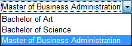
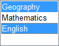
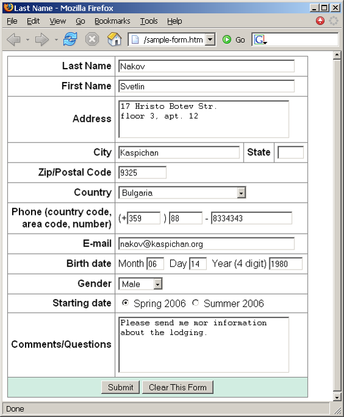
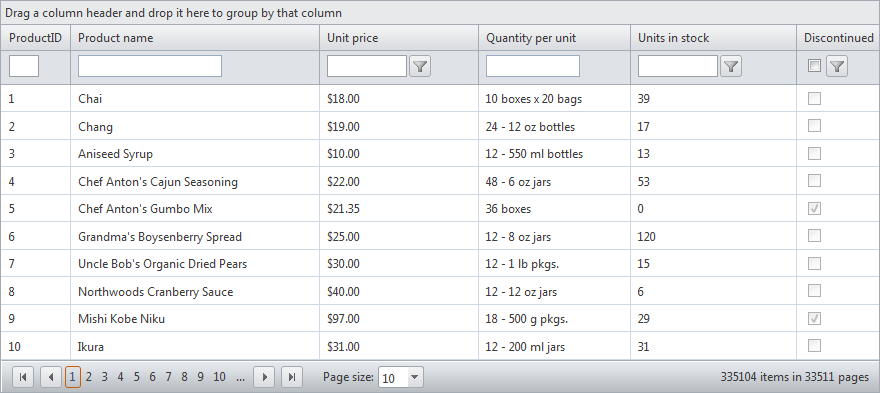

<!-- section start -->

<!-- attr: {id: 'title', class: 'slide-title', hasScriptWrapper: true} -->
# HTML Forms and Frames

<div class="signature">
    <p class="signature-course">HTML, CSS & JavaScript</p>
    <p class="signature-initiative">Telerik School Academy</p>
    <a href="http://academy.telerik.com" class="signature-link">http://academy.telerik.com</a>
</div>

<!-- section start -->

<!-- attr: { id:'table-of-contents', style:'font-size: 40px' } -->
# Table of Contents

- HTML Forms
  - Form Fields and Fieldsets
  - Text Boxes
  - Buttons
  - Checkboxes and Radio Buttons
  - Select Fields
  - Hidden Fields
  - Sliders and Spinboxes
  - Validation Fields
- HTML Frames
  - Frame and `noframe` tags
  - `iframe` tag


<!--  section start -->

<!-- attr: { class:'slide-section', id:'html-forms', showInPresentation: true } -->
<!-- # HTML Forms
## Entering User Data from a Web Page -->

<!-- attr: { style:'font-size:0.9em' } -->

# What are HTML Forms?

- The primary method for gathering data from site visitors
- HTML Forms can contain
  - Text fields for the user to type
  - Buttons for interactions like"Register", "Login", "Search"
  - Menus, Sliders, etc…
- Check Google, Yahoo, Facebook
  - Google search field is a simple Text field


<!-- attr: { hasScriptWrapper: true, style:'font-size:40px' } -->

# How to Create a HTML Form?

- Create a form block with

```html
<form></form>
```

- Example:

```html
<form name="myForm" method="post" action="path/to/some-script.php">
   ...
</form>
```

<div class="balloon fragment" style="position: absolute; top: 32%; left: 26%; opacity: 0.7;">The "method" attribute tells how the form data </br> should be sent – via GET or POST request</div>
<div class="balloon fragment" style="position: absolute; top: 48%; left: 50%; opacity: 0.7;">The "action" attribute tells </br> where the form data should be sent
</div>

<!-- attr: { hasScriptWrapper: true, style:'font-size:40px' } -->

# Text Fields

- `Single-line` text input fields:

```html
<input type="text" name="FirstName" value="This is a text field" />
```

- `Multi-line` text input fields (textarea):

```html
<textarea name="Comments">This is a multi-line text field</textarea>
```

- `Password` input – a text field which masks the entered text with * signs

```html
<input type="password" name="pass" />
```

<!-- attr: { hasScriptWrapper: true, style:'font-size:35px' } -->

# Text Fields

- `Reset` button – brings the form to its initial state

```html
<input type="reset" name="resetBtn"   
  value="Reset the form" />
```

- `Submit` button:

```html
<input type="submit" value="Apply Now" />
```

- `Image` button – acts like submit but image is displayed and click coordinates are sent

```html
<input type="image" src="submit.gif"
  name="submitBtn" alt="Submit" />
```

- `Ordinary` button – no default action, used with JS

```html
<input type="button" value="click me" />
```

<!-- attr: { hasScriptWrapper: true, style:'font-size:40px' } -->

# Checkboxes and Radio Buttons

- `Checkboxes`:


```html
<input type="checkbox" name="fruit" value="apple" />
```

- `Radio` buttons:


```html
<input type="radio" name="title" value="Mr." />
```

- Radio buttons can be grouped, allowing only one to be selected from a group:

```html
<input type="radio" name="city" value="Lom" />
<input type="radio" name="city" value="Ruse" />
```

<!-- attr: { hasScriptWrapper: true, style:'font-size:40px' } -->

# Select Fields

- Dropdown menus:


```html
<select name="gender">
  <option value="Value 1"
    selected="selected">Male</option>
  <option value="Value 2">Female</option>
  <option value="Value 3">Other</option>
</select>
```
</br>
- Multiple-choice menus


```html
<select name="products" multiple="multiple">
  <option value="Value 1"
    selected="selected">keyboard</option>
  <option value="Value 2">mouse</option>
</select>
```

<!-- attr: { hasScriptWrapper: true, style:'font-size:40px' } -->

# Hidden Fields

- Hidden fields contain invisible data

```html
<input type="hidden" name="Account"
  value="This is a hidden text field" />
```

  - Not shown to the user
  - Used by JavaScript and server-side code
    - ViewState, SessionState in ASP.NET


<!-- attr: { hasScriptWrapper: true, style:'font-size:40px' } -->

# Labels

- `Labels` are used to associate an explanatory text to a form field using the field's ID

```html
<label for="fn">First Name</label>
<input type="text" id="fn" />
```

- Clicking on a label `focuses` its associated field
  - Checkboxes are `toggled`
  - Radio buttons are `checked`
- Labels are
  - Both a `usability` and `accessibility` feature
  - Required in to pass accessibility validation

<!-- attr: { hasScriptWrapper: true, style:'font-size:40px' } -->

# Fieldsets

- `Fieldsets` are used to enclose a group of related form fields:

```html
<form method="post" action="form.aspx">
   <fieldset>
      <legend>Client Details</legend>
      <input type="text" id="Name" />
      <input type="text" id="Phone" />
   </fieldset>
   <fieldset>
      <legend>Order Details</legend>
      <input type="text" id="Quantity" />
      <textarea cols="40" rows="10"         id="Remarks"></textarea>
   </fieldset>
</form>
```

- The `<legend>` is the fieldset's title

<!-- attr: {class: 'slide-section', id: 'html-forms-demo', showInPresentation: true} -->
<!-- # HTML Forms, Inputs Fields
## Live Demo -->

<!--  section start -->

<!-- attr: {class: 'slide-section', id: 'sliders-spinboxes', showInPresentation: true} -->
<!-- # Sliders and Spinboxes
## Lets Make It Spin -->

<!-- attr: {hasScriptWrapper:true, style: 'font-size: 40px'} -->

# Range and Spinbox

- Restricts users to enter only numbers
  - Additional attributes `min`, `max` and `step` and `value`
  - Can become `Spinbox` or `Slider`, depending on the input type

```html
<input type="range" min="0" max="100" />
<input type="number" min="0" max="100" />
```

  - Have some `differences` on `different browsers`
  - Spinboxes do not work on `Firefox`
    - Shown as regular textboxes

<!-- attr: {class: 'slide-section', id: 'sliders-demo', showInPresentation: true} -->
<!-- # Sliders and Spinboxes
## Live Demo -->

<!-- attr: { hasScriptWrapper: true, style: 'font-size: 40px'} -->

# Field Attributes from HTML 5

- `Autocomplete`
  - The browser stores the previously typed values
  - Brings them back on a later visit
- `Autofocus`
  - The field becomes on focus on page load

```html
<input type="text" name="firstName"
  autofocus="autofocus" />
```
- `Required`
  - The field is required to be filled/selected


<!-- attr: { hasScriptWrapper: true, style: 'font-size: 40px'} -->

# Input Fields with Validation

- `Email` – provides a simple validation for email
  - Can be passed a pattern for validation
  - In a mobile device brings the email keyboard

```html
<input type="email" required="true" pattern="[^ @]*@[^ @].[^ @]"/>
```

- `URL` – has validation for url
  - In a mobile device brings the url keyboard

```html
<input type="url" required="true" />
```

- `Telephone`
  - Brings the numeric keyboard

```html
<input type="tel" required="true" />
```

<!-- attr: {class: 'slide-section', id: 'forms-validation-demo', showInPresentation: true} -->
<!-- # HTML Forms Validation
## Live Demo -->

<!-- attr: { hasScriptWrapper: true, style: 'font-size: 40px'} -->

# Tab Index

- The `tabindex` HTML attribute controls the order in which form fields and hyperlinks are focused when repeatedly pressing the `TAB` key
  - `tabindex="0"` (zero) – "natural" order
  - If `X < Y`, then elements with `tabindex="X"` are iterated before elements with `tabindex="Y"`
  - Elements with negative `tabindex` are skipped, however, this is not defined in the standard

```html
<input type="text" name="second" tabindex="10" />
<input type="text" name="first" tabindex="5" />
```

<!-- attr: {class: 'slide-section', id: 'tab-index-demo', showInPresentation: true} -->
<!-- # Tab Index
## Live Demo -->

<!--  section start -->

<!-- attr: {class: 'slide-section', id: 'html-frames', showInPresentation: true} -->
<!-- # HTML Frames
## frameset, frame and iframe -->

<!-- attr: {hasScriptWrapper: true, style: 'font-size: 40px'} -->

# HTML Frames

- `Frames` provide a way to show multiple HTML documents in a single Web page
- The page can be split into separate views (frames) horizontally and vertically
- Frames were popular in the early ages of HTML development, but now their usage is rejected
- Frames are not supported by all user agents (browsers, search engines, etc.)
  - A `<noframes>` element is used to provide content for non-compatible agents.


<!-- attr: {hasScriptWrapper: true, style: 'font-size: 40px'} -->

# HTML Frames – Demo

frames.html

```html<html>
  <head><title>Frames Example</title></head>
  <frameset cols="180px,*,150px">
    <frame src="left.html" />
    <frame src="middle.html" />
    <frame src="right.html" />
  </frameset>
</html>
```

- Note the `target` attribute applied to the `<a>` elements in the left frame.


<!-- attr: {hasScriptWrapper: true, style: 'font-size: 40px'} -->

# Inline Frames: `<iframe>`

- Inline frames provide a way to show one website inside another website:

iframe-demo.html

```html
<iframe name="iframeGoogle" width="600" height="400" src="http://www.google.com" frameborder="yes" scrolling="yes"></iframe>
```


<!-- attr: { class:'slide-section', showInPresentation: true } -->
<!-- # HTML, CSS & JavaScript
##  Questions -->

<!--  section start -->

<!-- attr: {class: 'slide-section', id: 'homework', showInPresentation: true} -->
<!-- # Homework -->

<!-- attr: {hasScriptWrapper: true, style: 'font-size: 40px'} -->

# Homework

`1.` Create a Web form that looks like this sample:

<!-- attr: {hasScriptWrapper: true, style: 'font-size: 40px'} -->

# Homework (2)

`2.` Create the following using tables and forms:


<!-- attr: {hasScriptWrapper: true, style: 'font-size: 40px'} -->

# Homework (3)

`3.` Create the following HTML Page
  - Hint: Use Fieldsets and Nested tables


<!-- attr: {hasScriptWrapper: true, style: 'font-size: 38px'} -->

# Homework (4)

`4.` `*`Construct the following Grid component:


  - Try to make a HTML page, that looks just like the example
  - CSS is required
