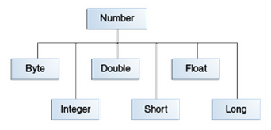

<!-- section start -->

<!-- attr: {id: 'title', class: 'slide-title', hasScriptWrapper: true} -->

# Data Types and Variables
##  Numbers, strings and stuff
<div class="signature">
    <p class="signature-course">Java Fundamentals - Part 1</p>
    <p class="signature-initiative">Telerik School Academy</p>
    <a href="http://academy.telerik.com" class="signature-link">http://academy.telerik.com</a>
</div>

<!-- section start -->
<!-- attr: { id:'table-of-contents', class:'table-of-contents', style:'font-size:0.9em'} -->
# Table of Contents
* How computing works
  * Variables, Data types
* Primitive data types
  * Integer values
    * `int`, `long`, `short`, etc...
  * Floating-point values
    * `double` and `float`
  * Boolean
  * Char
* Declaring variables
  * Identifiers

<!-- attr: { class:'table-of-contents', showInPresentation:true } -->
<!-- # Table of Contents -->
* [Literals](#literals-in-java)
  * Integer
  * Floating point
  * Boolean and Char
* String
  * A sequence of characters
  * Simple operations with string
* Numbers classes
  * Boxing in Java
* `BigInteger` and `BigDecimal`

<!-- section start -->

<!-- attr: {class: 'slide-section', id: 'how-computing-works'} -->
#   How Computing Works?
##  Data types, Variables

<!-- attr: {hasScriptWrapper: true} -->
#   How Computing Works?

*   Computers are machines that process data
    *   **Data** is stored in the computer memory in **variables**
    *   Variables have **name**, **data type** and **value**
*   Example of variable definition and assignment in Java

```java
int count = 5;
```

*   Data type <!-- .element: class="balloon fragment" style="top:50%; left:4%" -->
*   Variable name <!-- .element: class="balloon fragment" style="top:63%; left:12%" -->
*   Optional value <!-- .element: class="balloon fragment" style="top:50%; left:30%" -->

#   What is a Data Type?
* A **data type**
  * is a domain of values of similar characteristics
  * defines the type of information stored in the computer memory (in a variable)
* Examples:
  * Positive integer numbers: `1`, `2`, `3`, ...
  * Alphabetical characters: `a`, `b`, `c`, ..., `A`, `B`, `C`, ...
  * Days of week: `Monday`, `Tuesday`, ...

#   Data Type Characteristics
* A data type has:
  * **Name** (Java keyword)
  * **Size** (how much memory is used)
  * **Default value**
* Example - Integer numbers in Java
  * **Name**: `int`
  * **Size**: `32 bits` (4 bytes)
  * **Default value**: 0

<!-- section start -->
<!-- attr: {class: 'slide-section', id: 'primitive-data-types'} -->
#   Primitive Data Types
##    Representing Integer and Floating-point numbers, and Symbolic values

<!-- attr: { hasScriptWrapper: true, id: 'integer-data-types'} -->
#   Integer Number Types
* Integer Number types:
  * Represent whole numbers
  * May be signed or unsigned
  * Have range of values, depending on the size of memory used

<!-- attr: { hasScriptWrapper:true, style:'font-size:0.9em' } -->
#   Memory for Integer Number Types
| Name                     |  Size   | Range                |
| ------------------------ | ------- | -------------------- |
| `byte`                   | 1 byte  | -2<sup>7</sup> to 2<sup>7</sup>-1 |
| `short`                  | 2 bytes | -2<sup>15</sup> to 2<sup>15</sup>-1 |
| `int`                    | 4 bytes | -2<sup>31</sup> to 2<sup>31</sup>-1 |
| `long`                   | 8 bytes | -2<sup>63</sup> to 2<sup>63</sup>-1 |
|

* In Java SE 8 and later, you can use `int` and `long` data types to represent an unsigned integer data type

<!-- attr: { hasScriptWrapper:true, style:'font-size:0.9em' } -->
# Integer types - Explained
* `int` - the most common integer type
  * from -2 147 483 648 to 2 147 483 647
* `byte` - for very small integers
  * from -128 to 127
* `short` - **`s`maller** type than `int`
  * from -32,768 to 32,767
* `long` - **`l`arger** type than `int`
  * -9 223 372 036 854 775 808 to 9 223 372 036 854 775 807
* `BigInteger`
  * For large numbers
  * Has no limit to size

<!-- attr: { class:'slide-section table-of-contents', showInPresentation:true } -->
<!-- # Using Integer types -->
##  [Demo]()

<!-- attr: {id: 'floating-point-data-types'} -->
#   Floating-point Data Types
*   Floating-point numbers:
    *   Represent real numbers with approximations
        *   2.3, 0.7, -Infinity, -1452342.2313, etc...
    *   Range of values, depending on memory used
    *   Accuracy, depending on memory used

<!-- attr: { style:"font-size:0.85em", hasScriptWrapper:true } -->
# Floating-point Data Types
| Name         |  Size   | Precision  | Range                         |
| ------------ | ------- | ---------- | ----------------------------- |
| `float`      | 4 bytes | ~7 digits  | ±1.5 × 10<sup>−45</sup> to</br> ±3.4 × 10<sup>38</sup>   |
| `double`     | 8 bytes | ~15 digits | ±5.0 × 10<sup>−324</sup> to</br> ±1.7 × 10<sup>308</sup> |
| `BigDecimal` | 8 bytes | ~15 digits | ±5.0 × 10<sup>−324</sup> to</br> ±1.7 × 10<sup>308</sup> |

<!-- attr: { hasScriptWrapper:true, showInPresentation:true } -->
<!-- # Floating-point Data Types -->
* `float`
  * Single-precision 32-bit IEEE 754 floating point
  * Default value `0.0f`
* `double`
  * Double-precision 64-bit IEEE 754 floating point
  * Default value `0.0d`

```java
float fNum = 2.345f;
double dNum = 1.2346;
```

<!-- attr: { showInPresentation:true, style:'font-size:0.85em' } -->
<!-- # Floating-point Data Types -->
* The floating-point arithmetic sometime works incorrectly

```java
float fNum = 0.667f;
double dNum = 1.333;
System.out.println(fNum + dNum); // 1.9999999957084655
```

* Never use `float` or `double` for precise values, such as currency
  * In Java use the `BigDecimal` class for financial calculations

```java
import java.math.BigDecimal
...
BigDecimal aBigDec = new BigDecimal("0.667");
BigDecimal bBigDec = BigDecimal.valueOf(1.333);
System.out.println(aBigDec.add(bBigDec)); // 2.000
```

<!-- attr: { id:'floating-point-demo', class:'slide-section table-of-contents', showInPresentation:true } -->
<!-- # Using Floating-Point Types -->
##  [Demo]()

<!-- attr: { id: 'bool-data-type'} -->
# Boolean type (`boolean`)

* The `boolean` data type
  * Has only two possible values: `true` and `false`
  * Default value of 'false'
* Use this data type for `true`/`false` conditions
* This data type represents one bit of information
  * but its "size" isn't precisely defined
  
```java
boolean isTrue = true;
boolean areEqual = (2 == 3); // false
```

<!-- attr: { class:'slide-section table-of-contents', showInPresentation:true } -->
<!-- # Using `boolean` -->
##  [Demo]()

# Char
* The `char` data type is a single 16-bit Unicode character
  * Minimum value of '`\u0000`' (or 0)
  * Maximum value of '`\uffff`' (or 65,535 inclusive)
  * Default value of '`\u0000`'
  
```java
char ch = 'a';
char omega = '\u03A9'; \\ Ω
```

<!-- attr: { class:'slide-section table-of-contents', showInPresentation:true } -->
<!-- # Using `char` -->
##  [Demo]()

<!-- section start -->
<!-- attr: { id:'', class:'slide-section', showInPresentation:true } -->
<!-- # Classes
## Relational and Nullable types -->

<!-- attr: { hasScriptWrapper:true, style:'font-size:0.95em' } -->
# Number classes
* Usually use the primitive types in code
* In the Java platform there are classes for each of the primitive data types
  * They "wrap" the primitive in an object
  * The compiler **boxes the primitive** or **unboxes the object** when needed
* As objects they can have value `null`


  
<!-- attr: { showInPresentation:true } -->
<!-- # Number classes -->
* byte -> `Byte`
* int -> `Integer`
* long -> `Long`
* float -> `Float`
* double -> `Double`

```java
Integer intNum = 10;
intNum = Integer.valueOf(10);
intNum = new Integer(10);

Byte byteNum = Byte.valueOf("10");
Float fNum = Float.valueOf(1.234f);
Double dNum = Double.valueOf(1.234);
```

<!-- attr: { style:'font-size:0.85em' } -->
# BigInteger and BigDecimal
* `BigInteger` - [documentation](http://docs.oracle.com/javase/7/docs/api/java/math/BigInteger.html)
  * Immutable, arbitrary-precision signed integer numbers

```java
import java.math.BigInteger;
...
BigInteger bigInt;
bigInt = BigInteger.valueOf(10);
bigInt = new BigInteger("10");
```
 
* `BigDecimal` - [documentation](https://docs.oracle.com/javase/8/docs/api/java/math/BigDecimal.html)
  * Immutable, arbitrary-precision signed decimal numbers
  * Consists of `unscaled` value and a 32-bit integer `scale`

```java
import java.math.BigDecimal;
...
BigDecimal bigDec;
bigDec = BigDecimal.valueOf(1.2345);
bigDec = new BigDecimal("1.234");
```


# String Data Type
* The string data type:
  * Represents a sequence of characters
  * Is declared by the `String` keyword
  * Has a default value `null` (no value)
* Strings are enclosed in quotes:

```java
string text = "Hello, I'm Java";
```
* Strings can be concatenated
  * Using the `+` operator

```java
string text = "John" + " " + "Doe"; // "John Doe"
```

<!-- section start -->
<!-- attr: {class: 'slide-section', id: 'declaring-and-using-variables'} -->
# Declaring and Using Variables
##  Storing data

<!-- attr: {hasScriptWrapper: true} -->
#    Declaring Variables
*   When declaring a variable we:
    *   Specify its `type`
    *   Specify its `name` (called identifier)
    *   May give it an `initial value`
*   The syntax to declare a variable in Java is the following:

```java
<data_type> <identifier> [= <initialization>];
```

*   _Example:_

```cpp
int height = 200;
```

#   Identifiers
*   Variable names are called **identifiers**
*   All "words" in a language are identifiers
    *   Data types
    *   Operators
    *   Functions
*   Identifiers in Java are case-sensitive
    *   `THis != THIS != this`
        *   (the last being a reserved keyword)

<!-- attr: { id:'identifiers-limitations', style:'font-size:0.9em' } -->
#   Identifiers in Java
*   Java identifiers
    * One or more **letters**, **digits** or **underscores**
    * **Start with a letter** or **underscore**
      * Avoid starting underscores or double underscores
      * May be compiler-reserved
    * Can’t be a **standard reserved keyword**
    * Can’t be a **name of operator representations**
    * Can’t be a **reserved compiler keyword**
      * Some compilers reserve their own keywords
* **Bad identifiers are detected compile-time**
    * No need to remember all rules
    * Compiler will warn you about errors

<!-- attr: { hasScriptWrapper:true, showInPresentation:true, style:"font-size:0.95em" } -->
<!-- # Identifiers in Java ->
*   The following identifiers are **correct**:

```java
int New = 2;
int _2Pac;

string greeting = "Hello";
int n = 100;
int numberOfClients = 100;
int numberOfPrivateClientOfTheFirm = 100;
```
*   The following identifiers are **incorrect**:

```java
// new is a keyword
int new;

// Cannot begin with a digit
int 2Pac;
```

<!-- attr: { class:'slide-section', showInPresentation:true } -->
<!-- # Valid Java Identifiers -->
##  [Demo]()

<!-- section start -->
<!-- attr: {class: "slide-section", id: 'variable-scope', style:'font-size:0.9em' } -->
# Variable Scope
##  Where are variables accessible?

# Variable Scope
* **Scope** of a variable
  * **Lines in code**, where the identifier is valid
  * i.e. "where the variable is still alive"
* Variables in Java live inside their `{ }` scope

```java
int sum = 0;
for (int i = 0; i < 10; i++) {
    System.out.println(i);
    sum += i;
    int temp = 2*i;
}

System.out.println(sum); // sum will be printed here
System.out.println(i); // Error: i is out of scope here
System.out.println(temp); //Error: temp is out of scope here
```

<!-- attr: { class:'slide-section table-of-contents', showInPresentation:true } -->
<!-- # Variable Scope -->
##  [Demo]()

<!-- section start -->
<!-- attr: { class:'slide-section', id:'literals-in-java', showInPresentation:true } -->
<!-- # Literals
## Representations of values -->

<!-- attr: { hasScriptWrapper:true } -->
# Literals in Java
* Literals are **representations of values** in the source code
* There are six types of literals
  * Boolean
  * Integer
  * Real
  * Character
  * String
  * The `null` literal

<!-- attr: { style:'font-size:0.95em' } -->
# Boolean and Integer Literals
* The boolean literals are:
  * `true` and `false`
* The integer literals:
  * Are used for variables of type `int` and `long`
  * Consist of digits
  * May have a sign (`+`, `-`)
  * May be in a hexadecimal format
  * May be in binary form
  
```java
int dec = 5; // decimal value 5
int hex = 0xFE; // hexadecimal value FE -> 254
int bin = 0b11001; // binary value 11001 -> 25
int bigNum = 1_250_000; // decimal value 1250000
long fourBytes = 0b11010010_01101001_10010100_10010010; // -764832622
```

<!-- attr: { style:'font-size:0.95em' } -->
# Integer Literals
* Examples of integer literals
  * The '`0x`' and '`0X`' prefixes mean a hexadecimal value
    * e.g. `0xA8F1`
  * The '`l`' and '`L`' suffixes mean a long or ulong type
    * e.g. `9876543L`

```java
// The following causes an error "integer number too large"
long num = 9_999_999_999;

// The following is correct
long num = 9_999_999_999L;
```
_Note_: the letter '`l`' is easily confused with the digit '`1`' so it’s better to use '`L`'!!!

# Real Literals
* The real literals:
  * Are used for values of type `float`, `double`
  * May consist of digits, a `sign` and "`.`"
  * May be in exponential notation: `6.02e+23`
* The "`f`" and "`F`" suffixes mean `float`
* The "`d`" and "`D`" suffixes mean `double`
* The default interpretation is `double`

<!-- attr: { showInPresentation:true } -->
# Real Literals
* Example of incorrect float literal:

```java
// The following causes an error
// because 12.5 is double by default
float realNumber = 12.5;
```
* A correct way to assign floating-point value (using also the exponential format):

```java
// The following is the correct way of assigning the value:
float realNumber = 12.5f;

// This is the same value in exponential format:
realNumber = 1.25e+1f;
```

<!-- attr: { hasScriptWrapper:true } -->
# Character Literals
* The character literals:
  * Are used for values of the `char` type
  * Consist of two single quotes surrounding the character value: '`<value>`'
* The value may be:
  * Symbol
  * The code of the symbol
  * Escaping sequence

# Escaping Sequences
* Escaping sequences are:
  * Means of presenting a symbol that is usually interpreted otherwise (like `'`)
  * Means of presenting system symbols
    * Like the new line symbol
* Common escaping sequences are:
  * `\'` for single quote
  * `\"` for double quote
  * `\\` for backslash
  * `\n` for new line
  * `\uXXXX` for denoting any other Unicode symbol

<!-- attr: { showInPresentation:true } -->
<!-- # Character Literals -->
* Examples of different character literals:

```java
char symbol = 'a'; // An ordinary symbol
symbol = '\u006F'; // Unicode symbol code in a
                   // hexadecimal format (letter 'o')
symbol = '\u8449'; // 葉 (Leaf in Traditional Chinese)
symbol = '\''; // Assigning the single quote symbol
symbol = '\\'; // Assigning the backslash symbol
symbol = '\n'; // Assigning new line symbol
symbol = '\t'; // Assigning TAB symbol
symbol = "a";  // Incorrect: use single quotes
```

<!-- attr: { hasScriptWrapper:true } -->
# String Literals
* String literals:
  * Are used for values of the `String` type
  * Consist of two double quotes surrounding the value: **"**`<value>`**"**
  * May have escaping sequence character
* The value is a sequence of character literals

```java
String text = "I am a sting literal";
String str = "Hello,\nI\'m Java.";
```

<!-- section start -->
<!-- attr: {class: 'slide-questions', id:"questions"} -->
<!-- # Data Types and Variables -->
##  Questions
[link to Telerik Academy forum](http://telerikacademy.com/Forum/Home)
