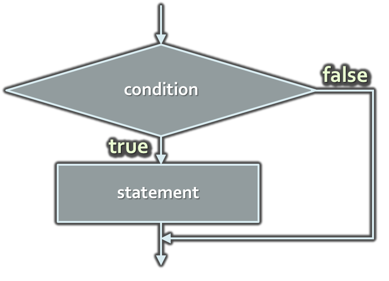
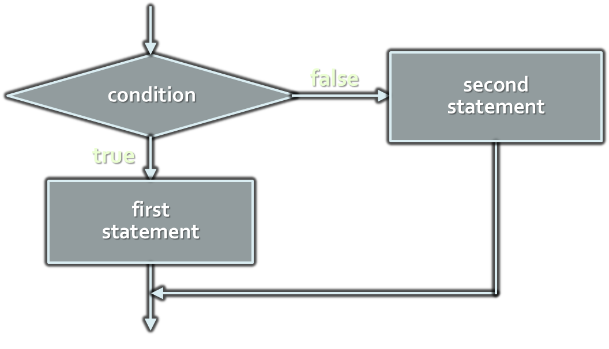

<!-- section start -->

<!-- attr: { id:'title', class:'slide-title', hasScriptWrapper:true } -->
#   Conditional Statements
##    Become master jedi of control flow
<div class="signature">
    <p class="signature-course">Java Fundamentals - Part 1</p>
    <p class="signature-initiative">Telerik Algo Academy</p>
    <a href="http://academy.telerik.com" class="signature-link">http://academy.telerik.com</a>
</div>

<!-- section start -->
<!-- attr: { id:'table-of-contents' } -->
# Table of Contents
* `if` statements
* `if-else` statements
* Nested `if-else-if` statements
* `switch-case` statements

<!-- section start -->
<!-- attr: { class:'slide-section', id:'if-statement', showInPresentation:true } -->
<!-- # The `if` Statement
##  The easiest way to use control flow -->

# The `if` Statement
* The most simple conditional statement
* Enables you to test for a condition
* Branch to different parts of the code depending on the result
* The simplest form of an `if` statement:

```java
if (condition) {
    statements;
}
```

#   Condition and Statement
*   The condition can be:
    *   **Boolean** variable
    *   **Boolean logical expression**
    *   **Comparison** expression
*   The condition cannot be integer variable (like in C / C++)
*   The statement can be:
    *   **Single statement** ending with a semicolon
    *   **Block enclosed in braces** 

<!-- attr: { hasScriptWrapper:true } -->
# How `if` works?



* The **condition is evaluated**
  * If it is `true`, the statement is **executed**
  * If it is `false`, the statement is **skipped** 

# _Example:_ `if`
* Find the bigger between two numbers:

```java
public static void main(String[] args) {
    System.out.println("Enter two numbers.");
    Scanner scanner = new Scanner(System.in);
    int biggerNumber = scanner.nextInt();
    int smallerNumber = scanner.nextInt();
    if (smallerNumber > biggerNumber) {
        biggerNumber = smallerNumber;
    }

    System.out.println(MessageFormat.format(
      "The greater number is: {0}", biggerNumber));
}
```

<!-- attr: { class:'slide-section', showInPresentation:true } -->
<!-- # The `if` Statement -->
##  [Demo]()

<!-- section start -->
<!-- attr: { class:'slide-section', id:'if-else-statement', showInPresentation:true } -->
<!-- # The `if-else` Statement
##  Fork your code -->

# The `if-else` Statement
* The `if-else` statement is more complex and useful
  * Executes one branch if the condition is true, and another if it is false 
* The simplest form of an `if-else` statement:

```java
if (expression) {
    statement1; 
} else {
    statement2; 
}
```

<!-- attr: { hasScriptWrapper:true } -->
#   How `if-else` Works?

*   The condition is evaluated
    *   If it is `true`, the **first statement is executed**
    *   If it is `false`, the **second statement is executed**

# _Example:_ `if-else`
* Check if a number if it is odd or even

```java
Scanner scanner = new Scanner(System.in);
System.out.println("Enter a number.");
int number = scanner.nextInt();

if (number % 2 == 0) {
    System.out.println("This number is even.");
}
else {
    System.out.println("This number is odd.");
}
```

<!-- attr: {class: 'slide-section', showInPresentation: true} -->
<!-- #   The `if-else` Statement -->
##  [Demo]()

<!-- section start -->
<!-- attr: { class:'slide-section', id:'nested-if-else', showInPresentation:true } -->
<!-- # Nested `if-else` Statements
##  Creating More Complex Logic -->

<!-- attr: {hasScriptWrapper: true} -->
# Nested `if-else` Statements
* `if` and `if-else` statements can be nested
  * i.e. **used inside** another `if` or `else` statement
  * Every `else` corresponds to **its closest preceding** `if`
    
```java
if (expression) {
    if (expression)  {
        statement;
    } else {
        statement;
    }
} else {
    statement;
} 
```
    
# _Example:_ Nested if Statements
* Comparing two integers: 

```java
Scanner scanner = new Scanner(System.in);
System.out.println("Enter two numbers.");
int first = scanner.nextInt();
int second = scanner.nextInt();
if (first == second) {
    System.out.println(
            "These two numbers are equal.");
}
else {
    if (first > second) {
        System.out.println(
                "The first number is bigger.");
    }
    else {
        System.out.println("The second is bigger.");
    }
}
```

<!-- attr: { class:'slide-section', showInPresentation:true } -->
<!-- # Nested `if-else` Statements -->
## [Demo]()

#   Nested if – Good Practices

*   **Always** use `{` … `}` blocks to avoid ambiguity
    *   Even when a single statement follows
*   **Avoid using more than three levels** of nested if statements
*   Put the case you **normally expect to process first**
    *   Then write the unusual cases
*   Arrange the code to make it more readable

<!-- section start -->

<!-- attr: {class: 'slide-section', id: 'if-else-if-statements', showInPresentation: true} -->
<!-- #   The `if-else-if` Statement
##  Make more than two branches -->

#   The `if-else-if` Statement
*   Java supports evaluating more than one `if` statements
    *   If the first `if` statement is `false`, evaluate the second `if` statement, etc..
    
```java
if (condition1) {
  statement1;
} else if (condition2) {
  //condition1 is false
  statement2;
} else {
  //condition1 and condition2 are false
  statement3;
}
```

# Example `if-else-if` Statement
* Check if a Latin leter is a **vowel** or **consonant**

```java
char ch = 'a';
if (ch == 'A' || ch == 'a')
{
    System.out.println("Vowel [ei]");
}
else if (ch == 'E' || ch == 'e')
{
    System.out.println("Vowel [i:]");
}
else if  …
else …
```

<!-- attr: { class:'slide-section', showInPresentation:true } -->
<!-- #   The `if-else-if` Statement -->
##  [Demo]()

<!-- section start -->
<!-- attr: { class:'slide-section', id:'switch-case', showInPresentation:true } -->
<!-- # The `switch-case` Statement
##  Make Many Comparisons at Once -->

# The `switch-case` Statement
* The `switch-case` statement **selects for execution a statement from a list** depending on the value of the switch expression 

```java
int day = scanner.nextInt();;
switch (day) {
  case 1: System.out.println("Monday"); break;
  case 2: System.out.println("Tuesday"); break;
  case 3: System.out.println("Wednesday"); break;
  case 4: System.out.println("Thursday"); break;
  case 5: System.out.println("Friday"); break;
  case 6: System.out.println("Saturday"); break;
  case 7: System.out.println("Sunday"); break;
  default: System.out.println("Error!"); break;
}
```

# How `switch-case` Works?
1.  The expression is evaluated
2.  When one of the constants specified in a case label is equal to the expression
  * The statement that corresponds to that case is executed
3.  If no case is equal to the expression
  * If there is `default` case, it is executed
  * Otherwise the control is transferred to the end point of the switch statement 

<!-- attr: { class:'slide-section', showInPresentation:true } -->
<!-- #   The `switch-case` Statement -->
##  [Demo]()

<!-- attr: { style:'font-size:0.95em' } -->
# Good Practices using `switch-case`
* There must be a separate case for every normal situation
* Put the normal case first
  * Put the most frequently executed cases first and the least frequently executed last
* Order cases alphabetically or numerically
* In default use case that cannot be reached under normal circumstances
* In Java there is a `fall through` rule if no `break`

# Fall through rule
* Print remaining months from the year

```java
switch (month) {
    case 1:  System.out.println("January");
    case 2:  System.out.println("February");
    case 3:  System.out.println("March");
    case 4:  System.out.println("April");
    case 5:  System.out.println("May");
    case 6:  System.out.println("June");
    case 7:  System.out.println("July");
    case 8:  System.out.println("August");
    case 9:  System.out.println("September");
    case 10: System.out.println("October");
    case 11: System.out.println("November");
    case 12: System.out.println("December");
    default: break;
}
```

<!-- section start -->
<!-- attr: { class:'slide-section', id:"questions" } -->
# Conditional Statements
##  Questions
