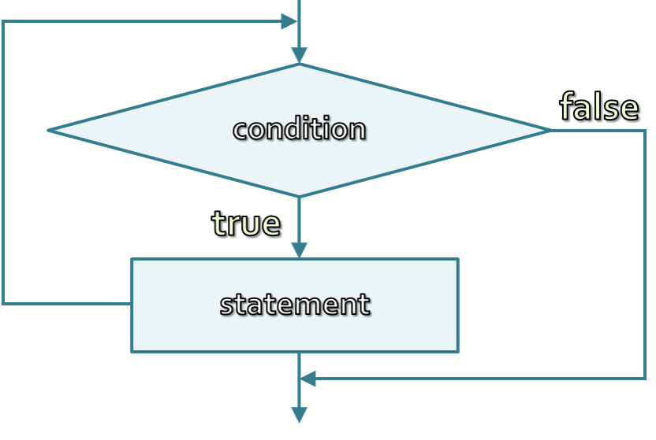
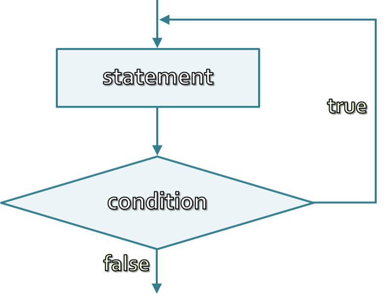

<!-- section start -->

<!-- attr: {id: 'title', class: 'slide-title', hasScriptWrapper: true} -->

# Loops
##  Repeat code over and over again

<div class="signature">
    <p class="signature-course">Java Fundamentals - Part 1</p>
    <p class="signature-initiative">Telerik School Academy</p>
    <a href="http://academy.telerik.com" class="signature-link">http://academy.telerik.com</a>
</div>

<!-- section start -->
<!-- attr: {id: 'table-of-contents'} -->
# Table of Contents

*   What is a Loop?
*   Loops in C#
    *   `while` loops
    *   `do-while` loops
    *   `for` loops
    *   `for-in` loops
*   Special loop operators
    *   `break`, `continue`, `goto`
*   Nested loops

<!-- section start -->
<!-- attr: {id: 'what-is-a-loop', class: 'slide-section'} -->
#   What is a Loop?
##    Repeat code

# What is a Loop?

*   A **loop** is a control statement that allows **repeating execution** of a block of statements
    *   May execute a code block **fixed number of times**
    *   May execute a code block **while given condition holds**
    *   May execute a code block **for each member of a collection**
*   Loops that never end are called an **infinite loops**

<!-- section start -->

<!-- attr: {class: 'slide-section'} -->
#   Using `while` Loop
##    Repeating a Statement While Given Condition Holds

#   How To Use While Loop?

*   The simplest and most frequently used loop

```java
while (condition) {
    statements;
}
```
*   The repeat condition
    *   Returns a boolean result of `true` or `false`
    *   Also called loop condition

<!-- attr: {hasScriptWrapper: true} -->
#   While Loop – How It Works?

*   The block schema of a while loop:

<div style="text-align: center">
  
</div>

#   While Loop – Example

*   _Example:_ Printing the numbers from 0 to 9:

```java
int counter = 0;
while (counter < 10) {
    Console.WriteLine("Number : {0}", counter);
    ++counter;
}
```

<!-- attr: { class: 'slide-section'} -->
#   The `while` Loop
##  Examples

#   Sum 1..N – Example

*   _Example:_ Calculate and print the sum of the **first N natural numbers**

```java
Scanner scanner = new Scanner(System.in);
int n = scanner.nextInt();
int number = 1;
int sum = 1;

System.out.print("The sum 1");
while (number < n) {
   ++number;
   sum += number;
   System.out.print("+" + number);
}
System.out.println(" = " + sum);
```

<!-- attr: { class: 'slide-section'} -->
#   Calculating Sum 1..N
##  [Demo](http://)


#   Prime Number – Example

*   _Example:_ Checking whether a number is prime or not:

```java
System.out.println("Enter a positive integer number: ");
Scanner scanner = new Scanner(System.in);

int number = scanner.nextInt();

int divider = 2;
int maxDivider = (int) Math.sqrt(number);
bool prime = true;
while (prime && (divider <= maxDivider)) {
    if (number % divider == 0) {
        prime = false;
    }
    divider++;
}
System.out.println(number + "is " + (prime?"":" not") + " prime");
```

<!-- attr: { class: 'slide-section'} -->
#   Checking Whether a Number Is Prime
##  [Demo](http://)

<!-- attr: { class: 'slide-section'} -->
#   Loop operators
##   `break`, `continue`, `goto`

#   Using break Operator

*   The `break` operator exits the **inner-most loop**
*   _Example:_ Calculate `N! = 1*2*3*....*(N-1)*N`

```java
int n = scanner.nextInt();

int result = 1;
while (true) {
    if (n == 1) {
        break;
    }

    result *= n;
    --n;
}
System.out.println("n! = " + result);
```

<!-- attr: { class: 'slide-section'} -->
#   Calculating Factorial
##  [Demo](http://)

<!-- section start -->

<!-- attr: { class: 'slide-section'} -->
#   The `do-while` Loop
##  Almost the same as `while`

#   Using do-while Loop

*   Another loop structure is:

```java
do {
    statements;
} while (condition);

```

*   The block of statements is repeated
    *   While the boolean loop condition holds
*   The loop is executed at least once

<!-- attr: { hasScriptWrapper: true} -->
#   do-while Loop - How does it works?

*   The block schema of a do-while loop:

<div style="text-align: center">
  
</div>

<!-- attr: { class: 'slide-section'} -->
#   The `do-while` loop
##  Examples

#   N Factorial – Example

*   _Example:_ Calculating N factorial (N!)

```java
String numberAsString = scanner.next();
int n = scanner.nextInt();
int factorial = 1;

do {
  factorial *= n;
  --n;
} while (n > 0);

System.out.println("n! = " + factorial);
```

<!-- attr: { class: 'slide-section'} -->
#   Calculating N! with do-while
##  [Demo](http://)

#   Product[N..M] – Example

*   Calculating the product of all numbers in the interval [n..m]:

```java
int n = scanner.nextInt()
int m = scanner.nextInt()
int number = n;
double product = 1;

do {
    product *= number;
    ++number;
} while (number <= m);

System.out.println("product[n..m] = " + product);
```

<!-- attr: { class: 'slide-section'} -->
#   Product of the Numbers in the Interval [n..m]
##  [Demo](http://)


<!-- section start -->

<!-- attr: { class: 'slide-section'} -->
#   The `for` loop
##  Repeating a fixed number of times

#   The `for` loop

*   The typical `for` loop syntax is:
```java
for (initialization; test; update) {
  statements;
}
```

*   Consists of:
    *   Initialization statement
    *   Boolean test expression
    *   Update statement
    *   Loop body block

#   The Initialization Expression

*   The initialization expression
    *   Executed once, just before the loop is entered
        *   Like it is out of the loop, before it
    *   Usually used to declare a counter variable

```java
for (int number = 0; ...; ...) {
  // Can use number here
}
// Cannot use number here
```


#   The Test Expression

*   The **test** expression
    *   Evaluated before each iteration of the loop
        *   If true, the loop body is executed
        *   If false, the loop body is skipped
    *   Used as a loop condition

```java
for (... ; number < 10; ...) {
  // Can use number here
}
// Cannot use number here
```

#   The Update Expression

*   The **update** expression
    *   Executed at each iteration after the body of the loop is finished
    *   Usually used to update the counter

```java
for (...; number < 10; ...){
  // Can use number heretar
}
// Cannot use number here
```

<!-- attr: { class: 'slide-section'} -->
#   The `for` Loop
##  Examples

#   Simple for Loop – Example

*   _Example:_ Print the numbers 0…9:

```java
for (int number = 0; number < 10; number++) {
    System.out.println(number + " ");
}
```

*   _Example:_ Calculate `n!`:

```java
int factorial = 1;
for (int i = 1; i <= n; ++i) {
  factorial *= i;
}
```

#   Complex `for` loops - Example

*   Complex for-loops could have several counter variables:

```java
for (int i=1, sum=1; i<=128; i=i*2, sum+=i) {
    System.out.println("i=" + i + ", sum=" + sum);
}
```

*   _Result:_

```java
i=1, sum=1
i=2, sum=3
i=4, sum=7
i=8, sum=15
...
```

<!-- attr: { class: 'slide-section'} -->
#   The `for` loop
##  [Demo](http://)

#   N^M – Example

*   Calculating n to power m (denoted as n^m):

```java
int n = scanner.nextInt();
int m = scanner.nextInt();
long result = 1;
for (int i = 0; i < m; i++) {
    result *= n;
}
System.out.println("n^m = " + result);
```

*   A better way to calculate N^M, than `Math.pow(n, m)`

#   Using continue Operator

*   continue operator ends the iteration of the inner-most loop
*   _Example:_ **sum** all **odd numbers** in [1, n] that are **not divisors of 7**:

```java
int n = scanner.nextInt();
int sum = 0;
for (int i = 1; i <= n; i += 2) {
   if (i % 7 == 0) {
      continue;
   }
   sum += i;
}
System.out.println("sum = " + sum);
```

<!-- attr: { class: 'slide-section'} -->
#   Using continue Operator
##  [Demo](http://)

<!-- section start  -->

<!-- attr: {class: 'slide-section'} -->
#   The `for-in` loop
##  Iterating collection

#   The `for-in` loop

*   The `for-in` loop is used to iterate collections
    *   Collections are arrays, lists, etc..
    *   Everything that inherits `Iteratable`
    *   _Example:_

```java
String[] names = {"Doncho", "Niki", "Evlogi", "Ivo", "Cuki"};
for(String name: names){
  System.out.println(name);
}
```

<!-- attr: { class: 'slide-section'} -->
#   The `for-in` loop
##  [Demo](http://)

<!-- section start -->

<!-- attr: { class: 'slide-questions'} -->
# Loops
## Questions
