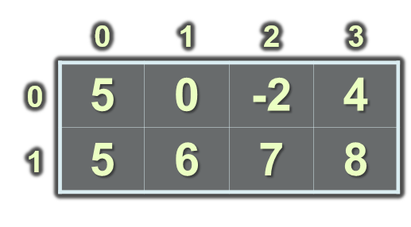
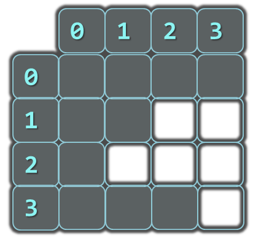
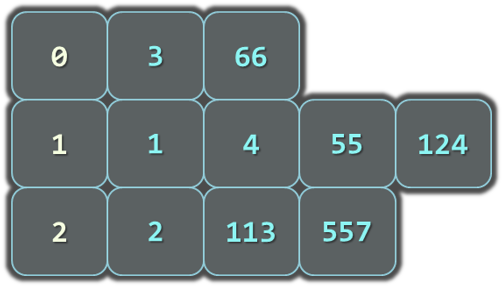

<!-- section start -->

<!-- attr: { id:'title', class:'slide-title', hasScriptWrapper:true } -->

# Arrays
##  Creating and using arrays
<div class="signature">
    <p class="signature-course">Java Fundamentals - Part 1</p>
    <p class="signature-initiative">Telerik School Academy</p>
    <a href="http://academy.telerik.com" class="signature-link">http://academy.telerik.com</a>
</div>

<!-- section start -->
<!-- attr: {id: 'table-of-contents'} -->
# Table of Contents
- Creating arrays
- Accessing Array Elements
- Iterating arrays
- One-dimensional
- Multi-dimentional arrays

<!-- section start -->
<!-- attr: { id:'', class:'slide-section', showInPresentation:true } -->
<!-- # Declaring and Creating Arrays -->

<!-- attr: { hasScriptWrapper:true } -->
# What are Arrays?
- An `array` is a sequence of elements
- All elements are of the same type
- The order of the elements is fixed
- Has fixed size (`Array.length`)


# Declaring Arrays
- Declaration defines the type of the elements
- Square brackets `[]` mean "array"
- Examples:
- Declaring array of integers:

```java
int[] myIntArray;
```
- Declaring array of strings:

```java
String[] myStringArray;
```

<!-- attr: { hasScriptWrapper:true } -->
# Creating Arrays
- Use the operator `new`
- Specify array length
  - Example creating (allocating) array of 5 integers:

```java
myIntArray = new int[5];
```


<!-- attr: { hasScriptWrapper:true } -->
# Creating and Initializing Arrays
- Creating and initializing can be done together:

```java
myIntArray = {1, 2, 3, 4, 5};
```


- The `new` operator is not required when using curly brackets initialization

# Creating Array – Example
- Creating an array that contains the names of the days of the week

```java
String[] daysOfWeek = {
    "Monday",
    "Tuesday",
    "Wednesday",
    "Thursday",
    "Friday",
    "Saturday",
    "Sunday"
};
```

<!-- section start -->
<!-- attr: { class:'slide-section' } -->
# Accessing Array Elements
##  Read and Modify Elements by Index

# How to Access Array Element?
- Array elements are accessed using the square brackets operator `[]` (indexer)
  - Array indexer takes element’s index as parameter
  - The first element has index `0`
  - The last element has index `length-1`
- Array elements can be retrieved and changed by the `[]` operator

<!-- attr: { hasScriptWrapper:true, style:'font-size:0.9em' } -->
# Creating and Accessing Array
- Creating an array to store `10` integers

```java
// declares an array of integers
int[] anArray;

// allocates memory for 10 integers
anArray = new int[10];   

anArray[0] = 100; // initialize first element
anArray[1] = 200; // initialize second element
anArray[2] = 300; // and so forth..

System.out.println("Element at index 0: " + anArray[0]);
System.out.println("Element at index 1: " + anArray[1]);
System.out.println("Element at index 2: " + anArray[2]);
```


# Reversing an Array – Example
- Reversing the contents of an array

```java
int[] array = new int[] { 1, 2, 3, 4, 5 };

// Get array size
int length = array.length;

// Declare and create the reversed array
int[] reversed = new int[length];
        
// Initialize the reversed array
for (int index = 0; index < length; index++) {
    reversed[length - 1 - index] = array[index];
}
```

<!-- attr: { class:'slide-section' } -->
# Arrays: Input and Output
##  Reading and Printing Arrays on the Console

<!-- attr: { style:'font-size:0.9em' } -->
# Reading Arrays From the Console
- First, read from the console the length of the array

```java
Scanner scanner = new Scanner(System.in);
int n = scanner.nextInt();
```
- Next, create the array of given size and read its elements in a `for` loop


```java
int[] arr = new int[n];
for (int i = 0; i < n; i++) {
   arr[i] = scanner.nextInt();
}
```

<!-- attr: { hasScriptWrapper:true } -->
# Symmetry Check – Example
- Read `int` array from the console and check if it is symmetric:


```java
boolean isSymmetric = true;
for (int i=0; i < array.length / 2; i++) {
    if (array[i] != array[n - 1 - i]) {
        isSymmetric = false;
    }
}
```

<!-- attr: { class:'slide-section table-of-contents', showInPresentation:true } -->
<!-- # Symmetry Check -->
## [Demo]()

# Printing Arrays on the Console
- Process all elements of the array
- Print each element to the console
- Separate elements with white space or a new line

```java
String[] array = { "one", "two", "three" };

// Process all elements of the array
for (int index = 0; index < array.length; index++) {
    // Print each element on a separate line
    System.out.println(MessageFormat.format(
      "element[{0}] = {1}", index, array[index]));
}
```

<!-- attr: { class:'slide-section table-of-contents', showInPresentation:true } -->
<!-- # Printing Arrays -->
## [Demo]()

<!-- section start -->
<!-- attr: { id:'', class:'slide-section' } -->
# Iterating arrays
##  Processing Array Elements Using `for` and `foreach`

# Processing Arrays: `for` Statement
- Use `for` loop to process an array when
  - Need to keep track of the index
  - Processing is strictly sequential from the first to the last element
- In the loop body use the element at the loop index (`array[index]`)

```java
for (int index = 0; index < array.length; index++) {
   squares[index] = array[index] * array[index];
}
```

<!-- attr: { style:'font-size:0.95em' } -->
# Processing Arrays Using `for` Loop – Examples
- Printing array of integers in reversed order:

```java
int[] array = { 1, 2, 3, 4, 5 };
System.out.println("Reversed: ");
for (int i = array.length - 1; i >= 0; i--) {
    System.out.print(array[i] + " ");
} // Result: 5 4 3 2 1
```
- Initialize all array elements with their corresponding index number:

```java
for (int index = 0; index < array.length; index++) {
    array[index] = index;
}
```

# Processing Arrays: `for-each`
- How `for-each` loop works?

```java
foreach (type value : array)
```
- - `type` – the type of the element
  - `value` – local name of variable
  - `array` – processing array
- Used when no indexing is needed
  - All elements are accessed one by one
  - Elements can not be modified (read only)

# Processing Arrays Using `foreach` – Example
- Print all elements of a `String[]` array

```java
String[] capitals = {
    "Sofia",
    "Washington",
    "London",
    "Paris"
};
for (String capital : capitals) {
    System.out.println(capital);
}
```

<!-- attr: { class:'slide-section table-of-contents' } -->
# Processing Arrays
##  [Demo]()

<!-- section start -->
<!-- attr: { id:'', class:'slide-section', showInPresentation:true } -->
<!-- # Resizable Arrays
##  `ArrayList` -->

<!-- attr: { hasScriptWrapper:true, style:'font-size:0.9em' } -->
# `ArrayList`
- `ArrayList<T>` – array that can resize dynamically
  - When adding or removing elements
  - `T` is the type that the list will hold
    - Has to be a reference type (`class`)
    - E.g. `ArrayList<Integer>` will hold integers
    - `ArrayList<Object>` will hold objects
- Basic methods and properties
  - `add(T element)` – adds new element to the end
  - `get(index)` - get the element at that index
  - `remove(index)` – removes the element at that index 
  - `remove(element)` – removes the element 
  - `size()` – returns the current size of the list

<!-- attr: { hasScriptWrapper:true } -->
# `ArrayList<T>` Example
```java
ArrayList<Integer> intList = new ArrayList();
for (int i = 0; i < 5; i++) {
   intList.add(i);
}
```
- Is the same as

```java
int[] intArray = new int[5];
for( int i = 0; i < 5; i++) {
   intArray[i] = i;
}
```
- The main difference
  - When using lists we don't have to know the exact number of elements

<!-- attr: { style:'font-size:0.85em' } -->
# `ArrayLists` vs. `Arrays`
- Lets have an array with capacity of 5 elements

```java
int[] intArray = new int[5];
```
- If we want to add a sixth element (we have already added 5) we have to manually resize

```java
int[] copyArray = intArray;
int[] intArray = new int[6];
for (int i = 0; i < 5; i++) {
   intArray[i] = copyArray[i];
}
intArray[5] = newValue;
```
- With `ArrayList<T>` we simply call

```java
list.add(newValue);
```

<!-- attr: { class:'slide-section table-of-contents', showInPresentation:true } -->
<!-- # ArrayList -->
##  [Demo]()

<!-- section start -->
<!-- attr: { id:'', class:'slide-section', showInPresentation:true } -->
<!-- # The `Arrays` class
##  Copying and Sorting arrays -->

<!-- attr: { style:'font-size:0.8em' } -->
# Copying Arrays
- Sometimes we must `copy` the values from one array to another one
- If we do it the intuitive way we would copy not only the values but the reference to the array
- Changing some of the values in one array will affect the other

```java
int[] copyArray = array;
```
- The way to avoid this is using `clone()`

```java
int[] copyArray = array.clone();
```
- This way only the values will be copied but not the reference

<!-- attr: { class:'slide-section table-of-contents', showInPresentation:true } -->
<!-- # Copying Arrays -->
##  [Demo]()

# Sorting Arrays
- Using the `Arrays.sort()` method

```java
// initializing unsorted int array
int iArr[] = {2, 1, 9, 6, 4};

// let us print all the elements available in list
for (int number : iArr) {
    System.out.println("Number = " + number);
}

// sorting array
Arrays.sort(iArr);

System.out.println("The sorted int array is:");
for (int number : iArr) {
    System.out.println("Number = " + number);
}
```

<!-- attr: { class:'slide-section table-of-contents', showInPresentation:true } -->
<!-- # Sorting Arrays -->
##  [Demo]()

<!-- section start -->
<!-- attr: { id:'', class:'slide-section', showInPresentation:true } -->
<!-- # Multidimensional Arrays
##  Matrices and Jagged arrays -->

<!-- attr: { hasScriptWrapper:true } -->
# Matrices 
- **Multidimensional arrays** have more than one dimension (2, 3, …)
  - The most important multidimensional arrays are the 2-dimensional
    - Known as **matrices** or **tables**
- Example of matrix of integers with 2 rows and 4 columns:



<!-- attr: { style:'font-size:0.9em' } -->
# Declaring and Creating Multidimensional Arrays
- Declaring multidimensional arrays:

```java
int[][] intMatrix;
float[][] floatMatrix;
String[][][] strCube;

```
- Creating a multidimensional array
- Use new keyword
- Must specify the size of each dimension

```java
int[][] intMatrix = new int[3][4];
float[][] floatMatrix = new float[8][2];
String[][][] stringCube = new String[5][5][5];

```

<!-- attr: { style:'font-size:0.9em' } -->
# Initializing Multidimensional Arrays with Values
- Creating and initializing with values multidimensional array:

```java
int[][] matrix = 
{
    {1, 2, 3, 4}, // row 0 values
    {5, 6, 7, 8}, // row 1 values
}; // The matrix size is 2 x 4 (2 rows, 4 cols)

```
- Matrices are represented by a list of rows
  - Rows consist of list of values
- The first dimension comes first, the second comes next (inside the first)

<!-- attr: { hasScriptWrapper:true, style:'font-size:0.9em' } -->
# Accessing The Elements of Multidimensional Arrays
- Accessing N-dimensional array element:

`nDimensionalArray[index`<sub>`1`</sub>`][ … ][index`<sub>`n`</sub>`]`
- Getting element value example:

```java
int[][] array = {{1, 2}, {3, 4}};
int element11 = array[1][1]; // element11 = 4
```
- Setting element value example:

```java
int[][] array = new int[3][4];
for (int row = 0; row < array.length; row++)
  for (int col = 0; col < array[row].length; col++)
    array[row][col] = row + col;
```

# Reading a Matrix
- Reading a matrix from the console

```java
Scanner scanner = new Scanner(System.in);
int rows = scanner.nextInt();
int cols = scanner.nextInt();
int[][] matrix = new int[rows][columns];
for (int row = 0; row < rows; row++)
{
  for (int column = 0; column < cols; column++)
  {
    System.out.println(MessageFormat.format(
        "matrix[{0}][{1}] = ", row, column));
    matrix[row][column] = scanner.nextInt();
  }
}
```

# Printing a Matrix
- Printing a matrix to the console

```java
int[][] matrix = {
        {1, 2, 3, 4},
        {5, 6, 7, 8},
        {9, 10, 11, 12},
        {13, 14, 15, 16}};

for (int i = 0; i < matrix.length; i++) {
    int[] ints = matrix[i];
    System.out.print("| ");
    for (int j = 0; j < ints.length; j++) {
        int anInt = ints[j];
        System.out.print(String.format("%s | ", anInt));
    }
    System.out.println();
}
```

<!-- attr: { hasScriptWrapper:true } -->
# Jagged arrays
- Jagged arrays are like multidimensional arrays
  - But each dimension has different size
  - A jagged array is array of arrays
  - Each of the arrays has different length
- How to create jagged array?

<div style="width:60%">
```java
int[][] jagged = new int[3][];
jagged[0] = new int[3];
jagged[1] = new int[2];
jagged[2] = new int[5];
```
</div>


# Initialization of Jagged Arrays
- When creating jagged arrays
  - Initially the array is created of `null` arrays
  - Need to initialize each of them

```java
int[][] jagged = new int[n][];
for (int i = 0; i < n; i++) {
   jagged[i] = new int[i];
}
```

<!-- attr: { hasScriptWrapper:true } -->
# Example of Jagged Arrays
- Check a set of numbers and group them by their remainder when dividing to 3 (0, 1 and 2)
- Example: `0, 1, 4, 113, 55, 3, 1, 2, 66, 557, 124, 2`
- First we need to count the numbers
  - Done with a iteration
- Make jagged array with appropriate sizes
- Each number is added into its jagged array




<!-- attr: { hasScriptWrapper:true } -->
# Example of Jagged Arrays

```java
int[] numbers = {0,1,4,113,55,3,1,2,66,557,124,2};
int[] sizes = new int[3];
int[] offsets = new int[3];
foreach (var number in numbers)
{
   int remainder = number % 3;
   sizes[remainder]++;
}
int[][] numbersByRemainder = new int[3][] { 
  new int[sizes[0]], new int[sizes[1]],
  new int[sizes[2]] };
foreach (var number in numbers)
{
   int remainder = number % 3; 
   int index = offsets[remainder];
   numbersByRemainder[remainder][index] = number;
   offsets[remainder]++;
}
```


<!-- section start -->
<!-- attr: { id:'questions', class:'slide-section', showInPresentation:true } -->
<!-- # Questions
## Arrays -->
