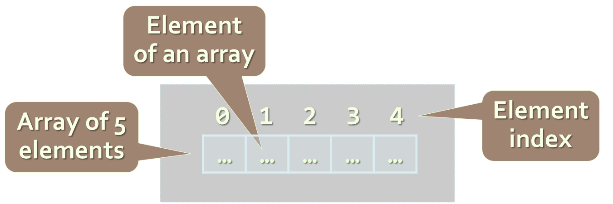
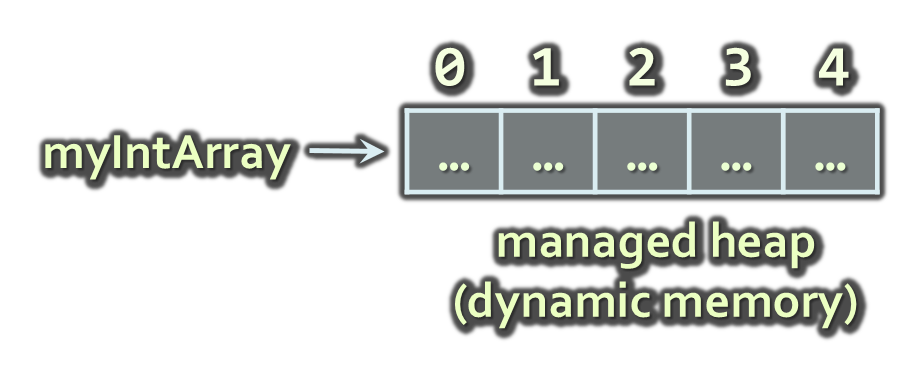
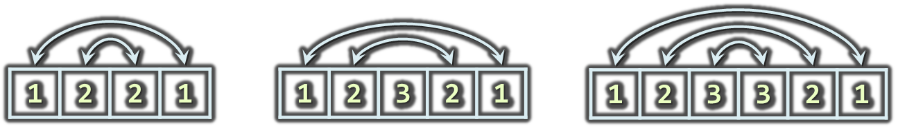

<!-- section start -->

<!-- attr: { id:'title', class:'slide-title', hasScriptWrapper:true } -->

# Arrays
##  Creating and using arrays
<div class="signature">
    <p class="signature-course">Java Fundamentals - Part 1</p>
    <p class="signature-initiative">Telerik School Academy</p>
    <a href="http://academy.telerik.com" class="signature-link">http://academy.telerik.com</a>
</div>

<!-- section start -->
<!-- attr: {id: 'table-of-contents'} -->
# Table of Contents
- Creating arrays
- Accessing Array Elements
- Iterating arrays
- One-dimensional
- Multi-dimentional arrays

<!-- section start -->
<!-- attr: { id:'', class:'slide-section', showInPresentation:true } -->
<!-- # Declaring and Creating Arrays -->

<!-- attr: { hasScriptWrapper:true } -->
# What are Arrays?
- An `array` is a sequence of elements
- All elements are of the same type
- The order of the elements is fixed
- Has fixed size (`Array.length`)



# Declaring Arrays
- Declaration defines the type of the elements
- Square brackets [] mean "array"
- Examples:
- Declaring array of integers:

```java
int[] myIntArray;
```
- Declaring array of strings:

```java
String[] myStringArray;
```

<!-- attr: { hasScriptWrapper:true } -->
# Creating Arrays
Use the operator new
Specify array length
Example creating (allocating) array of 5 integers:

```java
myIntArray = new int[5];
```



<!-- attr: { hasScriptWrapper:true } -->
# Creating and Initializing Arrays
- Creating and initializing can be done together:

```java
myIntArray = {1, 2, 3, 4, 5};
```


- The `new` operator is not required when using curly brackets initialization

# Creating Array – Example
- Creating an array that contains the names of the days of the week

```java
String[] daysOfWeek = {
    "Monday",
    "Tuesday",
    "Wednesday",
    "Thursday",
    "Friday",
    "Saturday",
    "Sunday"
};
```

<!-- section start -->
<!-- attr: { class:'slide-section' } -->
# Accessing Array Elements
##  Read and Modify Elements by Index

# How to Access Array Element?
- Array elements are accessed using the square brackets operator `[]` (indexer)
  - Array indexer takes element’s index as parameter
  - The first element has index `0`
  - The last element has index `length-1`
- Array elements can be retrieved and changed by the `[]` operator

<!-- attr: { hasScriptWrapper:true, style:'font-size:0.9em' } -->
# Creating and Accessing Array
- Creating an array to store `10` integers

```java
// declares an array of integers
int[] anArray;

// allocates memory for 10 integers
anArray = new int[10];   

anArray[0] = 100; // initialize first element
anArray[1] = 200; // initialize second element
anArray[2] = 300; // and so forth..

System.out.println("Element at index 0: " + anArray[0]);
System.out.println("Element at index 1: " + anArray[1]);
System.out.println("Element at index 2: " + anArray[2]);
```


# Reversing an Array – Example
- Reversing the contents of an array

```java
int[] array = new int[] { 1, 2, 3, 4, 5 };

// Get array size
int length = array.length;

// Declare and create the reversed array
int[] reversed = new int[length];
        
// Initialize the reversed array
for (int index = 0; index < length; index++) {
    reversed[length-index-1] = array[index];
}
```

<!-- attr: { class:'slide-section' } -->
# Arrays: Input and Output
##  Reading and Printing Arrays on the Console

<!-- attr: { style:'font-size:0.9em' } -->
# Reading Arrays From the Console
- First, read from the console the length of the array

```java
Scanner scanner = new Scanner(System.in);
int n = scanner.nextInt();
```
- Next, create the array of given size and read its elements in a for loop


```java
int[] arr = new int[n];
for (int i = 0; i < n; i++) {
   arr[i] = scanner.nextInt();
}
```

<!-- attr: { hasScriptWrapper:true } -->
# Symmetry Check – Example
- Read `int` array from the console and check if it is symmetric:




```java
boolean isSymmetric = true;
for (int i=0; i < array.length / 2; i++) {
    if (array[i] != array[n - i - 1]) {
        isSymmetric = false;
    }
}
```

<!-- attr: { class:'slide-section table-of-contents', showInPresentation:true } -->
<!-- # Symmetry Check -->
## [Demo]()

# Printing Arrays on the Console
Process all elements of the array
Print each element to the console
Separate elements with white space or a new line

```java
String[] array = { "one", "two", "three" };

// Process all elements of the array
for (int index = 0; index < array.length; index++) {
    // Print each element on a separate line
    System.out.println(MessageFormat.format(
      "element[{0}] = {1}", index, array[index]));
}
```

<!-- attr: { class:'slide-section table-of-contents', showInPresentation:true } -->
<!-- # Printing Arrays -->
## [Demo]()

<!-- section start -->
<!-- attr: { id:'', class:'slide-section' } -->
# Iterating arrays
##  Processing Array Elements Using for and foreach

# Processing Arrays: for Statement
- Use `for` loop to process an array when
  - Need to keep track of the index
  - Processing is not strictly sequential from the first to the last element
- In the loop body use the element at the loop index (`array[index]`)

```java
for (int index = 0; index < array.length; index++) {
   squares[index] = array[index] * array[index];
}
```

<!-- attr: { style:'font-size:0.95em' } -->
# Processing Arrays Using `for` Loop – Examples
- Printing array of integers in reversed order:

```java
int[] array = { 1, 2, 3, 4, 5 };
System.out.println("Reversed: ");
for (int i = array.length-1; i >= 0; i--) {
    System.out.println(array[i] + " ");
} // Result: 5 4 3 2 1
```
- Initialize all array elements with their corresponding index number:

```java
for (int index = 0; index < array.length; index++) {
    array[index] = index;
}
```

# Processing Arrays: `for-each`
- How `for-each` loop works?

```java
foreach (type value : array)
```
- - `type` – the type of the element
  - `value` – local name of variable
  - `array` – processing array
- Used when no indexing is needed
  - All elements are accessed one by one
  - Elements can not be modified (read only)

# Processing Arrays Using `foreach` – Example
- Print all elements of a `String[]` array

```java
String[] capitals = {
    "Sofia",
    "Washington",
    "London",
    "Paris"
};
for (String capital : capitals) {
    System.out.println(capital);
}
```

<!-- attr: { class:'slide-section table-of-contents' } -->
# Processing Arrays
##  [Demo]()

<!-- section start -->
<!-- attr: { id:'', class:'slide-section' } -->
# Resizable Arrays
##  `ListArray`

<!-- section start -->
<!-- attr: { id:'', class:'slide-section' } -->
# 
##  

<!-- section start -->
<!-- attr: { id:'', class:'slide-section' } -->
# 
##  

<!-- section start -->
<!-- attr: { id:'questions', class:'slide-section', showInPresentation:true } -->
<!-- # Questions
## Arrays -->
