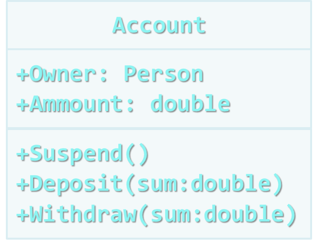
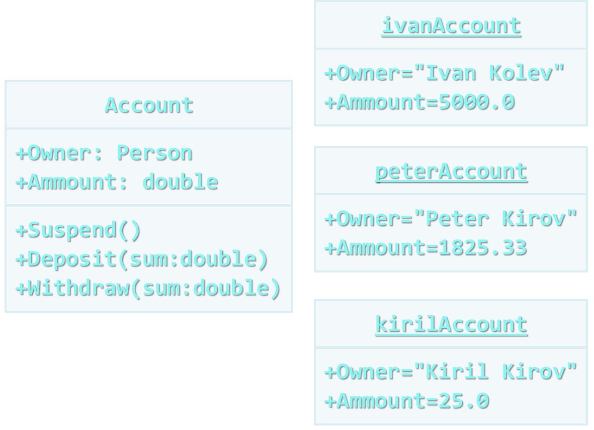

<!-- section start -->
<!-- attr: { class:'slide-title', hasScriptWrapper:true } -->
# Creating and using Objects
## Using the Standard Java Framework Classes

<div class="signature">
    <p class="signature-course">Java OOP</p>
    <p class="signature-initiative">Telerik School Academy</p>
    <a href="http://academy.telerik.com" class="signature-link">http://academy.telerik.com</a>
</div>


<!-- section start -->
<!-- attr: { class:'table-of-contents', showInPresentation:true } -->
# Table of Contents
* Classes and Objects
  * What are Objects?
  * What are Classes?
* Classes in Java
* Packages
  * What are packages

<!-- attr: { class:'table-of-contents', showInPresentation:true } -->
<!-- # Table of Contents -->
* Packages
  * java.lang
    * java.lang.Object
    * java.lang.Class
    * java.lang.String
    * java.lang.Math
  * java.util
    * java.util.Random
    * java.util.ArrayList
    * java.util.HashMap
  * java.time.LocalTime


<!-- section start -->
<!-- attr: { class:'slide-section', showInPresentation:true, hasScriptWrapper:true, style:'' } -->
<!-- # Classes and Objects
## Modeling Real-world Entities with Objects -->

# What are Objects?
* Software objects model real-world objects or abstract concepts
  * _Examples_: 
    * bank, account, customer, dog, bicycle, queue 
* Real-world objects have **states** and **behaviors**
  * _Examples_: 
    * Account states: 
      * holder, balance, type
    * Account behaviors: 
      * withdraw, deposit, suspend

<!-- attr: { showInPresentation:true } -->
<!-- # What are Objects? -->
* How do software objects implement real-world objects?
  * Use variables/data to implement states
  * Use methods/functions to implement behaviors
* An object is a software bundle of variables and related methods

<!-- attr: { hasScriptWrapper:true } -->
# What is a Class?
* The formal definition of `class`:
<div class="box">
`Classes` act as templates from which an instance of an object is created at run time. Classes define the **properties** of the object and the **methods** used to control the object's behavior.
</div>
  * Definition by Google

# Classes
* Classes provide the structure for objects
  * Define their prototype, act as template
* Classes define:
  * Set of **attributes**
    * Represented by **variables**
    * Hold their **state**
  * Set of actions (**behavior**)
    * Represented by **methods**
* A class defines the methods and types of data associated with an object


<!-- attr: { showInPresentation:true, hasScriptWrapper:true } -->
<!-- # Classes -->

<div>
  
  <div class="fragment">
    <div class="balloon" style="width:130px; top:25%; left:40%">Class Name</div>
    <div class="balloon" style="width:240px; top:42%; left:60%">Attributes<br/>(Properties and Fields)</div>
    <div class="balloon" style="width:120px; top:58%; left:60%">Operations<br/>(Methods)</div>
  </div>
</div>

# Objects
* An **object** is a concrete **instance** of a particular class 
* Creating an object from a class is called **instantiation**
* Objects have state
  * Set of values associated to their attributes
  * _Example_:
    * Class: `Account`
    * Objects: Ivan's account, Peter's account

<!-- attr: { showInPresentation:true, hasScriptWrapper:true } -->
<!-- # Objects -->

<div>
  
  <div class="fragment">
    <div class="balloon" style="width:60px; top:27%; left:34%">Class</div>
    <div class="balloon" style="width:70px; top:18%; left:78%">Object</div>
    <div class="balloon" style="width:70px; top:44%; left:78%">Object</div>
    <div class="balloon" style="width:70px; top:72%; left:78%">Object</div>
  </div>
</div>

<!-- section start -->
<!-- attr: { class:'slide-section', showInPresentation:true, hasScriptWrapper:true, style:'' } -->
<!-- # Classes in Java
## Using Classes and their Class Members -->

# Classes in Java
* Classes – basic units that compose programs
* Implementation is `encapsulated` (hidden) 
* Classes in Java can contain:
  * Fields (member variables)
  * Methods
  * Constructors
  * Inner types
  * Etc. (events, …)

<!-- attr: { showInPresentation:true } -->
<!-- # Classes in Java -->
* _Example_ of classes:
  * `java.lang.String`
  * `java.lang.Object`
  * `java.lang.Integer`
  * `java.lang.Math`
  * `java.util.ArrayList`
  * `java.util.Random`
  * `java.time.LocalTime`
  * `java.time.LocalDate`

# Declaring Objects
* An instance of a class can be defined like any other variable:

```java
using java.time.LocalDateTime;
...
// Define two variables of type LocalDateTime
LocalDateTime today; 
LocalDateTime halloween;
```

* Instances cannot be used if they are not initialized

```java
// Declare and initialize an instance
LocalDateTime today = LocalDateTime.now();
```


<!-- section start -->
<!-- attr: { class:'slide-section', showInPresentation:true, hasScriptWrapper:true, style:'' } -->
<!-- # Packages
## Organizing Classes Logically into packages -->

# What are packages
* Packages are used to organize the source code into more logical and manageable way
* Packages can contain
  * Classes
  * Interfaces and other types
  * Other packages
* _Example_:
  * `java` packages contains `util` packages
  * The name of the nested packages is `java.util`

# Full Class Names
* A full name of a class is the name of the class preceded by the name of its package
* Example:
  * `ArrayList` class, defined in the `java.util` package
  * The full name of the class is `java.util.ArrayList`

<!-- attr: { hasScriptWrapper:true, style:'font-size:0.85em' } -->
# Including packages
* The `import` directive in Java:

```java
import <namespace_name>
```
* Allows using types in a packages, without specifying their full name
  * Example:

```java
import java.util.*;
...
ArrayList list;
```
  * instead of

```java
java.util.ArrayList list
```

<!-- section start -->
<!-- attr: { class:'slide-section', showInPresentation:true } -->
# java.lang

# java.lang.Object

# java.lang.Class

# java.lang.String

# java.lang.Math


<!-- section start -->
<!-- attr: { class:'slide-section', showInPresentation:true } -->
# java.util

# java.util.Random

# java.util.ArrayList

# java.util.HashMap

<!-- section start -->
<!-- attr: { class:'slide-section', showInPresentation:true } -->
<!-- # java.time -->

# java.time.LocalTime

# java.time.LocalDateTime


<!-- section start -->
<!-- attr: { id:'questions', class:'slide-section' } -->
# Questions
## Defining Classes
[link to Telerik Academy Forum](http://telerikacademy.com/Forum/Category/12/telerik-school-academy)