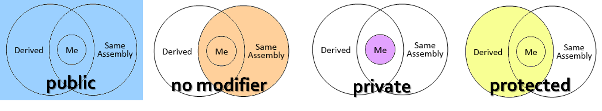
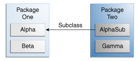
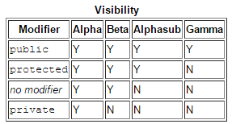

<!-- section start -->
<!-- attr: { class:'slide-title', hasScriptWrapper:true } -->
# Defining Classes
##  Classes, Fields, Constructors, Methods, Properties
<div class="signature">
    <p class="signature-course">Java OOP</p>
    <p class="signature-initiative">Telerik School Academy</p>
    <a href="http://academy.telerik.com" class="signature-link">http://academy.telerik.com</a>
</div>


<!-- section start -->
# Table of Contents
* Defining Simple Classes
* Fields
* Access Modifiers
* Using Classes and Objects
* Constructors
* Methods
* Properties
* Keeping the Object State


<!-- section start -->
<!-- attr: { class:'slide-section' } -->
# Defining Simple Classes
<!-- attr: { showInPresentation:true, style:'' } -->
# Classes in OOP
* `Classes` model real-world objects and define
  * `Attributes` (state, properties, fields)
  * `Behavior` (methods, operations)
* **Classes** describe the **structure** of objects
  * **Objects** describe particular **instance** of a class
* **Properties** hold information about the modeled object relevant to the problem
* **Operations** implement object behavior

<!-- attr: { showInPresentation:true, style:'' } -->
# Classes in Java
* Classes in Java can have `members`:
  * Fields, constants, methods, properties, events, constructors, destructors, …
  * Inner types (inner classes, interfaces, delegates, ...)
* Members can have access modifiers (scope)
  * `public`, `private`, `protected`
* Members can be
  * `static` (common) or `specific` for a given object

<!-- attr: { showInPresentation:true, hasScriptWrapper:true, style:'' } -->
# Simple Class Definition

```java
public class Cat extends Animal {
    private String name;
    private String owner;

    public Cat(String name, String owner) {
        this.name = name;
        this.owner = owner;
    }

    public String getName() {
        return this.name;
    }

    public void setName(String name) {
        this.name = name;
    }
    ...
```
<div class="fragment balloon" style="width:250px; top:11%; left:10%">Begin of class definition</div>
<div class="fragment balloon" style="width:230px; top:16%; left:55%">Inherited (base) class</div>
<div class="fragment balloon" style="width:65px; top:23%; left:43%">Fields</div>
<div class="fragment balloon" style="width:120px; top:39%; left:46%">Constructor</div>
<div class="fragment balloon" style="width:70px; top:54%; left:49%">Getter</div>
<div class="fragment balloon" style="width:70px; top:70%; left:62%">Setter</div>


<!-- attr: { showInPresentation:true, hasScriptWrapper:true, style:'' } -->
# Simple Class Definition

```java
    ...
    public String getOwner() {
        return this.owner;
    }

    public void setOwner(String owner) {
        this.owner = owner;
    }

    public String MakeSound() {
        return "Miauuuuuu!";
    }
}
```
<div class="fragment2 balloon" style="width:150px; top:54%; left:52%">Method</div>
<div class="fragment2 balloon" style="width:230px; top:67%; left:9%">End of class definition</div>

# Class Definition and Members
* `Class definition `consists of:
  * Class declaration
  * Extended/Inherited class or `implemented` interfaces
  * Fields (static or not)
  * Constructors (static or not)
  * Properties (static or not)
  * Methods (static or not)
  * Events, inner types, etc.

<!-- section start -->
<!-- attr: { class:'slide-section', showInPresentation:true } -->
<!-- # Fields
##  Defining and Using Data Fields -->

<!-- attr: { hasScriptWrapper:true } -->
# Fields
* `Fields` are member variables in a class
* Field declarations are composed of three components, in order:
  1. Zero or more modifiers, such as `public` or `private`
  2. The field's type - `int`, `String`,...
  3. The field's name - `name`, `age`,...

<!-- attr: { hasScriptWrapper:true } -->
# Fields
* Fields hold the internal object state
  * Can be `static` or per instance
  * Can be `private` / `public` / `protected` / …

```java
class Dog {
   private String name;
   private String breed;
   private int age;
   protected Color color;
}
```
<div class="fragment balloon" style="width:190px; top:52%; left:43%">Field declarations</div>

<!-- attr: { style:'font-size:0.95em' } -->
# Static Fields
* Variables that are common to all objects
* Fields with `static` modifier are called **static fields** or **class variables**
* Every instance of the class shares a class variable

```java
public class Bicycle {
    public static int numberOfBicycles = 0;    
}
```
* Usage

```java
  Bicycle.numberOfBicycles

```


# Constant Fields
* Constants are values that cannot be reassigned
  * Results in a compile-time error
* Use the `static` modifier, in combination with the `final` modifier
  * The `final` modifier indicates that the value of this field cannot change

```java
class Math {
    public static final double PI = 3.141592653589793;    
}
```

<!-- attr: { class:'slide-section demo', showInPresentation:true } -->
<!-- # Fields -->
## [Demo]()

<!-- section start -->
<!-- attr: { class:'slide-section', showInPresentation:true } -->
<!-- # Access Modifiers
## Public, Private, Protected -->

# Access Modifiers
* Class members can have access modifiers
* Restrict the access to them from outer sources
* Class members can be:
  * `public` – accessible from **any** class
  * `protected` – accessible within its **own package** and by a **subclass** in another package
  * _`no modifier`_ - **package-private** (default)
  * `private` – accessible **only** from the class itself

# Access Modifiers
* Supports the OOP principle "`encapsulation`"
  * It is common to make **fields** `private`
    * This means that they can only be directly accessed from the class
  * We still need access to these values
    * This can be done indirectly by adding public methods that **get**/**set** the field values

<!-- attr: { showInPresentation:true, hasScriptWrapper:true } -->
<!-- # Access Modifiers -->





# The '`this`' Keyword
* The keyword `this` inside a method points to the current instance of the class
* _Example_:

```java
class Dog {
   private String name;
  
   public String getName() {
      return this.name;
      // The same like "return name;"
   }
}
```

<!-- attr: { class:'slide-section demo', showInPresentation:true } -->
<!-- # Access Modifiers -->
## [Demo]()


<!-- section start -->
<!-- attr: { class:'slide-section', showInPresentation:true } -->
<!-- # Methods
## Defining, Overloading and Invoking Methods -->

<!-- attr: { style:'font-size:0.95em' } -->
# Methods
* Method declarations have six components:
  1. Modifiers - `public`, `private` and others
  2. The **return** type - the data type of the value returned
    * `void` if the method does not return a value
  3. The method name
  4. The parameter list in parenthesis
    * A comma-delimited list of input parameters
      * Preceded by their data types
    * Enclosed by parentheses `()`
  5. An exception list - to be discussed later
  6. The method body
    * Enclosed between braces - the method's code

# Methods
* `Methods` are class members that execute some action (some code, some algorithm)
  * Could be `static` / per instance
  * Could be `public` / `private` / `protected` / …

```java
public class Point {
  private int xCoord;
  private int yCoord;

  public double calcDistance(Point p) {
    return Math.sqrt(
      (p.xCoord - this.xCoord) * (p.xCoord - this.xCoord)
      + (p.yCoord - this.yCoord) * (p.yCoord - this.yCoord));
  }
}
```

# Overloading Methods
* Java can distinguish between methods with different method signatures
  * This is called **method overloading**
* Methods within a class can have the same name if they have **different parameter** lists
* Methods are differentiated by the **number** and the **type** of the **arguments** passed
  * You **cannot declare** more than one method with the **same name** and the **same number** and **type** of arguments


# Overloading Methods
```java
public class DataArtist {
    ...
    public void draw(String s) {
        ...
    }
    public void draw(int i) {
        ...
    }
    public void draw(double f) {
        ...
    }
    public void draw(int i, double f) {
        ...
    }
}
```

# Using Methods
* Invoking instance methods is done through the object (class instance):

```java
class TestMethods {
  static void main(String[] args) {
    Point p1 = new Point(2, 3);
    Point p2 = new Point(3, 4);
    System.out.println(p1.calcDistance(p2));
  }
}
```

<!-- attr: { class:'slide-section demo', showInPresentation:true } -->
<!-- # Methods -->
## [Demo]()

<!-- section start -->
<!-- attr: { class:'slide-section' } -->
# Getters and Setters

<!-- attr: { class:'slide-section demo', showInPresentation:true } -->
<!-- # Getters and Setters -->
## [Demo]()


<!-- section start -->
<!-- attr: { class:'slide-section', showInPresentation:true } -->
<!-- # Constructors -->

# What is a Constructor?
* `Constructors` are special methods
  * Invoked at the time of `creating a new instance` of an object
  * Used to initialize the fields of the instance
* Constructors has the same name as the class
  * Have no return type
  * Can have parameters
  * Can be `private`, `protected`, `public`

<!-- attr: { style:'font-size:0.95em' } -->
# Defining Constructors
* Class `Point` with parameterless constructor:

```java
public class Point {
   private int xCoord;
   private int yCoord;

   // Simple parameterless constructor
   public Point() { 
      this.xCoord = 0;
      this.yCoord = 0;
   }
   // More code …
} 
```
* Invoking

```java
Point myPoint = new Point();
```

<!-- attr: { hasScriptWrapper:true, style:'font-size:0.95em' } -->
# Defining Constructors

```java
public class Person {
    private string name;
    private int age;

    // Parameterless constructor
    public Person() {
        this.name = null;
        this.age = 0;
    }

    // Constructor with parameters
    public Person(string name, int age) {
        this.name = name;
        this.age = age;
    }
    // More code …
} 

```
<div class="fragment balloon" style="width:210px; top:60%; left:63%">As rule constructors should initialize all own class fields.</div>

<!-- attr: { style:'font-size:0.95em' } -->
# Constructors and Initialization
* Pay attention when using inline initialization!

```java
public class AlarmClock {
   private int hours = 9; // Inline initialization
   private int minutes = 0; // Inline initialization

   // Parameterless constructor (intentionally left empty)
   public AlarmClock() { }

   // Constructor with parameters
   public AlarmClock(int hours, int minutes) {
      this.hours = hours;      // Invoked after the inline 
      this.minutes = minutes;  // initialization!
   }
   // More code …
}
```

# Chaining Constructors Calls
* Reusing constructors (chaining)

```cs
public class Point {
    private int xCoord;
    private int yCoord;
	
    public Point() { 
        this(0, 0); // Reuse the constructor
    }

    public Point(int xCoord, int yCoord) {
        this.xCoord = xCoord;
        this.yCoord = yCoord;
    }
    // More code …
} 
```

<!-- attr: { class:'slide-section demo', showInPresentation:true } -->
<!-- # Constructors -->
## [Demo]()

<!-- section start -->
<!-- attr: { class:'slide-section' } -->
# Using Classes and Objects


<!-- section start -->
<!-- attr: { class:'slide-section' } -->
# Keeping the Object State

<!-- section start -->
<!-- attr: { style:'font-size:0.95em' } -->
# Summary
* Classes define specific structure for objects
  * Objects are particular instances of a class
* Classes define fields, methods, constructors and other members
  * Access modifiers limit the access to class members
* Constructors are invoked when creating new class instances and initialize the object's internal state
* Getters and setters expose the class data in safe, controlled way

<!-- section start -->
<!-- attr: { class:'slide-title', showInPresentation:true, hasScriptWrapper:true, style:'' } -->

<!-- section start -->
<!-- attr: { id:'questions', class:'slide-section' } -->
# Questions
## Defining Classes
[link to Telerik Academy Forum](http://telerikacademy.com/Forum/Category/12/telerik-school-academy)