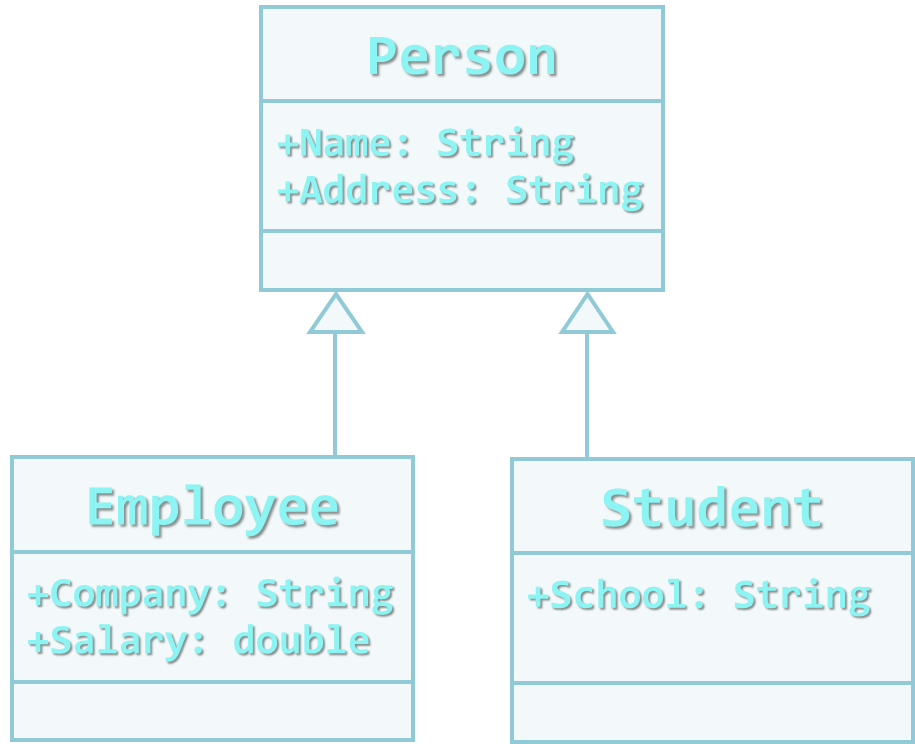
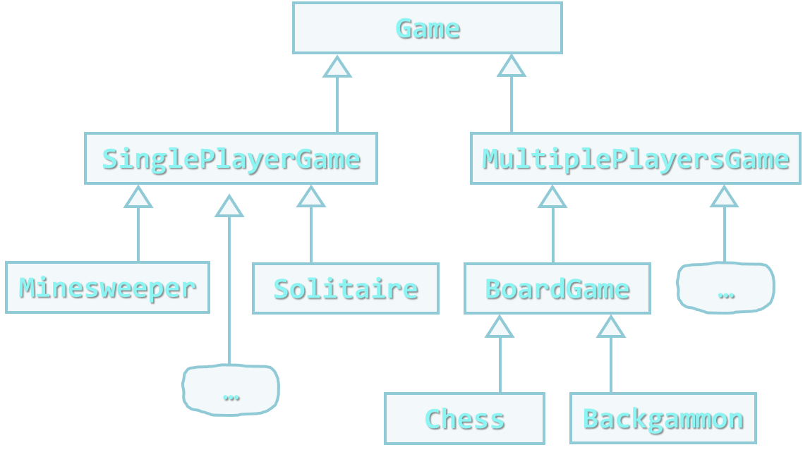
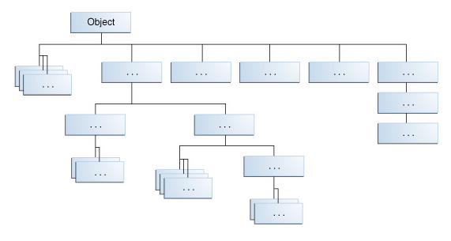

<!-- section start -->

<!-- attr: { class:'slide-title', hasScriptWrapper:true } -->
# Inheritance
## OOP Fundamental Principles
<div class="signature">
    <p class="signature-course">Java OOP</p>
    <p class="signature-initiative">Telerik School Academy</p>
    <a href="http://academy.telerik.com" class="signature-link">http://academy.telerik.com</a>
</div>


<!-- section start -->

<!-- attr: { class:'table-of-contents' } -->
# Table of Contents
* Inheritance - OOP principle
  * Inheritance in Java
  * Defining Inheritance
* Casting Objects
* Encapsulation
* 

<!-- section start -->

<!-- attr: { class:'slide-section', showInPresentation:true } -->
<!-- # Inheritance -->

<!-- attr: { style:'font-size:0.9em' } -->
# Inheritance
* `Inheritance` allows classes to be derived from other classes
* `subclass` `inherit` the characteristics of an existing `superclass`
  * Attributes (**fields**)
  * Operations (**methods**)
* Child class can extend the parent class
  * Add **new fields and methods**
  * **Redefine methods** (modify existing behavior)
* A class can `implement` an interface by providing implementation for all its methods


<!-- attr: { hasScriptWrapper:true } -->
# Types of Inheritance


# Inheritance
* `Inheritance` implicitly gains `all members` from another class
  * All fields, methods, events, …
  * Some members could be inaccessible (hidden)
* The class whose methods are inherited is called **superclass** (`base`, `parent` class)
* The class that gains new functionality is called **subclass**(`derived`, `child` class)

# Inheritance – Benefits
* Inheritance has a lot of benefits
  * Extensibility 
  * Reusability (`code reuse`)
  * Provides abstraction
  * Eliminates redundant code
* Use inheritance for buidling `is-a` relationships
  * E.g. dog `is-a` animal (dogs are kind of animals)
* Don't use it to build `has-a` relationship
  * E.g. dog `has-a` name (dog is not kind of name)

<!-- attr: { showInPresentation:true, hasScriptWrapper:true } -->
<!-- # Inheritance -->
* Example



<div class="fragment balloon" style="width:150px; top:19%; left:40%">Base class</div>
<div class="fragment balloon" style="width:150px; top:59%; left:22%">Derived class</div>
<div class="fragment balloon" style="width:150px; top:59%; left:60%">Derived class</div>

<!-- attr: { showInPresentation:true, hasScriptWrapper:true, style:'font-size:0.90em' } -->
# Class Hierarchies
* Classes can be derived from classes that are derived from classes that are derived from classes, and so on
* `Inheritance` leads to a **hierarchies** of <br/>`classes` and/or `interfaces` in an application:



<!-- section start -->

<!-- attr: { class:'slide-section', showInPresentation:true } -->
<!-- # Inheritance in Java -->

<!-- attr: { hasScriptWrapper:true } -->
# Inheritance in Java
* Every class has one and only one direct **superclass** (single inheritance)
  * Every class is implicitly a subclass of `Object`
* A class can implement several interfaces

```java
ArrayList<E> extends AbstractList<E>
  implements List<E>, RandomAccess, Cloneable, Serializable
```
* An interface can implement several interfaces

```java
List<E> extends Collectoin<E>
```

<!-- attr: { hasScriptWrapper:true } -->
# Java Platform Class Hierarchy
* In the Java platform, many classes derive directly from `Object`
  * Other classes derive from some of those classes
  * Forming a hierarchy of classes


<!-- attr: { class:'slide-section', showInPresentation:true } -->
<!-- # How to Define Inheritance? -->

# How to Define Inheritance?
* Specify the name of the base class after the name of the derived using keyword `extends`

```java
public class Shape { … }

public class Circle extends Shape { … }

```
* Use the keyword `super` to invoke the parent constructor

```java
public Circle (int x, int y) { 
  super(x);
}

```

<!-- attr: { class:'slide-section demo', showInPresentation:true } -->
<!-- # Inheritance in Java -->
## [Demo]()


<!-- section start -->

<!-- attr: { class:'slide-section', showInPresentation:true } -->
<!-- # Inheritance: Important Aspects -->

<!-- attr: { style:'font-size:0.9em' } -->
# What you can do in a `subclass`
* Write a **subclass constructor** that invokes the constructor of the superclass, either implicitly or by using the keyword `super`
* Fields
  * The **inherited fields** can be used directly, just like any other fields
  * You can **declare a field** in the subclass with the **same name** as the one in the superclass, thus **hiding it** (not recommended).
  * You can **declare new fields** in the subclass that are not in the superclass

<!-- attr: { showInPresentation:true, style:'font-size:0.9em' } -->
<!-- # What You can do in a Subclass -->
* Methods
  * The **inherited methods** can be used directly as they are
  * You can write a **new instance method** in the subclass that has the **same signatur**e as the one in the superclass, thus **overriding it**
  * You can write a **new static method** in the subclass that has the **same signature** as the one in the superclass, thus **hiding it**
  * You can declare **new methods** in the subclass that are not in the superclass

<!-- attr: { style:'font-size:0.9em' } -->
# Private Members in a Superclass
* A `subclass` does not inherit the private members of its `parent class`
  * If the **superclass** has `public` or `protected` methods for accessing its `private fields`, these can also be used by the **subclass**
* A `nested class` has access to all the private members of its enclosing class (fields and methods)
  * A `public` or `protected` nested class inherited by a subclass has indirect access to all of the private members of the superclass.

<!-- attr: { class:'slide-section demo', showInPresentation:true } -->
<!-- # What you can do in a `subclass` -->
## [Demo]()

# Inheritance: Important Aspects
* If **C** is derived from **B**, and **B** is derived from **A**, then **C** inherits **A** as well
  * Inheritance is **transitive** relation
* `Circle` is descended from `Shape` and `Object`
  * `Circle` **is a** `Shape` and **is an** `Object`
* The reverse is not necessarily true:
  * `Shape` may be a `Circle`, but it isn't necessarily
  * `Object` may be a `Shape` or a `Circle`, but it isn't necessarily

```java
Object obj = new Circle();
```

<!-- attr: { showInPresentation:true, style:'font-size:0.95em' } -->
<!-- # Casting Objects -->
```java
Circle myShape = obj;
```
* Will cause a compile-time error
  * `obj` is not known to the compiler to be a `Circle`
* `explicit casting`:

```java
Circle myShape = (Circle)obj;
```
* If `obj` is not a `Circle` at runtime, an exception will be thrown

```java
if (obj instanceof Circle) {
    Circle myShape = (Circle)obj;
}
```


<!-- section start -->

<!-- attr: { class:'slide-section', showInPresentation:true } -->
<!-- # Encapsulation -->

# Encapsulation
* Encapsulation hides the implementation details
* Class announces some operations (methods) available for its clients – its `public interface`
* All data members (fields) of a class should be hidden
  * Accessed via properties (read-only and read-write)
* No interface members should be hidden
 
# Encapsulation principles
* Fields are always declared `private`
  * Accessed through `getters`/`setters` in read-only or read-write mode
* Constructors are almost always declared `public`
* Interface methods are always `public`
  * Not explicitly declared with `public`
* Non-interface methods are declared `private`/`protected`

# Benefits of Encapsulation
* Ensures that structural changes remain local:
  * Changing the class internals does not affect any code outside of the class
  * Changing methods' implementation does not reflect the clients using them
* Encapsulation allows adding some logic when accessing client's data
  * E.g. `validation` on modifying a property value
* Hiding implementation details reduces complexity &rarr; easier maintenance


<!-- attr: { class:'slide-section demo', showInPresentation:true } -->
<!-- # Encapsulation -->
## [Demo]()


<!-- section start -->

<!-- attr: { class:'slide-section', showInPresentation:true } -->
<!-- # Nested classes -->

# Nested classes
* The Java programming language allows you to define a **class within another class**
  * Such a class is called a **nested class**

```java
class OuterClass {
    ...
    static class StaticNestedClass {
        ...
    }
    class InnerClass {
        ...
    }
}
```

<!-- attr: { style:'font-size:0.95em' } -->
# Nested classes
* Two categories of nested classes
  * `Non-static nested classes` (inner classes) have access to other members of the enclosing class
    * Even if they are declared private
  * `Static nested classes` do not have access to other members of the enclosing class
* A nested class can be declared
  * **private**, **public**, **protected**, or _**package private**_
* Outer classes can only be declared
  * **public** or _**package private**_

<!-- attr: { style:'font-size:0.95em' } -->
# Why Use Nested Classes?
* Reasons for using nested classes:
  * Logically grouping classes used in one place
    * If a class is useful to only one other class
  * It can lead to more readable and maintainable code
    * Nesting small classes within top-level classes places the code closer to where it is used
  * It increases encapsulation
  * Only nested classes can be declared `static`

<!-- attr: { class:'slide-section demo', showInPresentation:true } -->
<!-- # Nested classes -->
## [Demo]()


<!-- section start -->

<!-- attr: { id:'questions', class:'slide-section' } -->
# Questions
## Defining Classes
[link to Telerik Academy Forum](http://telerikacademy.com/Forum/Category/12/telerik-school-academy)