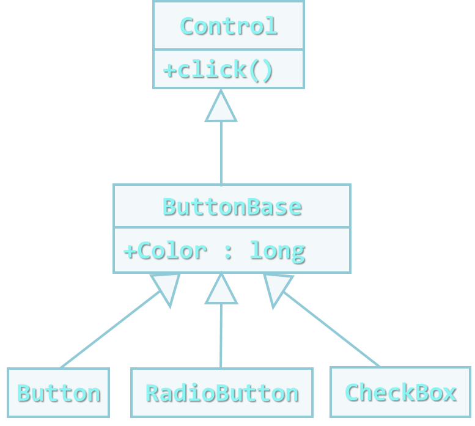

<!-- section start -->
<!-- attr: { class:'slide-title', hasScriptWrapper:true } -->
# Interfaces, virtual and abstract <br/>classes and methods
<div class="signature">
    <p class="signature-course">Java OOP</p>
    <p class="signature-initiative">Telerik School Academy</p>
    <a href="http://academy.telerik.com" class="signature-link">http://academy.telerik.com</a>
</div>


<!-- section start -->
<!-- attr: { class:'table-of-content', showInPresentation:true, hasScriptWrapper:true, style:'' } -->
# Table of Contents
* Abstraction
* Abstract and virtual methods
* Interfaces
  * Default methods
  * Static methods
* Abstract classes


<!-- section start -->
<!-- attr: { class:'slide-section', showInPresentation:true, hasScriptWrapper:true, style:'' } -->
# Abstraction

<!-- attr: { hasScriptWrapper:true, style:'' } -->
# Abstraction
* `Abstraction` means ignoring irrelevant features, properties, or functions and emphasizing the relevant ones ...

* ... relevant to the given project
  * With an eye to future reuse in similar projects
* Abstraction helps `managing complexity`

<!-- attr: { showInPresentation:true, style:'' } -->
<!-- # Abstraction -->
* Abstraction is something we do every day
  * Looking at an object, we see those things about it that have meaning to us
  * We **abstract the properties of the object**, and keep only what we need
  * E.g. students get "name" but not "color of eyes"
* Allows us to represent a complex reality in terms of a simplified model
* Abstraction **highlights the properties of an entity that we need** and hides the others

<!-- attr: { showInPresentation:true, hasScriptWrapper:true, style:'' } -->
# Abstraction in OOP
* In object-oriented programming (Java, C#) abstraction is achieved in several ways:
  * Abstract classes 
  * Interfaces
  * Inheritance




<!-- section start -->
<!-- attr: { class:'slide-section', showInPresentation:true, hasScriptWrapper:true, style:'' } -->
<!-- # Abstract and virtual methods -->

# Abstract and virtual methods
* An abstract method is a method that is declared without an implementation
  * Without braces, and followed by a semicolon

```java
abstract void moveTo(double deltaX, double deltaY);
```
* If a class includes abstract methods, then the class itself must be declared abstract

```java
public abstract class GraphicObject {
   // declare fields
   // declare nonabstract methods
   abstract void draw();
}
```

<!-- attr: { class:'slide-section demo', showInPresentation:true } -->
<!-- # Abstract and virtual methods -->
## [Demo]()


<!-- section start -->
<!-- attr: { class:'slide-section', showInPresentation:true, hasScriptWrapper:true, style:'' } -->
<!-- # Interfaces -->

# Interfaces
* An `interface` defines a set of operations (methods) that given object should perform
  * Also called "`contract`" for providing a set of operations
  * Defines **abstract behavior**
* Interfaces provide abstractions
  * You invoke the abstract actions
  * Without worrying how it is internally implemented

# Interfaces
* In Java an `interface` is a reference type
  * Similar to a `class`
* Can contain only
  * **constants**, **method signatures**, **nested types**
  * **default methods**, **static methods**
    * Method bodies exist only for default methods and static methods
* Interfaces **cannot be instantiated**
  * They can only be `implemented` by classes or `extended` by other interfaces

# Defining an Interface
* An interface declaration consists of:
  1. Modifiers
  2. The keyword `interface`
  3. The interface name
  4. A comma-separated list of parent interfaces
    * Optional
  5. The interface body

```java
public interface GroupedInterface
    extends Interface1, Interface2, Interface3 {
    ... // interface body
}
```

<!-- attr: { style:'font-size:0.9em' } -->
# The Interface Body
* The interface body can contain:
  1. `abstract` methods
    * Followed by a semicolon `;`
    * No braces `{}`
  2. `default` methods
    * defined with the `default` modifier
  3. `static` methods
    * defined with the `static` modifier
* All `abstract`, `default`, and `static` methods in an interface are implicitly `public`
* All **constant** values defined in an interface are implicitly `public`, `static`, and `final`

<!-- attr: { showInPresentation:true } -->
<!-- # The Interface Body -->
```java
public interface GroupedInterface
    extends Interface1, Interface2, Interface3 {
    // constant declarations    
    // base of natural logarithms
    double E = 2.718282;
 
    // method signatures
    void doSomething (int i, double x);
    int doSomethingElse(String s);

    default boolean didItWork(int i, double x, String s) {
      // Method body 
    }

    static ZoneId getZoneId (String zoneString) {
      // Method body
    }
}
```

<!-- attr: { class:'slide-section' } -->
# Interfaces
## Default and Static Methods

# Default and Static Methods
* Default methods enable you to add **new functionality** to the interfaces of your libraries and ensure binary **compatibility** with code written for **older versions** of those interfaces

<!-- attr: { showInPresentation:true } -->
<!-- # Defailt and Static Methods -->
* Having the `interface`

```java
public interface TimeClient {
    void setTime(int hour, int minute, int second);
    void setDate(int day, int month, int year);
    void setDateAndTime(int day, int month, int year,
                         int hour, int minute, int second);
    LocalDateTime getLocalDateTime();
}
```

* We want to add the method

```java
ZonedDateTime getZonedDateTime(String zoneString);
```

<!-- attr: { showInPresentation:true, style:'font-size:0.90em' } -->
<!-- # Defailt and Static Methods -->
* Instead of adding an abstract method we can add a default method
  * This way we do not break any existing implementations

```java
static ZoneId getZoneId (String zoneString) {
  try {
    return ZoneId.of(zoneString);
  } catch (DateTimeException e) {
    System.err.println("Invalid time zone: " + zoneString +
      "; using default time zone instead.");
    return ZoneId.systemDefault();
  }
}
    
default ZonedDateTime getZonedDateTime(String zoneString) {
    return ZonedDateTime.of(getLocalDateTime(), getZoneId(zoneString));
}
```

<!-- attr: { class:'slide-section demo', showInPresentation:true } -->
<!-- # Interfaces -->
## [Demo]()


<!-- section start -->
<!-- attr: { class:'slide-section', showInPresentation:true, hasScriptWrapper:true, style:'' } -->
<!-- # Abstract classes -->

# Abstract classes
* An `abstract class` is a class that is declared abstract
  * It may or may not include `abstract` methods
* Abstract classes **cannot be instantiated**, but they can be subclassed
* When an abstract class is subclassed, the **subclass usually provides implementations** for all of the `abstract` methods in its parent class
  * If it does not, then the **subclass** must also be declared `abstract`


<!-- attr: { class:'slide-section demo', showInPresentation:true } -->
<!-- # Abstract classes -->
## [Demo]()


<!-- section start -->
<!-- attr: { id:'questions', class:'slide-section' } -->
# Questions
## Virtual and abstract classes and methods
[link to Telerik Academy Forum](http://telerikacademy.com/Forum/Category/12/telerik-school-academy)