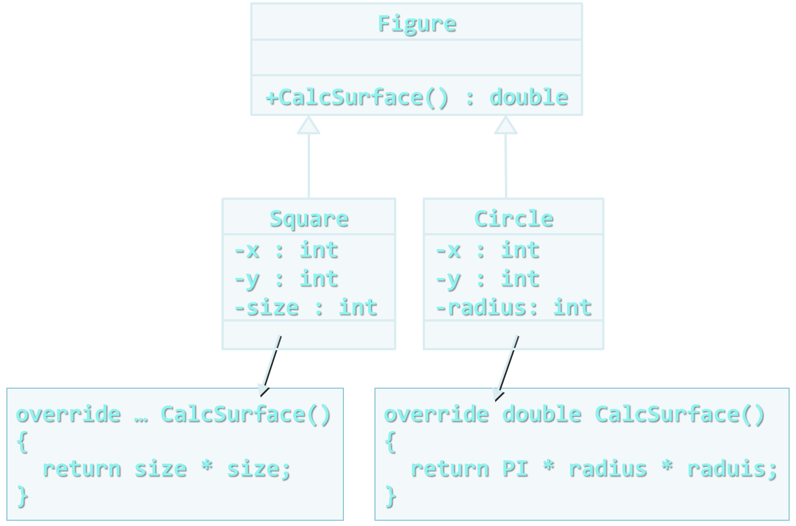

<!-- section start -->
<!-- attr: { class:'slide-title', hasScriptWrapper:true } -->
# Polymorphism
<div class="signature">
    <p class="signature-course">Java OOP</p>
    <p class="signature-initiative">Telerik School Academy</p>
    <a href="http://academy.telerik.com" class="signature-link">http://academy.telerik.com</a>
</div>


<!-- section start -->
<!-- attr: { class:'slide-sectoin', showInPresentation:true, hasScriptWrapper:true, style:'' } -->
# Table of Contents
* Polymorphism
* Real world example
<!-- * Cohesion and Coupling -->


<!-- section start -->
<!-- attr: { class:'slide-section', showInPresentation:true, hasScriptWrapper:true, style:'' } -->
# Polymorphism

# Polymorphism
* `Polymorphism` = ability to `take more than one form` (objects have more than one type)
  * A class can be used through its parent interface
  * A child class may override some of the behaviors of the parent class
* Polymorphism allows `abstract operations` to be defined and invoked
  * Abstract operations are defined in the base class' interface and implemented in the child classes
    * Declared as `abstract` or `virtual`

<!-- attr: { showInPresentation:true, hasScriptWrapper:true, style:'' } -->
<!-- # Polymorphism -->
* Why handle an object of given type as object of its base type?
  * To invoke `abstract operations`
  * To mix different related types in the same collection
    * E.g. `List<object>` can hold anything
  * To pass more specific object to a method that expects a parameter of a more generic type
  * To declare a more generic field which will be initialized and "specialized" later

# How Polymorphism works?
* `Polymorphism` ensures that the appropriate method of the subclass is called through its base class interface
* Polymorphism is implemented using a technique called `late method binding`
  * The exact method to be called is determined at `runtime`, just before performing the call
  * Applied for all `abstract` / `virtual` methods
* _Note_: Late binding is a bit slower than normal (early) binding

<!-- attr: { showInPresentation:true, hasScriptWrapper:true, style:'' } -->
<!-- # Polymorphism -->


<div class="fragment">
  <div class="balloon" style="width:150px; top:20%; left:20%">Abstract class</div>
  <div class="balloon" style="width:170px; top:33%; left:68%">Abstract action</div>

  <div class="balloon" style="width:160px; top:47%; left:15%">Concrete class</div>
  <div class="balloon" style="width:160px; top:47%; left:68%">Concrete class</div>

  <div class="balloon" style="width:180px; top:69%; left:7%">Overriden action</div>
  <div class="balloon" style="width:180px; top:69%; left:73%">Overriden action</div>
</div>

<!-- attr: { showInPresentation:true, hasScriptWrapper:true, style:'' } -->
<!-- # Polymorphism -->
```java
public abstract class Figure {
  public abstract double calcSurface();
}
```

```java
public class Square extends Figure {
  @Override
  public double calcSurface() {
    return this.side * this.side;
  }
}
```
```java
public class Circle extends Figure {
  @Override
  public double calcSurface() {
    return this.radius * this.radius * Math.PI;
  }
}
```

<!-- attr: { class:'slide-section demo', showInPresentation:true } -->
<!-- # Polymorphism -->
## [Demo]()


<!-- section start -->
<!-- attr: { class:'slide-section', showInPresentation:true } -->
<!-- # Class Hierarchies
## Real World Example -->

<!-- attr: { hasScriptWrapper:true } -->
# Real World Example: Calculator
* Creating an application like the Windows Calculator
  * Typical scenario for applying the object-oriented approach


<!-- attr: { showInPresentation:true, style:'' } -->
<!-- # Real World Example: Calculator -->
* The calculator consists of controls:
  * Buttons, panels, text boxes, menus, check boxes, radio buttons, etc.
* Class `Control` – the root of our OO hierarchy
  * All controls can be painted on the screen
    * Should implement an interface `IPaintable` with a method `paint()`
  * Common properties: location, size, text, face color, font, background color, etc.

<!-- attr: { showInPresentation:true, style:'' } -->
<!-- # Real World Example: Calculator -->
* Some controls could contain other (nested) controls inside (e. g. panels and toolbars)
  * We should have class `Container` that extends `Control` holding a collection of child controls
* The `Calculator` itself is a `Form`
  * `Form` is a special kind of `Container`
  * Contains also border, title (`text` derived from `Control`), icon and system buttons 
* How the `Calculator` paints itself?
  * Invokes `paint() `for all child controls inside it

<!-- attr: { showInPresentation:true, style:'' } -->
<!-- # Real World Example: Calculator -->
* How a `Container` paints itself?
  * Invokes `paint()` for all controls inside it
  * Each control knows how to visualize itself
* What is the common between buttons, check boxes and radio buttons?
  * Can be pressed
  * Can be selected
* We can define class `AbstractButton` and all buttons can derive from it

<!-- attr: { hasScriptWrapper:true, style:'' } -->
# Calculator Classes 


<!-- section start -->
<!-- attr: { id:'questions', class:'slide-section' } -->
# Questions
## Polymorphism
[link to Telerik Academy Forum](http://telerikacademy.com/Forum/Category/12/telerik-school-academy)