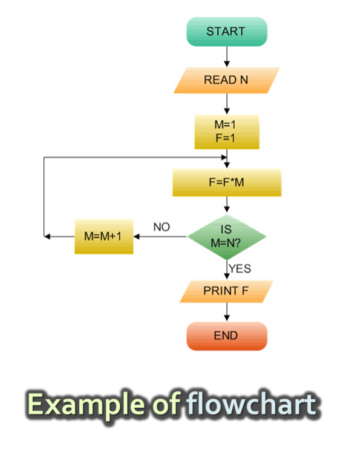
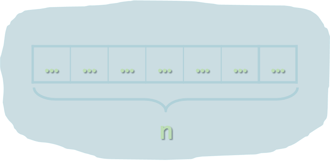
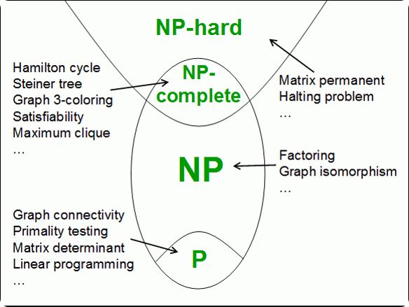

<!-- section start -->
<!-- attr: { class:'slide-title', showInPresentation:true, hasScriptWrapper:true, style:'' } -->
# Data Structures and Algorithms
## Overview of Data Structures and Algorithms
## Computational Complexity
## Asymptotic Notation
<div class="signature">
    <p class="signature-course">Java DSA</p>
    <p class="signature-initiative">Telerik School Academy</p>
    <a href="http://academy.telerik.com" class="signature-link">http://academy.telerik.com</a>
</div>


<!-- section start -->
<!-- attr: { id:'table-of-contents', class:'table-of-contents' } -->
# Table of Contents
- Data Structures Overview
  - Linear Structures, Trees, Hash Tables, Others
- Algorithms Overview
  - Sorting and Searching
  - Combinatorics
  - Dynamic Programming
  - Graphs
- Algorithms Complexity
  - Time and Memory Complexity
  - Mean, Average and Worst Case
  - Asymptotic Notation `O(g)`

<!-- section start -->
<!-- attr: { id:'', class:'slide-section', showInPresentation:true, hasScriptWrapper:true } -->
# Data Structures
##  Introduction

<!-- attr: { hasScriptWrapper:true } -->
# What is a Data Structure?
<div class="box">
  "In computer science, a _data structure_ is a particular way of storing and organizing data in a computer so that it can be used efficiently."
  <div>-- Wikipedia</div>
</div>

- Examples of data structures:
  - `Person` structure (first name + last name + age)
  - Array of integers – `int[]`
  - List of strings – `List<String>`
  - Queue of people – `Queue<Person>`

<!-- attr: { style:'font-size:0.9em' } -->
# Why are Data Structures so Important?
- `Data structures` and `algorithms` are the foundation of computer programming
- Algorithmic thinking, problem solving and data structures are vital for software engineers
  - All Java developers should know when to use `T[]`, `LinkedList<T>`, `List<T>`, `Stack<T>`, `Queue<T>`, `Map<K,T>`, `HashSet<T>`, `TreeMap<K,V>` and `SortedSet<T>`
- `Computational complexity` is important for algorithm design and efficient programming

# Primitive Types and Collections
- Primitive data types
  - Numbers: `int`, `float`, `double`, …
  - Text data: `char`, `String`, …
- Simple structures
  - A group of fields stored together
  - E.g. `LocalDateTime`, `Point`, `Rectangle`, …
- Collections
  - A set of elements (of the same type)
  - E.g. array, list, stack, tree, hash-table, …

# Abstract Data Types (ADT)
- `An Abstract Data Type (ADT)` is
  - A data type together with the operations, whose properties are specified independently of any particular implementation
  - ADT are set of definitions of operations
    - Like the interfaces in Java
- ADT can have multiple different `implementations`
  - Different implementations can have different efficiency, inner logic and resource needs

# Basic Data Structures
- Linear structures
  - Lists: fixed size and variable size
  - Stacks: LIFO (Last In First Out) structure
  - Queues: FIFO (First In First Out) structure
- Trees and tree-like structures
  - Binary, ordered search trees, balanced, B-trees, etc.
- Maps (dictionaries)
  - Contain pairs (key, value)
  - Hash tables: use hash functions to search/insert

<!-- attr: { showInPresentation:true, style:'font-size:0.95em' } -->
<!-- # Basic Data Structures -->
- Sets and bags
  - Set – collection of unique elements
  - Bag – collection of non-unique elements
- Ordered sets, bags and dictionaries
- Priority queues / heaps
- Special tree structures
  - Suffix tree, interval tree, index tree, trie
- Graphs
  - Directed / undirected
  - Weighted / un-weighted
  - Connected / non-connected, …

<!-- section start -->
<!-- attr: { id:'algorithms', class:'slide-section', showInPresentation:true, hasScriptWrapper:true } -->
# Algorithms
##  Introduction

<!-- attr: { hasScriptWrapper:true, style:'font-size:0.9em' } -->
# What is an Algorithm?
<div class="box">
  "In mathematics and computer science, an _algorithm_ is a step-by-step procedure for calculations. An algorithm is an effective method expressed as a finite list of well-defined instructions for calculating a function.”
  <div>-- Wikipedia</div>
</div>
- The term "algorithm" comes from the 
  - Derived from `Muḥammad Al-Khwārizmī`, a Persian mathematician and astronomer
    - An algorithm for solving quadratic equations

<!-- attr: { style:'font-size:0.95em' } -->
# Algorithms in Computer Science
- Algorithms are fundamental in programming
  - Imperative (traditional) programming means to `describe in formal` steps how to do something
  - Algorithm == sequence of operations (steps)
    - Can include branches (conditional blocks) and repeated logic (loops)
- Algorithmic thinking (mathematical thinking, logical thinking, engineering thinking)
  - Ability to decompose the problems into formal sequences of steps (algorithms)

<!-- attr: { hasScriptWrapper:true } -->
# Pseudocode and Flowcharts  
- Algorithms can be expressed in pseudocode, through flowcharts or program code

<div style="width:50%; font-size:0.8em">
```java
BFS(node) 
{
  queue <- node
  while queue not empty
    v <- queue
    print v
    for each child c of v
      queue <- c
}
```
Example of `pseudocode`
</div>


# Algorithms in Programming
- Sorting and searching
- Dynamic programming
- Graph algorithms
  - DFS and BFS traversals
- Combinatorial algorithms
  - Recursive algorithms
- Other algorithms
  - Greedy algorithms, computational geometry, randomized algorithms, genetic algorithms

<!-- section start -->
<!-- attr: { id:'algorithm-complexity', class:'slide-section', showInPresentation:true, hasScriptWrapper:true, style:'font-size:1em' } -->
# Algorithm Complexity
## Asymptotic Notation ##

# Algorithm Analysis
- Why we should analyze algorithms?
  - Predict the resources the algorithm requires
    - Computational time (CPU consumption)
    - Memory space (RAM consumption)
    - Communication bandwidth consumption
  - The `running time` of an algorithm is:
    - The total number of primitive operations executed (machine independent steps)
    - Also known as `algorithm complexity`

# Algorithmic Complexity
- What to measure?
  - CPU Time
  - Memory
  - Number of steps
  - Number of particular operations
    - Number of disk operations
    - Number of network packets
  - Asymptotic complexity

# Time Complexity
- `Worst-case`
  - An upper bound on the running time for any input of given size
- `Average-case`
  - Assume all inputs of a given size are equally likely
- `Best-case`
  - The lower bound on the running time (the optimal case)

<!-- attr: { hasScriptWrapper:true } -->
# Time Complexity – Example
- Sequential search in a list of size `n`
  - Worst-case:
    - `n` comparisons
  - Best-case:
    - `1` comparison
  - Average-case:
    - `n/2` comparisons
- The algorithm runs in linear time
  - Linear number of operations



<!-- attr: { hasScriptWrapper:true } -->
# Algorithms Complexity
- `Algorithm complexity` is a rough estimation of the number of steps performed by given computation depending on the size of the input data
  - Measured through `asymptotic notation`
    - `O(g)` where `g` is a function of the input data size
  - Examples:
    - Linear complexity `O(n)` – all elements are processed once (or constant number of times)
    - Quadratic complexity `O(n`<sup>`2`</sup>`)` – each of the elements is processed `n` times

<!-- attr: { hasScriptWrapper:true, style:'font-size:0.9em' } -->
# Asymptotic Notation: Definition
- Asymptotic upper bound
  - O-notation (Big O notation)
- For given function `g(n)`, we denote by `O(g(n))` the set of functions that are different than `g(n)` by a constant

<div class="box">
`O(g(n))` = {`f(n)`: there exist positive constants `c` and `n`<sub>`0`</sub> such that `f(n) <= c*g(n)` for all `n>=n`<sub>`0`</sub>}
</div>
- Examples:
  - 3 * n<sup>2</sup> + n/2 + 12 ∈ O(n<sup>2</sup>)
  - 4*n*log<sub>2</sub>(3*n+1) + 2*n-1 ∈ O(n * log n) 


<!-- attr: { style:'font-size:0.8em' } -->
# Typical Complexities
| Complexity | Notation | Description |
|------------|----------|-------------|
| constant | O(1) | Constant number of operations, not depending on the input data size, e.g. n = 1 000 000 &rarr; 1-2 operations |
| logarithmic | O(log n) | Number of operations propor-tional of log2(n) where n is the size of the input data, e.g. n = 1 000 000 000 &rarr; 30 operations |
| linear | O(n) | Number of operations proportional to the input data size, e.g. n = 10 000 &rarr; 5 000 operations |


<!-- attr: { showInPresentation:true, hasScriptWrapper:true, style:'font-size:0.8em' } -->
<!-- # Typical Complexities -->
| Complexity | Notation | Description |
|------------|----------|-------------|
| quadratic | O(n<sup>2</sup>) | Number of operations proportional to the square of the size of the input data, e.g. n = 500 &rarr; 250 000 operations
| cubic | O(n<sup>3</sup>) | Number of operations propor-tional to the cube of the size of the input data, e.g. n = 200 &rarr; 8 000 000 operations |
| exponential| O(2<sup>n</sup>),<br/>O(k<sup>n</sup>),<br/> O(n!) | Exponential number of operations, fast growing, e.g. n = 20 &rarr; 1 048 576 operations |


<!-- attr: { hasScriptWrapper:true, style:'font-size:0.65em' } -->
# Time Complexity and Speed
| Complexity | 10 | 20 | 50 | 100 | 1000 | 10000 | 100000 |
|------------|----|----|----|-----|-------|--------|---------|
| O(1) | < 1 s | < 1 s | < 1 s | < 1 s | < 1 s | < 1 s | < 1 s |
| O(log(n)) | < 1 s | < 1 s | < 1 s | < 1 s | < 1 s | < 1 s | < 1 s |
| O(n) | < 1 s | < 1 s | < 1 s | < 1 s | < 1 s | < 1 s | < 1 s |
| O(n*log(n)) | < 1 s | < 1 s | < 1 s | < 1 s | < 1 s | < 1 s | < 1 s |
| O(n<sup>2</sup>) | < 1 s | < 1 s | < 1 s | < 1 s | < 1 s | 2 s | 3-4 min |
| O(n<sup>3</sup>) | < 1 s | < 1 s | < 1 s | < 1 s | 20 s | 5 hours | 231 days |
| O(2<sup>n</sup>) | < 1 s | < 1 s | 260 days | hangs | hangs | hangs | hangs |
| O(n!) | < 1 s | hangs | hangs | hangs | hangs | hangs | hangs |
| O(n<sup>n</sup>) | 3-4 min | hangs | hangs | hangs | hangs | hangs | hangs |


<!-- attr: { hasScriptWrapper:true } -->
# Time and Memory Complexity
- Complexity can be expressed as formula on multiple variables, e.g.
  - Algorithm filling a matrix of size [`n` x `m`] with the natural numbers 1, 2, … will run in `O(n*m)`
  - A traversal of graph with `n` vertices and `m` edges will run in `O(n + m)`
- Memory consumption should also be considered, for example:
  - Running time `O(n)` & memory requirement `O(n`<sup>`2`</sup>`)`
  - n = 50 000 &rarr; `OutOfMemoryException`

<!-- attr: { hasScriptWrapper:true } -->
# The Hidden Constant
- Sometimes a linear algorithm could be slower than quadratic algorithm
  - The hidden constant could be significant
- Example:
  - Algorithm A makes: `100*n` steps &rarr; `O(n)`
  - Algorithm B makes: `n*n/2` steps &rarr; `O(n`<sup>`2`</sup>`)`
  - For `n < 200` the algorithm B is faster
- Real-world example:
  - Insertion sort is faster than quicksort for n <= 16

<!-- attr: { hasScriptWrapper:true, style:'font-size:1em' } -->
# Polynomial Algorithms
- A `polynomial-time` algorithm is one whose worst-case time complexity is bounded above by a polynomial function of its input size

<div class="box" style="margin:2% 0">
  `W(n) ∈ O(p(n))`
</div>

- Examples:
  - Polynomial-time: log(n), n<sup>2</sup>, 3n<sup>3</sup> + 4n, 2 * n log(n)
  - Non polynomial-time :  2<sup>n</sup>, 3<sup>n</sup>, n<sup>k</sup>, n!
  - Non-polynomial algorithms hang for large input data sets


<!-- attr: { hasScriptWrapper:true, style:'font-size:1em' } -->
# Computational Classes
- Computational complexity theory divides the computational problems into several classes:



<!-- section start -->
<!-- attr: { class:'slide-section', showInPresentation:true } -->
# Analyzing Complexity of Algorithms
## Examples ##

<!-- attr: { hasScriptWrapper:true } -->
# Complexity Examples
```java
int findMaxElement(int[] array) {
    int max = array[0];
    for (int i = 0; i < array.length; i++) {
        if (array[i] > max) {
            max = array[i];
        }
    }
    return max;
}
```
<ul class="fragment">
  <li>Runs in `O(n)` where `n` is the size of the array</li>
  <li>The number of elementary steps is `~n`</li>
</ul>

<!-- attr: { showInPresentation:true, hasScriptWrapper:true, style:'font-size:1em' } -->
<!-- # Complexity Examples -->
```java
long findInversions(int[] array) {
    long inversions = 0;
    for (int i = 0; i < array.Length; i++)
        for (int j = i + 1; j < array.Length; i++)
            if (array[i] > array[j])
                inversions++;
    return inversions;
}
```
<div class="fragment">
  <li>Runs in `O(n`<sup>`2`</sup>`)` where `n` is the size of the array</li>
  <li>The number of elementary steps is `~n*(n+1)/2`</li>
</div>

<!-- attr: { showInPresentation:true, hasScriptWrapper:true, style:'font-size:1em' } -->
<!-- # Complexity Examples -->
```java
long Sum3(int n) {
    decimal sum = 0;
    for (int a = 0; a < n; a++)
        for (int b = 0; b < n; b++)
            for (int c = 0; c < n; c++)
                sum += a * b * c;
    return sum;
}
```
<div class="fragment">
  <li>Runs in cubic time `O(n`<sup>`3`</sup>`)`</li>
  <li>The number of elementary steps is `~n`<sup>`3`</sup></li>
</div>


<!-- attr: { id:'', class:'', showInPresentation:true, hasScriptWrapper:true, style:'font-size:1em' } -->
<!-- # Complexity Examples -->
```java
long sumMN(int n, int m) {
    long sum = 0;
    for (int x = 0; x < n; x++)
        for (int y = 0; y < m; y++)
            sum += x * y;
    return sum;
}
```
<div class="fragment">
  <li>Runs in quadratic time `O(n*m)`</li>
  <li>The number of elementary steps is `~n*m`</li>
</div>


<!-- attr: { id:'', class:'', showInPresentation:true, hasScriptWrapper:true, style:'font-size:1em' } -->
<!-- # Complexity Examples -->
```java
long sumMN(int n, int m) {
    long sum = 0;
    for (int x  = 0; x < n; x++)
        for (int y = 0; y < m; y++)
            if (x == y)
                for (int i = 0; i < n; i++)
                    sum += i * x * y;
    return sum;
}
```
<div class="fragment">
  <li>Runs in quadratic time `O(n*m)`</li>
  <li>The number of elementary steps is <br/> `~n*m + min(m,n)*n`</li>
</div>


<!-- attr: { id:'', class:'', showInPresentation:true, hasScriptWrapper:true, style:'font-size:1em' } -->
<!-- # Complexity Examples -->
```java
long calculation(int n) {
    decimal result = 0;
    for (int i = 0; i < (1 << n); i++)
        result += i;
    return result;
}
```
<div class="fragment">
  <li>Runs in exponential time `O(2`<sup>`n`</sup>`)`</li>
  <li>The number of elementary steps is `~2`<sup>`n`</sup></li>
</div>


<!-- attr: { id:'', class:'', showInPresentation:true, hasScriptWrapper:true, style:'font-size:1em' } -->
<!-- # Complexity Examples -->
```cs
long factorial(int n) {
    if (n == 0)
        return 1;
    else
        return n * Factorial(n-1);
}
```
<div class="fragment">
  <li>Runs in linear time `O(n)`</li>
  <li>The number of elementary steps is `~n`</li>
</div>


<!-- attr: { id:'', class:'', showInPresentation:true, hasScriptWrapper:true, style:'font-size:1em' } -->
<!-- # Complexity Examples -->
```java
long fibonacci(int n) {
    if (n == 0)
        return 1;
    else if (n == 1)
        return 1;
    else
        return fibonacci(n-1) + fibonacci(n-2);
}
```
<div class="fragment">
  <li>Runs in exponential time `O(2`<sup>`n`</sup>`)`</li>
  <li>The number of elementary steps is `~fib(n+1)` where `fib(k)` is the `k`-th Fibonacci's number</li>
</div>

<!-- section start -->
<!-- attr: { id:'summary', style:'font-size:1em' } -->
# Summary
- Data structures organize data for efficient use
  - ADT describe a set of operations
  - Collections hold a group of elements
- Algorithms are sequences of steps for performing or calculating something
- Algorithm complexity is rough estimation of the number of steps performed by given computation
  - Complexity can be logarithmic, linear, n log n, square, cubic, exponential, etc.
  - Allows to estimating the speed of given code before its execution  

<!-- section start -->
<!-- attr: { id:'questions', class:'slide-section', showInPresentation:true } -->
<!-- # Questions
## Data Structures, Algorithms and Complexity -->
[link to Telerik Academy Forum](http://telerikacademy.com/Forum/Category/12/telerik-school-academy)