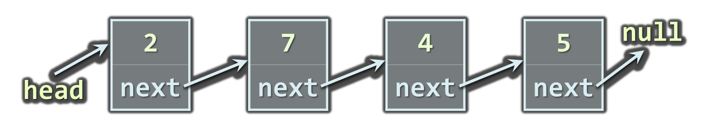
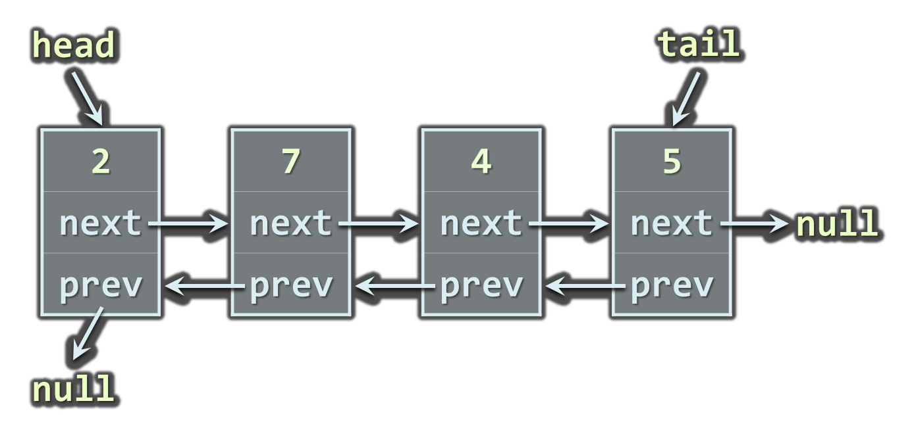

<!-- section start -->
<!-- attr: { class:'slide-title', showInPresentation:true, hasScriptWrapper:true } -->
# Linear Data Structures
## Arrays, Lists, Queues, Stacks, Deck<br/>Static and Dynamic Implementation

<div class="signature">
    <p class="signature-course">Java DSA</p>
    <p class="signature-initiative">Telerik School Academy</p>
    <a href="http://academy.telerik.com" class="signature-link">http://academy.telerik.com</a>
</div>

<!-- section start -->
<!-- attr: { id:'', class:'', showInPresentation:true, hasScriptWrapper:true, style:'font-size:1em' } -->
# Table of Contents
- Lists
  - Static and Linked Implementation
  - `List<T>` and `LinkedList<T>`
- Queues
  - Circular and Linked Implementation
  - The `Queue<T>` Class
- Stacks
  - Static and Linked Implementation
  - The `Stack<T>` Class
- Deck


<!-- section start -->
<!-- attr: { id:'lists', class:'slide-section', showInPresentation:true, hasScriptWrapper:true, style:'font-size:1em' } -->
# Lists
## Static and Dynamic Implementations


<!-- attr: { id:'', class:'', showInPresentation:true, hasScriptWrapper:true, style:'font-size:1em' } -->
# The List ADT
- What is "`list`"?
  - A data structure (container) that contains a sequence of elements
    - Can have variable size
    - Elements are arranged linearly, in sequence
  - Can be implemented in several ways
    - Statically (using array &rarr; fixed size)
    - Dynamically (linked implementation)
    - Using resizable array (the `List<T>` class)

# Static List
- Implemented by an array
  - Provides direct access by index
  - Has fixed capacity
  - Insertion, deletion and resizing are slow operations


<!-- attr: { hasScriptWrapper:true } -->
# Linked List
- Dynamic (pointer-based) implementation
- Different forms
  - Singly-linked and doubly-linked
  - Sorted and unsorted
- Singly-linked list
  - Each `item` has 2 fields: `value` and `next`




<!-- attr: { showInPresentation:true, hasScriptWrapper:true } -->
<!-- # Linked List -->
- Doubly-linked List
  - Each item has 3 fields: `value`, `next` and `prev`




<!-- section start -->
<!-- attr: { id:'the-list-class', class:'slide-section', showInPresentation:true, hasScriptWrapper:true } -->
<!-- # The `ArrayList<T>` Class
## Auto-Resizable Indexed Lists -->


<!-- attr: { id:'', class:'', showInPresentation:true, hasScriptWrapper:true, style:'font-size:1em' } -->
# The `ArrayList<T>` Class
- Implements the abstract data structure list using an array 
  - All elements are of the same type T
  - `T` must be a **reference type**, e.g. `ArrayList<Integer>`, `ArrayList<String>`, `ArrayList<LocalDateTime>`
  - Size is dynamically increased as needed
- Basic functionality:
  - `size()` – returns the number of elements 
  - `add(T)` – appends given element at the end

<!-- attr: { showInPresentation:true, hasScriptWrapper:true, style:'font-size:1em' } -->
# `ArrayList<T>` – Simple Example
```java
static void main(String[] args) {
  List<String> list = new ArrayList<>();
  list.add("Java");
  list.add("C#");
  list.add("SQL");
  for (String item : list) {
    System.out.println(item);
  }
  // Result:
  //   Java
  //   C#
  //   SQL
}
```
<div class="fragments balloon" style="width:300px; right:5%; top:32%" >Inline initialization: the compiler adds specified elements to the list</div>

<!-- section start -->
<!-- attr: { id:'questions', class:'slide-section' } -->
# Questions
## Data Structures and Algorithms
[link to Telerik Academy Forum](http://telerikacademy.com/Forum/Category/12/telerik-school-academy)