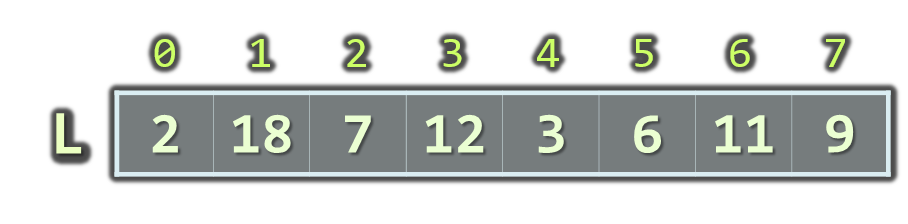
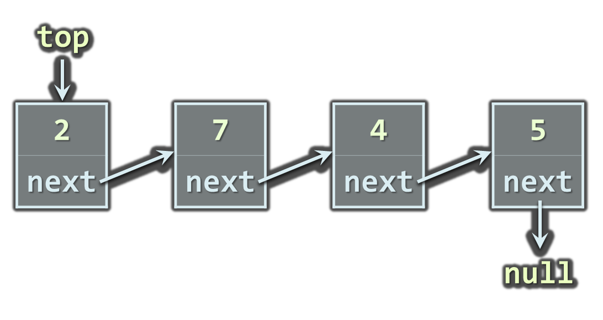

<!-- section start -->
<!-- attr: { class:'slide-title', showInPresentation:true, hasScriptWrapper:true } -->
# Linear Data Structures
## Arrays, Lists, Queues, Stacks, Deque<br/>Static and Dynamic Implementation

<div class="signature">
    <p class="signature-course">Java DSA</p>
    <p class="signature-initiative">Telerik School Academy</p>
    <a href="http://academy.telerik.com" class="signature-link">http://academy.telerik.com</a>
</div>

<!-- section start -->
<!-- attr: { id:'', class:'', showInPresentation:true, hasScriptWrapper:true, style:'font-size:1em' } -->
# Table of Contents
- Lists
  - Static and Linked Implementation
  - `List<T>` and `LinkedList<T>`
- `Queue<T>`
- `Stack<T>`
- `Deque<T>`


<!-- section start -->
<!-- attr: { id:'lists', class:'slide-section', showInPresentation:true, hasScriptWrapper:true, style:'font-size:1em' } -->
# Lists
## Static and Dynamic Implementations


<!-- attr: { id:'', class:'', showInPresentation:true, hasScriptWrapper:true, style:'font-size:1em' } -->
# The List ADT
- What is "`list`"?
  - A data structure (container) that contains a sequence of elements
    - Can have variable size
    - Elements are arranged linearly, in sequence
  - Can be implemented in several ways
    - Statically (using array &rarr; fixed size)
    - Dynamically (linked implementation)
    - Using resizable array (the `ArrayList<T>` class)

# Static List
- Implemented by an array
  - Provides direct access by index
  - Has fixed capacity
  - Insertion, deletion and resizing are slow operations



<!-- attr: { hasScriptWrapper:true } -->
# Linked List
- Dynamic (pointer-based) implementation
- Different forms
  - Singly-linked and doubly-linked
  - Sorted and unsorted
- Singly-linked list
  - Each `item` has 2 fields: `value` and `next`


<!-- attr: { showInPresentation:true, hasScriptWrapper:true } -->
<!-- # Linked List -->
- Doubly-linked List
  - Each item has 3 fields: `value`, `next` and `prev`


<!-- section start -->
<!-- attr: { id:'the-list-class', class:'slide-section', showInPresentation:true, hasScriptWrapper:true } -->
<!-- # The `ArrayList<T>` Class
## Auto-Resizable Indexed Lists -->


<!-- attr: { id:'', class:'', showInPresentation:true, hasScriptWrapper:true, style:'font-size:1em' } -->
# The `ArrayList<T>` Class
- Implements the abstract data structure list using an array 
  - All elements are of the same type T
  - `T` must be a **reference type**, e.g. `ArrayList<Integer>`, `ArrayList<String>`, `ArrayList<LocalDateTime>`
  - Size is dynamically increased as needed
- Basic functionality:
  - `size()` – returns the number of elements 
  - `add(T)` – appends given element at the end

<!-- attr: { showInPresentation:true, hasScriptWrapper:true, style:'font-size:1em' } -->
# `ArrayList<T>`<br/>Simple Example
```java
static void main(String[] args) {
  List<String> list = new ArrayList<>();
  list.add("Java");
  list.add("C#");
  list.add("SQL");
  for (String item : list) {
    System.out.println(item);
  }
  // Result:
  //   Java
  //   C#
  //   SQL
}
```

<!-- attr: { class:'slide-section demo', showInPresentation:true, hasScriptWrapper:true, style:'font-size:1em' } -->
<!-- # `ArrayList<T>` – Simple Example -->
## [Demo]()


<!-- attr: { hasScriptWrapper:true } -->
# `ArrayList<T>` – Functionality
- `get(index)` – access element by index
- `add(index, T)` – inserts given element to the list at a specified position
- `remove(T)` – removes the first occurrence of given element
- `remove(index)` – removes the element at the specified position
- `clear()` – removes all elements
- `indexOf()` – returns the index of the first occurrence of a value in the list (zero-based)
- `toArray()` – converts the elements of the list to an array


<!-- attr: { showInPresentation:true, hasScriptWrapper:true } -->
# `ArrayList<T>`: How It Works?
- `ArrayList<T>` keeps a buffer memory, allocated in advance, to allow fast `add(T)`
  - Most operations use the buffer memory and do not allocate new objects
  - Occasionally the capacity grows (doubles)


<!-- attr: {hasScriptWrapper:true } -->
# Primes in an Interval – Example
```java
static List<Integer> findPrimes(int start, int end)  {
   List<Integer> primesList = new ArrayList<>();
   for (int num = start; num <= end; num++) {	
      boolean prime = true;
      for (int div = 2; div <= Math.sqrt(num); div++) {
         if (num % div == 0) {
            prime = false;
            break;
         }	
      }

      if (prime) {
         primesList.add(num);
      }
   }

   return primesList;
}
```

<!-- attr: { class:'slide-section demo', showInPresentation:true } -->
<!-- # Primes in an Interval -->
## [Demo]()


<!-- section start -->
<!-- attr: { class:'slide-section', showInPresentation:true, hasScriptWrapper:true } -->
<!-- # The `LinkedList<T>` Class
## Dynamic Linked List in Java -->


<!-- attr: { id:'', class:'', showInPresentation:true, hasScriptWrapper:true, style:'font-size:1em' } -->
# The `LinkedList<T>` Class
- Implements the abstract data structure list using a doubly-linked dynamic structure
  - All elements are of the same type `T`
  - `T` can be any type, e.g. `LinkedList<Integer>`, `LinkedList<String>`, etc.
  - Elements can be added at both sides
- Basic `LinkedList<T>` functionality:
  - `addFirst(T)`, `addLast(T)`, `addBefore(T)`, `addAfter(T)`, `removeFirst(T)`, `removeLast(T)`


<!-- attr: { id:'', class:'', showInPresentation:true, hasScriptWrapper:true, style:'font-size:1em' } -->
# `LinkedList<T>` – Example
```java
public static void main(String[] args) {
    LinkedList<string> list = new LinkedList<string>();
    list.addFirst("First");
    list.addLast("Last");
    list.add(1, "After First");
    list.add(2, "Before Last");

    System.out.println(list);

    // Result: [First, After First, Before Last, Last]
}
```


<!-- attr: { class:'slide-section demo', showInPresentation:true } -->
<!-- # LinkedList<T> -->
## [Demo]()


<!-- section start -->
<!-- attr: { id:'stacks', class:'slide-section', showInPresentation:true, hasScriptWrapper:true, style:'font-size:1em' } -->
# Stacks
## Static and Dynamic Implementation


# The Stack ADT
- LIFO (Last In First Out) structure 
- Elements inserted (push) at "top"
- Elements removed (pop) from "top"
- Useful in many situations
  - E.g. the execution stack of the program 
- Can be implemented in several ways
  - Statically (using array)
  - Dynamically (linked implementation)
  - Using the `Stack<T>` class


<!-- attr: { hasScriptWrapper:true } -->
# Static Stack
- Static (array-based) implementation
  - Has limited (fixed) capacity
  - The current index (`top`) moves left / right with each pop / push


<!-- attr: { hasScriptWrapper:true } -->
# Linked Stack
- Dynamic (pointer-based) implementation
  - Each `item` has 2 fields: `value` and `next`
  - Special pointer keeps the top element




<!-- attr: { class:'slide-section', showInPresentation:true, hasScriptWrapper:true } -->
<!-- # The `Stack<T>` Class
## The Standard Stack Implementation in Java -->

<!-- attr: { hasScriptWrapper:true } -->
# The `Stack<T>` Class
- Implements the `stack` data structure using an array
  - Elements are from the same type `T`
  - `T` can be any type, e.g. `Stack<Integer>`   
  - Size is dynamically increased as needed
- Basic functionality:
  - `push(T)` – inserts elements to the stack
  - `pop()` – removes and returns the top element from the stack


<!-- attr: { showInPresentation:true, hasScriptWrapper:true } -->
<!-- # The Stack<T> Class -->
- Basic functionality:
  - `peek()` – returns the top element of the stack without removing it
  - `size()` – returns the number of elements
  - `clear()` – removes all elements
  - `contains(T)` – determines whether given element is in the stack
  - `toArray()` – converts the stack to an array
  - `trimToSize()` – sets the capacity to the actual number of elements

<!-- attr: { class:'slide-section demo', showInPresentation:true } -->
<!-- # Stack<T> -->
## [Demo]()


<!-- section start -->
<!-- attr: { id:'queues', class:'slide-section', showInPresentation:true, hasScriptWrapper:true, style:'font-size:1em' } -->
<!-- # Queues
## Static and Dynamic Implementation -->


<!-- attr: { id:'', class:'', showInPresentation:true, hasScriptWrapper:true, style:'font-size:1em' } -->
# The Queue ADT
- FIFO (First In First Out) structure
- Elements inserted at the tail (Enqueue)
- Elements removed from the head (Dequeue)
- Useful in many situations
  - Print queues, message queues, etc.
- Can be implemented in several ways
  - Statically (using array)
  - Dynamically (using pointers)
  - Using the `Queue<T>` class


<!-- attr: { id:'', class:'', showInPresentation:true, hasScriptWrapper:true, style:'font-size:1em' } -->
# Static Queue
- Static (array-based) implementation
  - Has limited (fixed) capacity
  - Implement as a "circular array"
  - Has `head` and `tail` indices, pointing to the head and the tail of the cyclic queue


<!-- attr: { id:'', class:'', showInPresentation:true, hasScriptWrapper:true, style:'font-size:1em' } -->
# Linked Queue
- Dynamic (pointer-based) implementation
  - Each item has 2 fields: `value` and `next`
  - Dynamically create and delete objects


<!-- attr: { class:'slide-section', showInPresentation:true, hasScriptWrapper:true } -->
<!-- # The `Queue<T>` 
## Implementations in Java -->

<!-- attr: { hasScriptWrapper:true } -->
# The `Queue<T>`
- In Java `LinkedList` implements the `Queue` interface
- Basic functionality:
  - `add(T)` - adds an element to the end of the queue
  - `poll()` - removes and returns the element at the beginning of the queue

<!-- attr: { hasScriptWrapper:true } -->
# `Queue<T>` – Example
- Using `add()` and `poll()` methods

```java
public static void main(String[] args) {
  Queue<String> queue = new LinkedList<String>();
  queue.add("Message One");
  queue.add("Message Two");
  queue.add("Message Three");
  queue.add("Message Four");

  while (queue.size() > 0) {
    String message = queue.poll();
    System.out.println(message);
  }
}
```

<!-- attr: { class:'slide-section demo', showInPresentation:true } -->
<!-- # Stack<T> -->
## [Demo]()


<!-- section start -->
<!-- attr: { id:'deques', class:'slide-section', showInPresentation:true, hasScriptWrapper:true } -->
<!-- # Deques
## Static and Dynamic Implementation -->

<!-- attr: { style:'font-size:0.95em' } -->
# Deque
-  A `Deque` is a double-ended-queue
  -  Supports the insertion and removal of elements at both end points
-  The `Deque` interface is a richer abstract data type
  -  Implements both stacks and queues at the same time
  -  `Deque` interface can be used both as **last-in-first-out** stacks and **first-in-first-out** queues
-  Implementations in Java
  -  `ArrayDeque<>` and `LinkedList<>`

# Deque
- Basic functionality:
  - `addFirst`/`offerFirst` - insert elements at the beginning
  - `addLast`/`offerLast` - insert elements at the end
  - `removeFirst`/`pollFirst` - remove elements from the beginning
  - `removeLast`/`pollLast` - remove elements from the end
  - `getFirst`/`peekFirst` - retrieve the first element
  - `getLast`/`peekLast` - retrieve the last element
    - these methods dont remove the value

<!-- attr: { class:'slide-section demo', showInPresentation:true } -->
<!-- # Deque<T> -->
## [Demo]()


<!-- section start -->
<!-- attr: { id:'questions', class:'slide-section' } -->
# Questions
## Data Structures and Algorithms
[link to Telerik Academy Forum](http://telerikacademy.com/Forum/Category/12/telerik-school-academy)