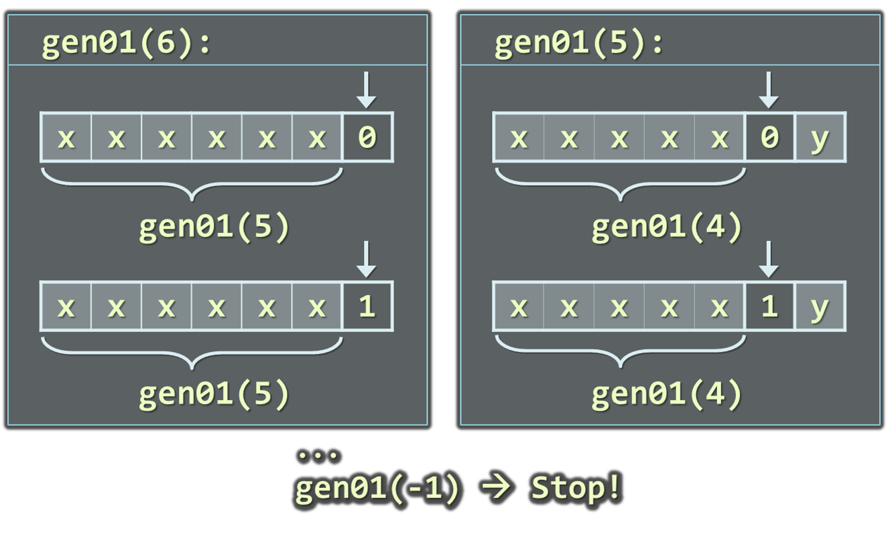
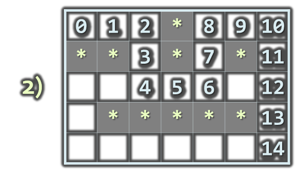

<!-- section start -->
<!-- attr: { class:'slide-title', showInPresentation:true, hasScriptWrapper:true, style:'' } -->
# Recursion
<div class="signature">
    <p class="signature-course">Java DSA</p>
    <p class="signature-initiative">Telerik School Academy</p>
    <a href="http://academy.telerik.com" class="signature-link">http://academy.telerik.com</a>
</div>


<!-- section start -->
<!-- attr: { showInPresentation:true, hasScriptWrapper:true, style:'' } -->
# Table of Contents
* What is Recursion?
* Calculating Factorial Recursively
* Generating All 0/1 Vectors Recursively
* Finding All Paths in a Labyrinth Recursively
* Recursion or Iteration?
  * Harmful Recursion
  * Optimizing Bad Recursion


<!-- attr: { showInPresentation:true, hasScriptWrapper:true, style:'' } -->
# What is Recursion?
* `Recursion` is when a methods calls itself
  * Very powerful technique for implementing combinatorial and other algorithms
* Recursion should have
  * `Direct` or `indirect` recursive call
    * The method calls itself directly
    * Оr through other methods
  * Exit criteria (`bottom`)
    * Prevents infinite recursion


<!-- attr: { showInPresentation:true, hasScriptWrapper:true, style:'' } -->
# Recursive Factorial – Example
* Recursive definition of `n!` (`n factorial`):

```java
n! = n x (n–1)! for n >= 0
0! = 1
```
  * 5! = 5 x 4! = 5 x 4 x 3 x 2 x 1 x 1 = 120
  * 4! = 4 x 3! = 4 x 3 x 2 x 1 x 1 = 24
  * 3! = 3 x 2! = 3 x 2 x 1 x 1 = 6
  * 2! = 2 x 1! = 2 x 1 x 1 = 2
  * 1! = 1 x 0! = 1 x 1 = 1
  * 0! = 1


<!-- attr: { showInPresentation:true, hasScriptWrapper:true, style:'' } -->
# Recursive Factorial – Example
* Calculating factorial:
  * 0! = 1
  * n! = nx (n-1)!, n>0

```java
static decimal factorial(decimal num) {
    if (num == 0) { 
        return 1;
    }
    else {
        return num * factorial(num - 1);
    }
} 
```
* Don't try this at home!
  * Use iteration instead

<div class="fragment balloon" style="width:300px; top:46%; left:36%">The bottom of the recursion</div>
<div class="fragment balloon" style="width:200px; top:66%; left:55%">Recursive call: the method calls itself</div>

<!-- attr: { class:'slide-section demo', showInPresentation:true, hasScriptWrapper:true, style:'' } -->
<!-- # Recursive Factorial -->
##  [Demo]()

<!-- attr: { showInPresentation:true, hasScriptWrapper:true, style:'' } -->
# Generating 0/1 Vectors
* How to generate all 8-bit vectors recursively?
  * `00000000`
  * `00000001`
  * ...
  * `01111111`
  * `10000000`
  * ...
  * `11111110`
  * `11111111`
* How to generate all n-bit vectors?


<!-- attr: { showInPresentation:true, hasScriptWrapper:true, style:'font-size:0.9em' } -->
<!-- # Generating 0/1 Vectors -->
* Algorithm `gen01(n)`: put 0 and 1 at the last position `n` and call `gen01(n-1)` for the rest:



<!-- attr: { showInPresentation:true, hasScriptWrapper:true, style:'' } -->
<!-- # Generating 0/1 Vectors -->

```java
static void gen01(int index, int[] vector) {
  if (index == -1) {
    print(vector);
  } else {
    for (int i = 0; i <= 1; i++) {
      vector[index] = i;
      gen01(index - 1, vector);
    }
  }
}

public static void main(String[] args) {
  int size = 8;
  int[] vector = new int[size];
  gen01(size - 1, vector);
}
```


<!-- attr: { class:'slide-section demo', showInPresentation:true, hasScriptWrapper:true, style:'' } -->
<!-- # Generating 0/1 Vectors -->
##  [Demo]()


<!-- section start -->
<!-- attr: { class:'slide-section', showInPresentation:true, hasScriptWrapper:true, style:'' } -->
<!-- # Generating Combinations
##  Simple Recursive Algorithm -->


<!-- attr: { showInPresentation:true, hasScriptWrapper:true, style:'' } -->
# Generating Combinations
* Combinations are give the ways to select a subset of larger set of elements
  * Select `k` members from a set of `n` elements
  * Example: there are 10 ways to select 3 different elements from the set `{4,5,6,7,8}`:
    * (4, 5, 6)	(4, 5, 7)	(4, 5, 8)	(4, 6, 7)	(4, 6, 8)<br/>(4, 7, 8)	(5, 6, 7)	(5, 6, 8)	(5, 7, 8)	(6, 7, 8)
* Combinations with and without repetitions can be easily generated with `recursion`

<!-- attr: { showInPresentation:true, hasScriptWrapper:true, style:'' } -->
<!-- # Generating Combinations -->
* Algorithm `genCombs(k)`: put the numbers [1..n] at position `k` the and call `genCombs(k+1)` recursively for the rest of the elements:


<div class="fragment balloon" style="width: 270px; top:70%; left:10%">Put all numbers in range [1..n] at position k</div>
<div class="fragment balloon" style="width: 270px; top:70%; left:60%">Put all numbers in range [1..n] at position k</div>

<!-- attr: { class:'slide-section demo', showInPresentation:true, hasScriptWrapper:true, style:'' } -->
<!-- # Generating Combinations -->
##  [Demo]()


<!-- section start -->
<!-- attr: { class:'slide-section', showInPresentation:true, hasScriptWrapper:true, style:'' } -->
# Backtracking
##  Solving Computational Problemsby Generating All Candidates


<!-- attr: { showInPresentation:true, style:'' } -->
# Backtracking
* What is `backtracking`?
  * Backtracking is a class of algorithms for finding all solutions to some computational problem
  * E.g. find all paths from Sofia to Varna
* How does backtracking work?
  * Usually implemented recursively
  * At each step we try **all perspective possibilities** to generate a solution
* Backtracking has **exponential running time**!

<!-- attr: { showInPresentation:true, hasScriptWrapper:true, style:'' } -->
# The 8 Queens Problem
* Write a program to find all possible placements of 8 queens on a chessboard
  * So that no two queens attack each other
  * http://en.wikipedia.org/wiki/Eight_queens_puzzle


<!-- attr: { showInPresentation:true, style:'font-size:0.9em' } -->
# Solving The 8 Queens Problem
* Backtracking algorithm for finding all solutions to the "8 Queens Puzzle"

```java
static void putQueens(int row) {
  if (row == 8) {
    printSolution();
    return;
  }

  for (int col = 0; col < 8; col++) {
    if (canPlaceQueen(row, col)) {
      markAllAttackedPositions(row, col);
      putQueens(count + 1);
      unmarkAllAttackedPositions(row, col);
    }
  }
}
```

<!-- attr: { showInPresentation:true, hasScriptWrapper:true, style:'font-size:0.95em' } -->
# Finding All Paths in a Labyrinth
* We are given a labyrinth
  * Represented as matrix of cells of size M x N
  * Empty cells are passable, the others (*) are not
* We start from the top left corner and can move in the all 4 directions: left, right, up, down
* We need to find all paths to the bottom right corner

<div class="fragments balloon" style="top:70%; left:10%">Start position</div>
<div class="fragments balloon" style="top:90%; left:62%">End position</div>


<!-- attr: { showInPresentation:true, hasScriptWrapper:true, style:'' } -->
<!-- # Finding All Paths in a Labyrinth -->
* There are 3 different paths from the top left corner to the bottom right corner:





<!-- attr: { showInPresentation:true, style:'font-size:0.95em' } -->
<!-- # Finding All Paths in a Labyrinth -->
* Suppose we have an algorithm `findExit(x,y)` that finds and prints all paths to the exit (bottom right corner) starting from position `(x,y)`
* If `(x,y)` is not passable, no paths are found
* If `(x,y)` is already visited, no paths are found
* Otherwise:
  * Mark position `(x,y)` as visited (to avoid cycles)
  * Find recursively all paths to the exit from all neighbor cells: `(x-1,y)` ,` (x+1,y)` ,` (x,y+1)` ,` (x,y-1)`
  * Mark position `(x,y)` as free (can be visited again)

<!-- attr: { showInPresentation:true, style:'font-size:0.95em' } -->
# Find All Paths: Algorithm
* Representing the labyrinth as matrix of characters (in this example 5 rows and 7 columns):

```java
static char[][] lab = {
    {' ', ' ', ' ', '*', ' ', ' ', ' '},
    {'*', '*', ' ', '*', ' ', '*', ' '},
    {' ', ' ', ' ', ' ', ' ', ' ', ' '},
    {' ', '*', '*', '*', '*', '*', ' '},
    {' ', ' ', ' ', ' ', ' ', ' ', 'е'},
};
```
* * Spaces ('` `') are passable cells
  * Asterisks ('`*`') are  not passable cells
  * The symbol '`e`' is the exit (can occur multiple times)

<!-- attr: { showInPresentation:true, style:'font-size:0.95em' } -->
<!-- # Find All Paths: Algorithm -->

```java
static void findExit(int row, int col) {
  if (row < 0 || row >= lab.length ||
     col < 0 || col >= lab[0].length) {
    // We are out of the labyrinth -> can't find a path
    return;
  }

  // Check if we have found the exit
  if (lab[row][col] == 'е') {
    System.out.println("Found the exit!");
  }

  if (lab[row][col] != ' ') {
    // The current cell is not free -> can't find a path
    return;
  }
// (example continues)
```

<!-- attr: { showInPresentation:true, style:'font-size:0.95em' } -->
<!-- # Find All Paths: Algorithm -->

```java
  // Temporary mark the current cell as visited
  lab[row][col] = 's';

  // Invoke recursion to explore all possible directions
    findExit(row, col - 1); // left
    findExit(row - 1, col); // up
    findExit(row, col + 1); // right
    findExit(row + 1, col); // down

  // Mark back the current cell as free
  lab[row, col] = ' ';
}

public static void main(String[] args) {
  findExit(0, 0);
}
```

<!-- attr: { class:'slide-section demo', showInPresentation:true, hasScriptWrapper:true, style:'' } -->
<!-- # Find All Paths in a Labyrinth -->
##  [Demo]()


<!-- attr: { showInPresentation:true, style:'' } -->
# Find All Paths and Print Them
* How to print all paths found by our recursive algorithm?
  * Each move's direction can be stored in a list
  * Need to pass the movement direction at each recursive call (`L`, `R`, `U`, or `D`)
  * At the start of each recursive call the current direction is appended to the list
  * At the end of each recursive call the last direction is removed from the list

```java
  static List<Character> path = new ArrayList<>();
```

<!-- attr: { showInPresentation:true, style:'font-size:0.95em' } -->
<!-- # Find All Paths and Print Them -->

```java
static void findPathToExit(int row, int col, char direction)
{
    ...
    // Append the current direction to the path
    path.add(direction);
    if (lab[row, col] == 'е') {
        // The exit is found -> print the current path
    }
    ...
    // Recursively explore all possible directions
    findPathToExit(row, col - 1, 'L'); // left
    findPathToExit(row - 1, col, 'U'); // up
    findPathToExit(row, col + 1, 'R'); // right
    findPathToExit(row + 1, col, 'D'); // down
    ...
    // Remove the last direction from the path
    path.remove(path.size() - 1);
}
```

<!-- attr: { class:'slide-section demo', showInPresentation:true, hasScriptWrapper:true, style:'' } -->
<!-- # Find and Print All Paths in a Labyrinth -->
##  [Demo]()


<!-- section start -->
<!-- attr: { class:'slide-section', showInPresentation:true, hasScriptWrapper:true, style:'' } -->
# Recursion or Iteration?
##  When to Use and When to Avoid Recursion?


<!-- attr: { showInPresentation:true, style:'font-size:0.95em' } -->
# Recursion Can be Harmful!
* When used incorrectly the recursion could take too much memory and computing power
  * _Example_:

```java
static long fibonacci(int n) {
  if ((n == 1) || (n == 2)) {
    return 1;
  } else {
    return fibonacci(n - 1) + fibonacci(n - 2);
  }
}

public static void main(String[] args) {
    System.out.println(fibonacci(10)); // 89
    System.out.println(fibonacci(60)); // This will hang!
}
```

<!-- attr: { class:'slide-section demo', showInPresentation:true, hasScriptWrapper:true, style:'' } -->
<!-- # Harmful Recursion -->
##  [Demo]()


<!-- attr: { showInPresentation:true, hasScriptWrapper:true, style:'font-size:0.95em' } -->
# How the Recursive Fibonacci Calculation Works?


* `fib(n)` makes about `fib(n)` recursive calls
* The same value is calculated many, many times!


<!-- attr: { showInPresentation:true, style:'font-size:0.95em' } -->
# Fast Recursive Fibonacci
* Each Fibonacci sequence member can be remembered once it is calculated
  * Can be returned directly when needed again

```java
static long[] fib = new long[MAX_FIB];
static long fibonacci(int n) {
    if (fib[n] == 0) {
        // The value of fib[n] is still not calculated
        if ((n == 1) || (n == 2)) {
            fib[n] = 1;
        } else {
            fib[n] = Fibonacci(n - 1) + Fibonacci(n - 2);
        }
    }

    return fib[n];
}
```

<!-- attr: { class:'slide-section demo', showInPresentation:true, hasScriptWrapper:true, style:'' } -->
<!-- # Fast Recursive Fibonacci -->
##  [Demo]()


<!-- attr: { showInPresentation:true, style:'' } -->
# When to Use Recursion?
* **Avoid recursion** when an obvious iterative algorithm exists
  * _Examples_: **factorial**, **Fibonacci numbers**
* Use recursion for **combinatorial algorithm** where at each step you need to recursively explore **more than one possible continuation**
  * _Examples_: **permutations**, all **paths in labyrinth**
  * If you have only **one recursive call** in the body of a recursive method, it can directly become iterative (like calculating factorial)

<!-- attr: { showInPresentation:true, style:'' } -->
# Summary
* Recursion means to call a method from itself
  * It should always have a **bottom** at which recursive calls stop
* Very powerful technique for implementing combinatorial algorithms
  * _Examples_: generating combinatorial configurations like **permutations**, **combinations**, **variations**, etc.
* Recursion can be harmful when not used correctly


<!-- section start -->
<!-- attr: { id:'questions', class:'slide-section' } -->
# Questions
## Recursion
[link to Telerik Academy Forum](http://telerikacademy.com/Forum/Category/12/telerik-school-academy)