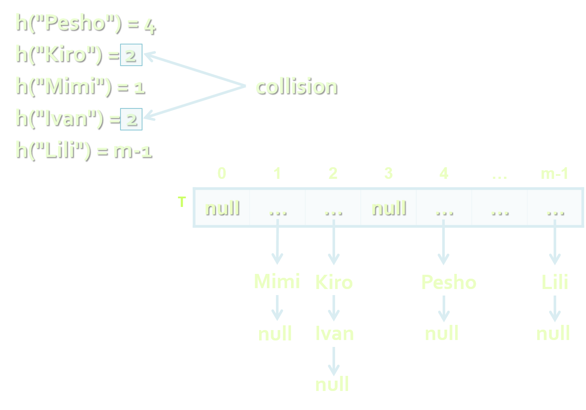

<!-- section start -->
<!-- attr: { class:'slide-title', showInPresentation:true, hasScriptWrapper:true, style:'' } -->
# Hash tables
## Map, HashMap, HashSet
<div class="signature">
    <p class="signature-course">Java DSA</p>
    <p class="signature-initiative">Telerik School Academy</p>
    <a href="http://academy.telerik.com" class="signature-link">http://academy.telerik.com</a>
</div>


<!-- section start -->
<!-- attr: { showInPresentation:true, hasScriptWrapper:true, style:'' } -->
# Table of Contents
- Dictionaries (ADT)
- What is a Hash Table
- The `Set<E>` Interface
- `HashSet`
- The `Map<K,V>` Interface
- `HashMap<K,V>`

<!-- section start -->
<!-- attr: { class:'slide-section', showInPresentation:true, hasScriptWrapper:true, style:'' } -->
# Dictionaries
##  Data Structures that Map Keys to Values

<!-- attr: { showInPresentation:true, hasScriptWrapper:true, style:'' } -->
# The Dictionary (Map) ADT
- The abstract data type (ADT) `dictionary` maps key to values
  - Also known as `map` or `associative array`
  - Contains a set of (key, value) pairs
- Dictionary ADT operations:
  - `add(key, value)`
  - `findByKey(key) &rarr; value`
  - `delete(key)`
- Can be implemented in several ways
  - List, array, hash table, balanced tree, ...

<!-- section start -->
<!-- attr: { class:'slide-section', showInPresentation:true, hasScriptWrapper:true, style:'' } -->
<!-- # Hash Table
## What is a Hash Table and how it works -->

<!-- attr: { hasScriptWrapper:true, style:'' } -->
# What is a Hash Table
- A hash table is an array that holds a set of(key, value) pairs
- The process of mapping a key to a position in a table is called `hashing`

<div class="fragment">
  <div class="balloon" style="width:120px; top:70%; left:65%">Hash table of size m</div>
  <div class="balloon" style="width:160px; top:75%; left:22%">Hash function h: k → 0 … m-1</div>
</div>

<!-- attr: { hasScriptWrapper:true, style:'' } -->
# Hash Functions and Hashing
- A hash table has `m` slots, indexed from `0` to `m-1`
- A hash function `h(k)` maps keys to positions:
  - `h: k → 0 … m-1`
- For any value `k` in the key range and some hash function `h` we have `h(k)` `=` `p` and `0` `≤` `p` `<` `m`


# Hashing Functions
- Perfect hashing function (PHF)
  - `h(k)` : one-to-one mapping of each key `k` to an integer in the range [0, m-1]
  - The PHF maps each key to a `distinct` integer within some manageable range
- Finding a perfect hashing function is in most cases `impossible`
- More realistically
  - Hash function `h(k)` that maps `most` of the keys onto unique integers, but `not all`

<!-- attr: { style:'font-size:0.95em' } -->
# Collisions in a Hash Table
- A `collision` is the situation when different keys have the same hash value
  - `	h(k1)` `=` `h(k2)` for `k1` `≠` `k2`
- When the number of collisions is sufficiently small, the hash tables work quite well (fast)
- Several `collisions resolution `strategies exist
  - Chaining in a list
  - Using the neighboring slots (linear probing)
  - Re-hashing (second hash function)
  - ...

<!-- attr: { hasScriptWrapper:true, style:'' } -->
# Collision Resolution
- Chaining

<div class="balloon" style="width:220px; top:30%; left:65%">Chaining elements in case of collision
</div>

<!-- attr: { style:'font-size:0.95em' } -->
# Hash Tables and Efficiency
- Hash tables are the most efficient implementation of ADT "dictionary"
- Add / Find / Delete take just few primitive operations
  - Speed does not depend on the size of the hash-table (constant time)
    - Amortized complexity **O(1)**
  - _Example_:
    - finding an element in a hash-table with 1 000 000 elements, takes just few steps
    - Finding an element in array of 1 000 000 elements takes average 500 000 steps

<!-- section start -->
<!-- attr: { class:'slide-section', showInPresentation:true, hasScriptWrapper:true, style:'' } -->
<!-- # The `Set<K,V>` Interface -->

<!-- attr: { hasScriptWrapper:true } -->
# The `Set<K,V>` Interface
- A `Set` is a `Collection` that cannot contain duplicate elements
- Implementations in Java
  -  `HashSet`, `TreeSet`, and `LinkedHashSet`
  -  `HashSet` is the best-performing implementation
    -  stores its elements in a hash table
  -  `TreeSet` - orders its elements
    -  stores its elements in a red-black tree

<!-- section start -->
<!-- attr: { class:'slide-section', showInPresentation:true, hasScriptWrapper:true, style:'' } -->
<!-- # `HashSet<E>` -->

<!-- attr: { hasScriptWrapper:true } -->
# `HashSet<E>`
- Implements the Set interface
  - Backed by a hash table
- It makes no guarantees as to the iteration order of the set
- Constant time performance for the basic operations
- _Note_: this implementation is not synchronized
- [Class HashSet<E> documentation](http://docs.oracle.com/javase/7/docs/api/java/util/HashSet.html)

<!-- attr: { hasScriptWrapper:true, style:'font-size:0.95em' } -->
# `HashSet<E>`
- Basic operations:
  - `size()` - returns the number of elements in this set
  - `contains(Object o)` - returns true if this set contains the specified element
  - `add(E e)` - adds the specified element to this set if it is not already present
    - returns `true` if this set did not already contain the specified element
  - `remove(Object o)` - removes the specified element from this set if it is present
  - `clear()` - removes all of the elements from this set

<!-- attr: { hasScriptWrapper:true } -->
# `HashSet<E>`
```java
Set<String> set = new HashSet<>();
set.add("Jordan");
set.add("Steven");
set.add("Mike");
set.add("Jordan");

System.out.println(set); //[Mike, Jordan, Steven]
System.out.println(set.contains("Jordan")); // true

set.remove("Jordan");
System.out.println(set.contains("Jordan")); // false
```

<!-- attr: { class:'slide-section demo', showInPresentation:true } -->
<!-- # `HashSet<E>` -->
## [Demo]()


<!-- section start -->
<!-- attr: { class:'slide-section', showInPresentation:true, hasScriptWrapper:true, style:'' } -->
<!-- # The `Map<K,V>` Interface -->

<!-- attr: { hasScriptWrapper:true } -->
# The `Map<K,V>` interface
- `Map` is an object that maps keys to values
  - Cannot contain duplicate keys
  - Each key can map to at most one value
- Basic operations:
  - `put`, `get`, `remove`, `containsKey`, `containsValue`, `size`
- Bulk operations: 
  - `putAll`, `clear`
- Collections views:
  - `keySet`, `entrySet`, `values`


<!-- section start -->
<!-- attr: { class:'slide-section', showInPresentation:true, hasScriptWrapper:true, style:'' } -->
<!-- # `HashMap<K,V>` -->

<!-- attr: { hasScriptWrapper:true } -->
# `HashMap<K,V>`
- Hash table based implementation of the Map interface
  - Permits `null` values and the `null` key
- Makes no guarantees as to the order of the map
  - It does not guarantee that the order will remain constant over time
- _Note_: This implementation is not synchronized
- [Class HashMap<K,V> documentation](https://docs.oracle.com/javase/8/docs/api/java/util/HashMap.html)

<!-- attr: { hasScriptWrapper:true, style:'font-size:0.95em' } -->
# `HashMap<K,V>`
- Basic operations:
  - `size()` - returns the number of key-value mappings in this map
  - `get(key)` - returns the value to which the specified key is mapped
  - `put(key, value)`
    - associates the specified value with the specified key in this map
    - if the map previously contained a mapping for the key, the old value is replaced
  - `containsKey(key)` - returns true if this map contains a mapping for the specified key

<!-- attr: { hasScriptWrapper:true, style:'font-size:0.95em' } -->
# `HashMap<K,V>`
- Basic operations:
  - `remove(key)` - removes the mapping for the specified key from this map if present
  - `clear()` - removes all of the mappings from this map
  - `keySet()` - returns a set view of the keys contained in this map
  - `values()` - returns a set view of the mappings contained in this map
  - `entrySet()` - returns a set view of the mappings contained in this map

<!-- attr: { class:'slide-section demo', showInPresentation:true } -->
<!-- # `HashMap<K,V>` -->
## [Demo]()


<!-- section start -->
<!-- attr: { id:'questions', class:'slide-section' } -->
# Questions
## Hash Tables
[link to Telerik Academy Forum](http://telerikacademy.com/Forum/Category/12/telerik-school-academy)