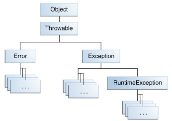
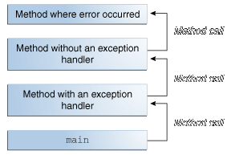

<!-- section start -->
<!-- attr: { class:'slide-title', showInPresentation:true, hasScriptWrapper:true, style:'' } -->
# Exception Handling
##  Handling Errors during the Program Execution
<div class="signature">
    <p class="signature-course">Java DSA</p>
    <p class="signature-initiative">Telerik School Academy</p>
    <a href="http://academy.telerik.com" class="signature-link">http://academy.telerik.com</a>
</div>


<!-- section start -->
<!-- attr: { showInPresentation:true, hasScriptWrapper:true, style:'' } -->
# Table of Contents
- What are Exceptions?
- Handling Exceptions
- The java.lang.Exception Class
- The Catch or Specify Requirement
- Specifying the Exceptions Thrown by a Method
- Types of Exceptions and their Hierarchy
- Raising (Throwing) Exceptions
- Best Practices


<!-- section start -->
<!-- attr: { class:'slide-section', showInPresentation:true, hasScriptWrapper:true, style:'' } -->
# What are Exceptions?
## The Paradigm of Exceptions in OOP

<!-- attr: { showInPresentation:true, style:'' } -->
# What are Exceptions?
- _Definition_: An exception is an event that occurs during the execution of a program that disrupts the normal flow of instructions
- When an error occurs within a method, the method creates an **exception object** and hands it off to the runtime system
  - Contains information about the error
- Creating an exception object and handing it to the runtime system is called **throwing an exception**


<!-- section start -->
<!-- attr: { class:'slide-section', showInPresentation:true, hasScriptWrapper:true, style:'' } -->
# Handling Exceptions
## Catching and Processing Errors

<!-- attr: { showInPresentation:true, hasScriptWrapper:true, style:'' } -->
# Handling Exceptions
- In Java the exceptions can be handled by the `try-catch-finally` construction
- `catch` blocks can be used multiple times to process different exception types

```java
try {
  // Do some work that can raise an exception
} catch (IllegalArgumentException ex) {
  // Handle the caught exception
}
```

<!-- attr: { showInPresentation:true, hasScriptWrapper:true, style:'' } -->
<!-- # Handling Exceptions -->

```java
public static void main(String[] args) {
  String s = "some text";
  try {
    Integer.parseInt(s);
    System.out.printf(
        "You entered valid Integer number {0}.\n", s);
  } catch (NumberFormatException nfex) {
    System.out.println("Invalid integer number!");
  }
}
```

<!-- attr: { class:'slide-section demo', showInPresentation:true, hasScriptWrapper:true, style:'' } -->
# Handling Exceptions
## [Demo]()


<!-- section start -->
<!-- attr: { class:'slide-section' } -->
# Exception Properties

<!-- attr: { showInPresentation:true, style:'font-size:0.95em' } -->
# The Catch or Specify Requirement
- Exceptions in Java are objects
- The `java.lang.Exception` class is base for all exceptions
  - Contains information for the cause of the error / unusual situation
    - `getMessage()` – text description of the exception
    - `getStackTrace()` – the snapshot of the stack at the moment of exception throwing
    - `getCause()` – exception caused the currentexception (if any)

<!-- attr: { showInPresentation:true, style:'font-size:0.95em' } -->
# Exception Properties

```java
public class ExceptionsExample {
  public static void CauseFormatException() {
    String s = "an invalid number";
    Integer.parseInt(s);
  }

  public static void main(String[] args) {
    try {
      CauseFormatException();
    } catch (NumberFormatException nfe) {
      System.out.printf("Exception: %s\n", nfe.getMessage());
      for (StackTraceElement elem : nfe.getStackTrace()) {
          System.out.printf("%s\n", elem);
      }
    }
  }
}
```

<!-- attr: { showInPresentation:true, style:'' } -->
<!-- # Exception Properties -->
- The `message` property gives brief description of the problem
- The `stackTrace` property is extremely useful when identifying the reason caused the exception

```java
Exception: For input string: "an invalid number"
java.lang.NumberFormatException.forInputString(NumberFormatException.java:65)
java.lang.Integer.parseInt(Integer.java:580)
java.lang.Integer.parseInt(Integer.java:615)
ExceptionsDemo.CauseFormatException(ExceptionsDemo.java:4)
ExceptionsDemo.main(ExceptionsDemo.java:9)
...
```

<!-- attr: { class:'slide-section demo', showInPresentation:true, hasScriptWrapper:true, style:'' } -->
# Exception Properties
## [Demo]()

<!-- section start -->
<!-- attr: { class:'slide-section' } -->
# Exceptions in Java
## The Catch or Specify Requirement

# The Catch or Specify Requirement
- Valid Java programming language code must honor the Catch or Specify Requirement
- Code that might throw certain exceptions must be enclosed by either of the following:
  - A `try` statement that catches the exception
  - A method that specifies that it can throw the exception
    - The method must provide a `throws` clause that lists the exception

<!-- attr: { style:'font-size:0.9em' } -->
# Types of Exceptions
- Checked Exception
  - A well-written application should anticipate and recover from
  - All exceptions are **checked exceptions**
    - Except for those indicated by `Error`, `RuntimeException`
- Error - external to the application
- Runtime Exception - internal to the application
  -  The application usually cannot anticipate or recover from
  -  Indicate programming bugs, such as logic errors or improper use of an API

<!-- attr: { style:'font-size:0.9em' } -->
# Example
- Suppose an application prompts a user for an input file name
  - Checked Exception 
    - the user supplies the name of a nonexistent file
    - `java.io.FileNotFoundException`  
  - Error
    - unable to read the file because of a hardware or system malfunction
    - `java.io.IOError`
  - Runtime Exception
    - a logic error causes a null to be passed to the constructor
    - `NullPointerException`

<!-- attr: { class:'slide-section demo', showInPresentation:true, style:'' } -->
# The Catch or Specify Requirement
## [Demo]()


<!-- section start -->
<!-- attr: { class:'slide-section', showInPresentation:true } -->
<!-- # Method Exceptions in Java
## Specifying the Exceptions Thrown by a Method -->

<!-- attr: { style:'font-size:0.9em' } -->
# Method Exceptions
- In some cases it's better to let a method further up the call stack handle the exception

```java
public void writeList() {
  PrintWriter out = new PrintWriter(new FileWriter("OutFile.txt"));
  for (int i = 0; i < SIZE; i++) {
    out.println("Value at: " + i + " = " + list.get(i));
  }
  out.close();
}
```
- Specify that `writeList` can throw an exception
- Add a throws clause to the method 

```java
public void writeList() throws IOException {
```

<!-- attr: { class:'slide-section demo', showInPresentation:true, hasScriptWrapper:true, style:'' } -->
# Method Exceptions
## [Demo]()


<!-- section start -->
<!-- attr: { class:'slide-section', showInPresentation:true, hasScriptWrapper:true, style:'margin-top:-10%' } -->
# Exception Hierarchy
## Exceptions in Java Framework are organized in a hierarchy



<!-- attr: { showInPresentation:true, style:'' } -->
# Types of Exceptions
- Java exceptions inherit from `java.lang.Exception` and 
- The system exceptions inherit from `java.lang.Exception`
  - `java.lang.IllegalArgumentException`
  - `java.lang.IllegalAccessException`
  - `java.lang.NegativeArraySizeException`
- The `RuntimeException` is reserved for exceptions that indicate incorrect use of an API
  - `java.lang.NullPointerException`

<!-- attr: { showInPresentation:true, hasScriptWrapper:true, style:'' } -->
# Handling Exceptions
- When catching an exception of a particular class, all its inheritors (child exceptions) are caught too
- _Example_:
  - Handles `IllegalArgumentException` and its descendant `NumberFormatException`

```java
try {
  // Do some works that can cause an exception
} catch (Exception ex) {
  // Handle the caught arithmetic exception
}
```

<!-- attr: { showInPresentation:true, hasScriptWrapper:true, style:'' } -->
# Find the Mistake!

```java
public static void main(String[] args) {
    try {
      String s = "an invalid number";
    Integer.parseInt(s);
    } catch (Exception ex) {
      System.out.printf("Exception: %s\n", ex.getMessage());
    } catch (IllegalArgumentException iae) {
      System.out.printf("Exception: %s\n", iae.getMessage());
    } catch (NumberFormatException nfe) {
      System.out.printf("Exception: %s\n", nfe.getMessage());
    }
  }
```

<!-- section start -->
<!-- attr: { class:'slide-section', showInPresentation:true, hasScriptWrapper:true, style:'' } -->
# Throwing Exceptions

<!-- attr: { showInPresentation:true, style:'' } -->
# Throwing Exceptions
- Exceptions are thrown (raised) by `throw` keyword in Java
  - Used to notify the calling code in case of error or unusual situation
- When an exception is thrown:
  - The program execution stops
  - The exception travels over the stack until a suitable `catch` block is reached to handle it
- Unhandled exceptions display error message

<!-- attr: { showInPresentation:true, hasScriptWrapper:true, style:'' } -->
<!-- # How Exceptions Work? -->



<!-- attr: { showInPresentation:true, style:'font-size:0.8em' } -->
# Using throw Keyword
- Throwing an exception with an error message:
- Exceptions can accept message and cause:
- _Note_: if the original exception is not passed the initial cause of the exception is lost

```java
throw new IllegalArgumentException();
```

```java
public Object pop() {
    Object obj;
    if (size == 0) {
        throw new EmptyStackException();
    }

    obj = objectAt(size - 1);
    setObjectAt(size - 1, null);
    size--;
    return obj;
}
```

<!-- attr: { showInPresentation:true, style:'' } -->
# Re-Throwing Exceptions
- Caught exceptions can be re-thrown again:

```java
try {
  Integer.parseInt(s);
} catch (NumberFormatException nfe) {
  System.out.printf("Exception: %s\n", nfe.getMessage());
  throw nfe;
}
```

```java
catch (IllegalArgumentException) {
  throw; // Re-throws the last caught exception
}
```

<!-- attr: { class:'slide-section', showInPresentation:true, hasScriptWrapper:true, style:'' } -->
# Throwing Exceptions
## [Demo]()


<!-- section start -->
<!-- attr: { class:'slide-section', showInPresentation:true, hasScriptWrapper:true, style:'' } -->
# Using `try-finally` Blocks

<!-- attr: { showInPresentation:true, style:'' } -->
# The try-finally Statement
- The statement:
- Ensures execution of given block in all cases
  - When exception is raised or not in the `try` block
- Used for execution of cleaning-up code, e.g. releasing resources

```java
try {
    // Do some work that can cause an exception
} finally {
    // This block will always execute
}
```

<!-- attr: { showInPresentation:true, style:'' } -->
<!-- # `try-finally` -->

```java
static void TestTryFinally() {
  System.out.println("Code executed before try-finally.");
  try {
    String str = "some text";
    Integer.parseInt(str);
    System.out.println("Parsing was successful.");
    return; // Exit from the current method
  } catch (NumberFormatException nfe) {
    System.out.println("Parsing failed!");
  } finally {
    System.out.println(
      "This cleanup code is always executed.");
  }
  System.out.println(
      "This code is after the try-finally block.");
}
```

<!-- attr: { class:'slide-section demo', showInPresentation:true, hasScriptWrapper:true, style:'' } -->
# Try-Finally
## [Demo]()


<!-- section start -->
<!-- attr: { class:'slide-section', showInPresentation:true, hasScriptWrapper:true, style:'' } -->
# Exceptions: Best Practices

<!-- attr: { showInPresentation:true, style:'' } -->
<!-- # Exceptions – Best Practices -->
- `catch` blocks should begin with the exceptions lowest in the hierarchy
  - And continue with the more general exceptions
  - Otherwise a compilation error will occur
- Each `catch` block should handle only these exceptions which it expects
  - If a method is not competent to handle an exception, it should be left unhandled
  - Handling all exceptions disregarding their type is popular bad practice (anti-pattern)!

<!-- attr: { showInPresentation:true, hasScriptWrapper:true, style:'' } -->
<!-- # Exceptions – Best Practices  -->
- When raising an exception always pass to the constructor good explanation message
- When throwing an exception always pass a good description of the problem
  - `Exception message` should explain what causes the problem and how to solve it
  - Good: "Size should be integer in range [1…15]"
  - Good: "Invalid state. First call Initialize()"
  - Bad: "Unexpected error"
  - Bad: "Invalid argument"

<!-- attr: { showInPresentation:true, style:'' } -->
<!-- # Exceptions – Best Practices -->
- Exceptions can decrease the application performance
  - Throw exceptions only in situations which are really `exceptional` and should be handled
  - Do not throw exceptions in the normal program control flow (e.g. for invalid user input)
- JRE could throw exceptions at any time with no way to predict them
  - E.g. `java.lang.OutOfMemoryError`

<!-- attr: { showInPresentation:true, style:'' } -->
# Summary
- Exceptions provide flexible error handling mechanism in the Java Framework
  - Allow errors to be handled at multiple levels
  - Each exception handler processes only errors of particular type (and its child types)
    - Other types of errors are processed by some other handlers later
  - Unhandled exceptions cause error messages
- `try-finally` ensures given code block is always executed (even when an exception is thrown)

# Summary
```java
public void writeList() {
  PrintWriter out = null;

  try {
    System.out.println("Entering" + " try statement");

    out = new PrintWriter(new FileWriter("OutFile.txt"));
    for (int i = 0; i < SIZE; i++) {
      out.println("Value at: " + i + " = " + list.get(i));
    }
  } catch (IndexOutOfBoundsException e) {
    System.err.println("Caught IndexOutOfBoundsException: "
                       +  e.getMessage());                               
  } catch (IOException e) {
    System.err.println("Caught IOException: " +  e.getMessage());
                               
  } finally {
    if (out != null) {
      System.out.println("Closing PrintWriter");
      out.close();
    } 
    else {
      System.out.println("PrintWriter not open");
    }
  }
}
```

<!-- section start -->
<!-- attr: { id:'questions', class:'slide-section' } -->
# Questions
## Exception Handling
[link to Telerik Academy Forum](http://telerikacademy.com/Forum/Category/12/telerik-school-academy)