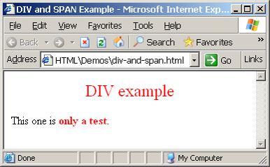
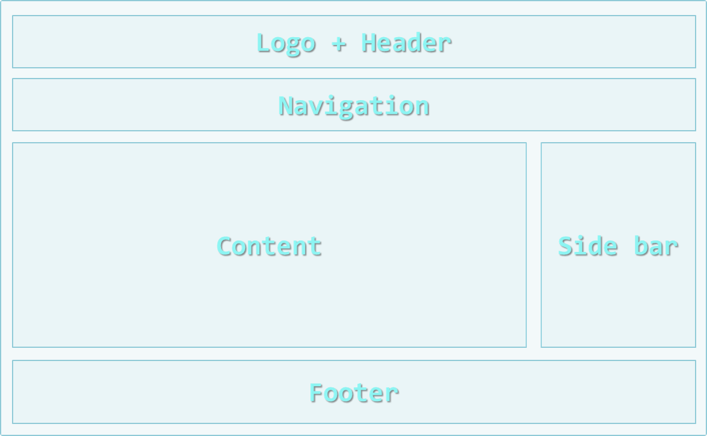

<!-- section start -->

<!-- attr: {id: 'title', class: 'slide-title', hasScriptWrapper: true} -->
# HTML 5
## The past, the present, the future

<div class="signature">
    <p class="signature-course">HTML, CSS & JavaScript</p>
    <p class="signature-initiative">Telerik School Academy</p>
    <a href="http://academy.telerik.com" class="signature-link">http://academy.telerik.com</a>
</div>

<!-- section start -->

<!-- attr: { id:'table-of-contents' } -->
# Table of Contents

- Hypertext Markup Language
- HTML Concepts
- HTML Document Structure
- HTML Common Elements
- Section Elements
- Semantic Structural Tags

<!--  section start -->

<!-- attr: { class:'slide-section', id:'hypertext-markup-language', showInPresentation: true } -->
<!-- # Hypertext Markup Language -->

<!-- attr: { style:'font-size:0.9em' } -->

# Hypertext Markup Language

- HTML – `H`yper `T`ext `M`arkup `L`anguage
  - A notation for describing
  - `document structure` (semantic markup)
  - `formatting` (presentation markup)
- Looks (looked?) like:
  - A Microsoft Word document
- The markup tags provide information about the page content structure
- A HTML document consists of many tags

<!-- attr: { style:'font-size:0.9em' } -->

# Creating HTML Pages

- An HTML document must have an `.htm` or `.html` file extension
- HTML files can be created with text editors:
  - Notepad, Notepad++, Sublime Text
- Or HTML editors (WYSIWYG Editors):
  - Microsoft WebMatrix
  - Microsoft Expression Web
  - Microsoft Visual Studio
  - Adobe Dreamweaver

  <!-- attr: { style:'font-size:0.8em' } -->

# HTML – Past, Present, Future

- 1991 – HTML first mentioned – Tim Berners-Lee – HTML tags
- 1993 – HTML (first public version, published at IETF)
- 1993 – HTML 2 draft
- 1995 – HTML 2 – W3C
- 1995 – HTML 3 draft
- 1997 – HTML 3.2 – “Wilbur”
- 1997 – HTML 4 – ”Cougar” – CSS
- 1999 – HTML 4.01 (final)
- 2000 – XHTML draft
- 2001 – XHTML  (final)
- 2008 – HTML5 / XHTML5 draft
- 2011 – feature complete HTML5
- **http://en.wikipedia.org/wiki/HTML5#Plan_2014**

<!--  section start -->

<!-- attr: {class: 'slide-section', id: 'html-terminology', showInPresentation: true} -->
<!-- # HTML Terminology
## Tags, Attributes and Elements -->

<!-- attr: {style: 'font-size: 40px'} -->

# HTML Terminology

- Concepts in HTML
  - Tags
    - Opening tag and closing tag
    - The smallest piece in HTML
- Attributes
  - Properties of the tag
  - Size, color, etc…
- Elements
  - Combination of opening, closing tag and attributes

<!-- attr: { hasScriptWrapper: true, style: 'font-size: 40px'} -->

# HTML Tags

- Tags are the smallest piece in HTML Document
  - Start with "<" and end with ">"
- Two kinds of tags
  - Opening
    - Mark the start of an HTML element
  - Closing
    - Mark the end of an HTML element
    - Start in "</"
```html
<html>
  <body>
    <h1>Hello Pesho!</h1>
  </body>
</html>
```
<div class="balloon fragment" style="position: absolute; top: 63%; left: 23%; opacity: 0.7;">Opening tag</div>
<div class="balloon fragment" style="position: absolute; top: 77%; left: 24%; opacity: 0.7;">Closing tag</div>

<!-- attr: { hasScriptWrapper: true, style: 'font-size: 40px'} -->

# Attributes

- Attributes are properties of HTML Elements
  - Used to set size, color, border, etc…
  - Put directly in the tags
  - Has value surrounded by `" "` or `' '`
    - The value is always a string

```html
<!-– makes a hyperlink to Google -->
<a href="http://google.com"> go to Google</a>
<!-– makes a horizontal line -->
<hr width="95%" size="3px"/>
<!-– adds an image in the web page -->

```
<div class="balloon fragment" style="position: absolute; top: 60%; left: 55%; opacity: 0.7;">Some tags don't </br> have closing tag</div>

<!-- attr: { hasScriptWrapper: true, style: 'font-size: 40px'} -->

# Most Common Attributes

- There are some attributes that are common for every HTML element
  - Id, class, name, style
- And some attributes are specific
  - For example the attribute `src` of the `img` element
    - Shows the path to the image to be shown

<!-- attr: { hasScriptWrapper: true, style: 'font-size: 40px'} -->

# HTML Elements

- HTML Elements are combination of tags and attributes
  - Opening tag with some or none attributes and a closing tag
```html
<a href="http://google.com"> go to Google</a>
```
```html
<html>...</html>
```

<!-- attr: {class: 'slide-section', id: 'html-terminology-demo', showInPresentation: true} -->
<!-- # HTML Terminology
## Live Demo -->

<!--  section start -->

<!-- attr: {class: 'slide-section', id: 'html-structure', showInPresentation: true} -->
<!-- # HTML Document Structure
## HTML Document, Doctype, Head, Body -->

<!-- attr: {hasScriptWrapper: true, style: 'font-size: 40px'} -->

# HTML Document Structure

- Some elements are essential to each HTML Document:
  - `html`, `head`, `body`, `doctype`
- The `html` element
  - Used to mark the beginning and ending of a HTML document
  - All the content of the web page is inside this tag

```html
<html>
    ...
</html>
```

<!-- attr: {hasScriptWrapper: true, style: 'font-size: 40px'} -->

# Head Element

- The `head` tag contains markup that is not visible to the user (i.e. the person using the browser)
  - But helps the browser to render correctly the HTML document
- What is in there?
  - Styles, scripts
  - Declare encodings
  - Etc..
  - The `title` tag - the text in the tab of a browser


<!-- attr: {hasScriptWrapper: true, style: 'font-size: 40px'} -->

# Body Element and Doctype

- `body` element contains all the visible to the user markup
  - Headings, text, hyperlinks, images, etc…
  - Textboxes, sliders, buttons…
- `Doctype` is kind of the validator of the page
  - Tells the browser in which version of HTML the page is written
  - HTML 5 Doctype

```html
<!DOCTYPE html>
```

<!-- attr: {class: 'slide-section', id: 'html-structure-demo', showInPresentation: true} -->
<!-- # HTML Document Structure
## Live Demo -->

<!--  section start -->

<!-- attr: {class: 'slide-section', id: 'html-elements-slide', showInPresentation: true} -->
<!-- # HTML Common Elements
## Used in 90% of all the sites -->

<!-- attr: {hasScriptWrapper: true, style: 'font-size: 28px'} -->

# Text Formatting

- Text formatting tags modify the text between the opening tag and the closing tag
  - Ex. `<b>Hello</b>` makes "Hello" bold

|         **tag**         |         **example**          |
|:-----------------------:|:----------------------------:|
|      ```<b></b>```      |         <b>bold</b>          |
|      ```<i></i>```      |      <i>itilicized</i>       |
|      ```<u></u>```      |      <u>underlined</u>       |
|    ```<sup></sup>```    | Sample<sup>superscript</sup> |
|    ```<sub></sub>```    |  Sample<sub>subscript</sub>  |
| ```<strong></strong>``` |   <strong>strong</strong>    |
|     ```<em></em>```     |     <em>emphasized</em>      |
|    ```<pre></pre>```    | <pre>Preformatted text</pre> |

- Many of the formatting tags are deprecated
  - Use CSS instead

<!-- attr: {hasScriptWrapper: true, style: 'font-size: 40px'} -->

# Text Formatting

- Hyperlink Tags

```html
<a href="http://www.telerik.com/"
  title="Telerik">Link to Telerik Web site</a>
```
- Image Tags

```html

```

- Text formatting tags

```html
This text is <em>emphasized.</em>
<br />new line<br />
This one is <strong>more emphasized.</strong>
```

<!-- attr: {hasScriptWrapper: true, style: 'font-size: 40px'} -->

# Headings and Paragraphs

- Heading Tags (h1 – h6)

```html
<h1>Heading 1</h1>
<h2>Sub heading 2</h2>
<h3>Sub heading 3</h3>
```
- Paragraph Tags

```html
<p>This is my first paragraph</p>
<p>This is my second paragraph</p>
```

- Sections: `div` and `span`

```html
<div style="background: skyblue;">This is a div</div>
```

<!-- attr: {hasScriptWrapper: true, style: 'font-size: 40px'} -->

# Ordered Lists: `<ol>` Tag

- Create an `O`rdered `L`ist using `<ol></ol>`:

```html
<ol type="1">
  <li>Apple</li>
  <li>Orange</li>
  <li>Grapefruit</li>
</ol>
```
- Attribute values for `type` are: `1`, `A`, `a`, `I`, or `i`
<div class="fragment">
<div style='position:absolute; top:55%; left:5%;'>`1`</div>
<div style='position:absolute; top:62%; left:2%;' class='balloon'>
  <ol style='list-style:'>
    <li>Apple</li>
    <li>Orange</li>
    <li>Grapefruit</li>
  </ol>
</div>
</div>

<div class="fragment">
<div style='position:absolute; top:55%; left:25%;'>`A`</div>
<div style='position:absolute; top:62%; left:24%;' class='balloon'>
  <ol style='list-style: upper-alpha'>
    <li>Apple</li>
    <li>Orange</li>
    <li>Grapefruit</li>
  </ol>
</div>
</div>

<div class="fragment">
<div style='position:absolute; top:55%; left:45%;'>`a`</div>
<div style='position:absolute; top:62%; left:44%;' class='balloon'>
  <ol style='list-style: lower-alpha'>
    <li>Apple</li>
    <li>Orange</li>
    <li>Grapefruit</li>
  </ol>
</div>
</div>

<div class="fragment">
<div style='position:absolute; top:55%; left:65%;'>`I`</div>
<div style='position:absolute; top:62%; left:64%;' class='balloon'>
  <ol style='list-style: upper-roman'>
    <li>Apple</li>
    <li>Orange</li>
    <li>Grapefruit</li>
  </ol>
</div>
</div>

<div class="fragment">
<div style='position:absolute; top:55%; left:85%;'>`i`</div>
<div style='position:absolute; top:62%; left:84%;' class='balloon'>
  <ol style='list-style: lower-roman'>
    <li>Apple</li>
    <li>Orange</li>
    <li>Grapefruit</li>
  </ol>
</div>
</div>

<!-- attr: {hasScriptWrapper: true, style: 'font-size: 40px'} -->

# Unordered Lists: `<ul>` Tag

- Create an `U`nordered `L`ist using `<ul></ul>`:

```html
<ul type="disc">
  <li>Apple</li>
  <li>Orange</li>
  <li>Grapefruit</li>
</ul>
```
- Attribute values for `type` are: `disc`, `circle`, `square`
<div class="fragment">
<div style='position:absolute; top:55%; left:5%;'>`disc`</div>
<div style='position:absolute; top:62%; left:2%;' class='balloon'>
  <ol style='list-style:disc'>
    <li>Apple</li>
    <li>Orange</li>
    <li>Grapefruit</li>
  </ol>
</div>
</div>

<div class="fragment">
<div style='position:absolute; top:55%; left:25%;'>`circle`</div>
<div style='position:absolute; top:62%; left:24%;' class='balloon'>
  <ol style='list-style: circle'>
    <li>Apple</li>
    <li>Orange</li>
    <li>Grapefruit</li>
  </ol>
</div>
</div>

<div class="fragment">
<div style='position:absolute; top:55%; left:45%;'>`square`</div>
<div style='position:absolute; top:62%; left:44%;' class='balloon'>
  <ol style='list-style: square'>
    <li>Apple</li>
    <li>Orange</li>
    <li>Grapefruit</li>
  </ol>
</div>
</div>

<!-- attr: {hasScriptWrapper: true, style: 'font-size: 40px'} -->

# Definition lists: `<dl>` tag

- Create definition lists using `<dl>`
  - Pairs of text and associated definition; text is in `<dt>` tag, definition in `<dd>` tag

```html
<dl>
  <dt>HTML</dt>
  <dd>A markup language …</dd>
  <dt>CSS</dt>
  <dd>Language used to …</dd>
</dl>
```

- Renders without bullets
- Definition is indented

<!-- attr: {class: 'slide-section', id: 'html-elements-demo', showInPresentation: true} -->
<!-- # HTML Common Elements
## Live demo -->

<!--  section start -->

<!-- attr: {class: 'slide-section', id: 'section-elements', showInPresentation: true} -->
<!-- # Section Elements
## The <div> and The <span> -->

<!-- attr: {hasScriptWrapper: true, style: 'font-size: 40px'} -->

# The `<div>` Tag

- `<div>` creates logical divisions within a page

  - Block element
  - Used with CSS
</br>
</br>
</br>
</br>
- Example:

```html
<div style="font-size:24px; color:red">DIV example</div>
<p>This one is <span style="color:red; font-weight:bold">only a test</span>.</p>
```
<!-- attr: {hasScriptWrapper: true, style: 'font-size: 40px'} -->

# The `<span>` Tag

- Inline style element
  - Useful for modifying a specific portion of text
  - Don't create a separate area (paragraph) in the document
- Mainly used to style parts of a text

```html
<p>This one is <span style="color:red; font-weight:bold">only a test</span>.</p>
<p>This one is another <span style="font-size:32px; font-weight:bold">TEST</span>.</p>
```

<!--  section start -->

<!-- attr: {class: 'slide-section', id: 'semantic-tags', showInPresentation: true} -->
<!-- # Semantic Structural Tags -->

<!-- attr: {hasScriptWrapper: true, style: 'font-size: 40px'} -->

# The Structure of a Web Page

- A sample layout structure of a Web Page
</img>

<!-- attr: {hasScriptWrapper: true, style: 'font-size: 40px'} -->

# The "HTML 4 and Before" Way

- Using divs with IDs
  - The IDs are needed for styling

```html
<html>
<head> … </head>
<body>
    <div id="header"> … </div>
    <div id="navigation"> … </div>
    <div id="sidebar"> … </div>
    <div id="content"> … </div>
    <div id="footer"> … </div>
</body>
</html>
```

<!-- attr: {class: 'slide-section', id: 'html4-demo', showInPresentation: true} -->
<!-- # The HTML 4 Way
## Live Demo-->

<!-- attr: {hasScriptWrapper: true, style: 'font-size: 40px'} -->

# The HTML 5 Way

- In HTML 5 there are semantic tags for layout
  - `<nav>`, `<header>`, `<footer>`, `<section>`

```html
<html>
<head> … </head>
<body>
    <header> … </header>
    <nav> … </nav>
    <aside> … </aside>
    <section> … </section>
    <footer> … </footer>
</body>
</html>
```

- Work only on newer browsers

<!-- attr: {class: 'slide-section', id: 'html5-demo', showInPresentation: true} -->
<!-- # Semantic Structural Tags
## Live Demo-->

    <!-- attr: {hasScriptWrapper: true, style: 'font-size: 40px'} -->

# Remember

- It is important to have the correct vision and attitude towards HTML
  - HTML is only about structure, not appearance
  - Browsers tolerate invalid HTML code and parse errors – you should not
  - Always think about semantics
- The W3C HTML Validator is a way to validate your HTML
**http://validator.w3.org/**

<!--  section start -->

<!-- attr: { id:'resources', class:'slide-section', showInPresentation: true } -->
<!-- # Resources
## Additional to this Course Content? -->

<!-- attr: {hasScriptWrapper: true, style: 'font-size: 40px'} -->

# Course Web Site & Forums
-	Register for the [Telerik Academy Forums](http://telerikacademy.com/Forum/Category/12/telerik-school-academy)
	-	Discuss the course exercises with your colleagues
	-	Find solutions for the exercises
	-	Share source code / discuss ideas
-	The course official [web site](http://telerikacademy.com/Courses/Courses/Details/309)
-	More resources:
  - [Course materials](https://github.com/TelerikAcademy/SchoolAcademy/tree/master/2016-01-HTML-CSS-JavaScript)
  - [Youtube Channel]()
  </br>
<a href="http://www.telerikacademy.com" target="\_blank"></a>

<!-- attr: {hasScriptWrapper: true, style: 'font-size: 40px'} -->
# Telerik Integrated Learning System (TILS)
- The Telerik Integrated Learning System ([TILS](http://www.telerikacademy.com))
  - Important resource for all students
  - Homework submissions
  -  Homework peer reviews
  - Presence cards with barcode
  - Reports about your results
- [Course site](http://telerikacademy.com/Courses/Courses/Details/309)
</br>
<a href="http://www.telerikacademy.com" target="\_blank"></a>
<!-- section start  -->

<!-- attr: { class:'slide-section', showInPresentation: true } -->
<!-- # Questions
##  HTML Fundamentals -->
