<!-- section start -->
<!-- attr: { class:'slide-title', showInPresentation:true, hasScriptWrapper:true, style:'' } -->
# CSS Overview
##  Cascading Style Sheets
<div class="signature">
    <p class="signature-course">HTML, CSS & JavaScript</p>
    <p class="signature-initiative">Telerik School Academy</p>
    <a href="http://academy.telerik.com" class="signature-link">http://academy.telerik.com</a>
</div>

<!-- attr: { showInPresentation:true, hasScriptWrapper:true, style:'' } -->
# Table of Contents
- What is CSS?
- Styling with Cascading Style Sheets (CSS)
- CSS Selectors
  - Select by element name, id or class
  - Nested Selectors
- Importing CSS into HTML
- Selectors
  - Attribute selectors
  - Pseudo Selectors

<!-- section start -->
<!-- attr: { class:'slide-section', showInPresentation:true, hasScriptWrapper:true, style:'' } -->
# Cascading Style Sheets
##  Separating Content from Presentation

<!-- attr: { hasScriptWrapper:true, showInPresentation:true, style:'font-size: 36px' } -->
# CSS: A New Philosophy
- Separate content from presentation!
    - Content (`HTML` document on the left)
    - Presentation (`CSS` document on the right)

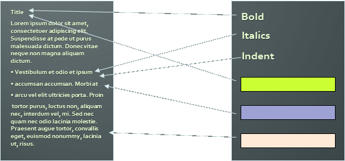

<!-- attr: { hasScriptWrapper:true, showInPresentation:true, style:'' } -->
# The Resulting Page
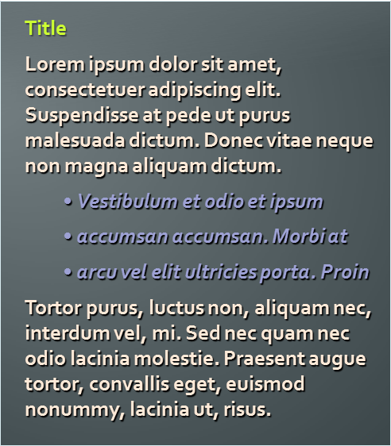

<!-- section start -->
<!-- attr: { class:'slide-section', showInPresentation:true, hasScriptWrapper:true, style:'' } -->
# CSS Intro
## Styling with Cascading Stylesheets

<!-- attr: { showInPresentation:true, style:'font-size: 40px' } -->
# CSS Introduction
- Cascading Style Sheets (CSS)
  - Used to `describe` the presentation of documents
  - Define `sizes`, `spacing`, `fonts`, `colors`, `layout`, etc.
  - Improve content `accessibility`
  - Improve `flexibility`
- Designed to separate presentation from content
- Due to CSS, all `HTML presentation` tags and `attributes` are `deprecated`, e.g. `font`, `center`, etc.

<!-- attr: { showInPresentation:true, style:'font-size: 40px' } -->
# CSS Introduction (2)
- CSS can be applied to any XML document
  - Not just to HTML / XHTML
- CSS can specify different styles for different `media`
  - On-screen
  - In print
  - Handheld, projection, etc.
  - … even by voice or Braille-based reader

<!-- attr: { showInPresentation:true, style:'font-size: 40px' } -->
# Why “Cascading”?
- Priority scheme determining which style rules apply to element
  - `Cascade priorities` or `specificity (weight)` are calculated and assigned to the rules
  - Child elements in the HTML DOM tree inherit styles from their parent
    - Can override them
    - Control via `!important` rule

<!-- attr: { showInPresentation:true, hasScriptWrapper:true, style:'' } -->
# Why "Cascading"? (2)

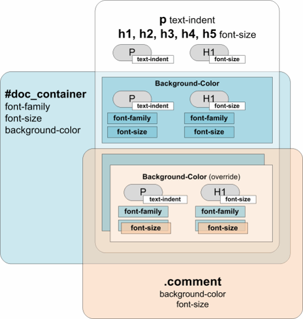

<!-- attr: { showInPresentation:true, style:'font-size: 40px' } -->
# Style Inheritance
- Some CSS styles are inherited and some are not
  - `Text-related` and `list-related` properties are `inherited`: `color`, `font-size`, `font-family`, `line-height`, `text-align`, `list-style`, etc.
  - `Box-related` and `positioning` styles are `not inherited`: `width`, `height`, `border`, `margin`, `padding`, `position`, `float`, etc
  - `<a>` elements do not inherit color and text-decoration

<!-- attr: { showInPresentation:true, hasScriptWrapper:true, style:'font-size: 40px' } -->
# Style Sheets Syntax
- Stylesheets consist of `rules`, `selectors`, `declarations`, `properties` and `values`

- `Selectors` are separated by commas
- `Declarations` are separated by semicolons
- `Properties` and `values` are separated by colons
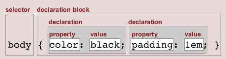

```css
h1,h2,h3 { color: green; font-weight: bold; }
```
- http://css.maxdesign.com.au

<!-- section start -->
<!-- attr: { class:'slide-section', showInPresentation:true, hasScriptWrapper:true, style:'font-size: 40px' } -->
# Common Selectors
##  Select the Elements to Apply a Style

<!-- attr: { showInPresentation:true, style:'' } -->
# Selectors
- Selectors determine which element the rules apply to:
  - All elements of specific type (`tag`)
  - Those that match a specific attribute (`id`, `class`)
  - Elements may be matched depending on how they are nested in the document tree (HTML)
- Examples:

```css
.header a { color: green }
```

```css
#menu>li { padding-top: 8px }
```

<!-- attr: {hasScriptWrapper:true, showInPresentation:true, style:'font-size: 30px' } -->
# Primary Selectors
- Three primary kinds of selectors:
  - By tag (type selector):

  ```css
  h1 { font-family: verdana,sans-serif; }
  ```

  - By element id:

  ```css
  #element_id { color: #ff0000; }
  ```

  - By element class name (only for HTML):

  ```css
  .myClass {border: 1px solid red}
  ```

- Selectors can be combined with commas:
```css
h1, .link, #top-link {font-weight: bold}
```

-     This will match `<h1>` `tags`, elements with `class` `link`, and the element with `id` `top-link`

<!-- attr: { hasScriptWrapper:true, showInPresentation:true, style:'font-size: 34px' } -->
# Nested Selectors
- Match relative to element placement:

```css
p a {text-decoration: underline}
```

- This will match all `<a>` tags that are inside of `<p>`

- `x` – universal selector (avoid or use with care!):

```css
p x {color: black}
```

- This will match all descendants of `<p>` element
- `+` selector – used to match “next sibling”:

```css
img + .link {float:right}
```

-     This will match all siblings with class name `link` that appear immediately after `` tag

<!-- attr: { hasScriptWrapper: true, showInPresentation:true, style:'font-size: 40px' } -->
# Nested Selectors (2)
- `>` selector – matches direct child nodes:

```css
p > .error {font-size: 8px}
```

-   This will match all elements with class `error`, direct children of `<p>` tag
- `.class1.class2 `(no space!)
  - Matches elements with both (all) classes applied at the same time

```css
p.post-text.special {font-weight: bold}
```

<!-- attr: { class:'slide-section demo', showInPresentation:true, hasScriptWrapper:true, style:'' } -->
<!-- # Common Selectors -->
##  [Demo]()

<!-- section start -->
<!-- attr: { class:'slide-section', showInPresentation:true, hasScriptWrapper:true, style:'' } -->
# Importing CSS Into HTML
##  How to Use CSS with HTML?

<!-- attr: { hasScriptWrapper: true, showInPresentation:true, style:'font-size: 40px' } -->
# Importing CSS Into HTML
- `CSS` (presentation) can be imported in `HTML` (content) in three ways:
  - `Inline`: the CSS rules in the `style` attribute
    - No selectors are needed
  - `Embedded`: in the `<head>` in a `<style>` tag
  - `External`: CSS rules in separate file (best)
    - Usually a file with `.css` extension
    - Linked via `<link rel="stylesheet" href="…">` tag
    - Via` @import` directive in embedded CSS block

<!-- attr: { showInPresentation:true, hasScriptWrapper:true, style:'font-size: 40px' } -->
# Linking HTML and CSS (2)
- Using `external CSS files `is highly recommended
  - Simplifies the HTML document
  - Improves page load speed (CSS file is cached)
- HTML links to external CSS file

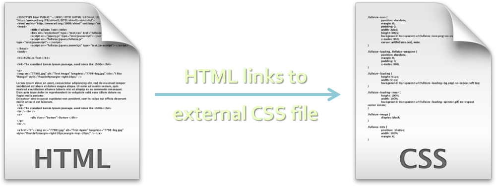

<!-- attr: { hasScriptWrapper: true, showInPresentation:true, style:'font-size: 40px' } -->
# Inline Styles: Example

```html
<!DOCTYPE html>
<html lang="en">
<head>
  <title>Inline Styles</title>
</head>
<body>
  <p>Here is some text</p>
<!--Separate multiple styles with a semicolon-->
  <p style="font-size: 20pt">Here is some
    more text</p>
  <p style="font-size: 20pt;color:
    #0000FF" >Even more text</p>
</body>
</html>
```

<div class="fragment">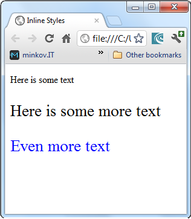</div>    

<!-- attr: { hasScriptWrapper: true, showInPresentation:true, style:'font-size: 40px' } -->
# Embedded Styles
- Embedded in the HTML in the `<style>` tag:

```html
<style type="text/css"/>
```

  - The `<style>` tag is placed in the `<head>` section of the document
  - `type` attribute specifies the MIME type
    - MIME describes the format of the content
    - Other MIME types include `text/html`, `image/gif`, `text/javascript` …
    - Not required in HTML5
- Used for document-specific styles

<!-- attr: { hasScriptWrapper: true, showInPresentation:true, style:'font-size: 40px' } -->
# Embedded Styles: Example

```html
<!DOCTYPE html>
<html>
<head>
  <title>Style Sheets</title>
  <style type="text/css">
    em {background-color:#8000FF; color:white}
    h1 {font-family:Arial, sans-serif}
    p  {font-size:18pt}
    .blue {color:blue}
  </style>
<head>
```

<!-- attr: { hasScriptWrapper: true, showInPresentation:true, style:'font-size: 40px' } -->
# Embedded Styles: Example (2)

```html
…
<body>
  <header>
      <h1 class="blue">A Heading</h1>  </header>  <article>
      <p>Here is some text. Here is some text.     
      Here is some text. Here is some text. Here
      is some text.</p>      
     <h1>Another Heading</h1>        
     <p class="blue">Here is some more text.
     Here is some more text.</p>
     <p class="blue">Here is some <em>more</em>
     text. Here is some more text.</p>  </article>
</body>
</html>
```
<div class="fragment">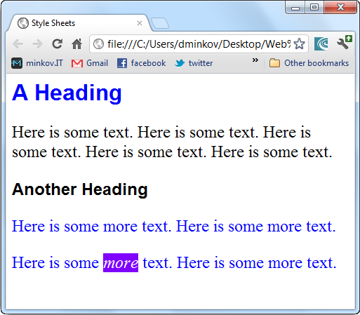</div>    

<!-- attr: { hasScriptWrapper: true, showInPresentation:true, style:'font-size: 40px' } -->

# External CSS Styles
- External linking
  - Separate pages can all use a shared style sheet
  - Only modify a single file to change the styles across your entire Web site (see [www.csszengarden.com](http://www.csszengarden.com))

- `link` tag (with a `rel` attribute)
  - Specifies a relationship between current document and another document

  ```html
  <link rel="stylesheet" type="text/css"
    href="styles.css">
  ```

  - `link` elements should be in the `<head>`


<!-- attr: { hasScriptWrapper: true, showInPresentation:true, style:'font-size: 40px' } -->
# External CSS Styles (2)
- `@import`
  - Another way to link external CSS files
  - Example:

  ```html
  <style type="text/css">
    @import url("styles.css");  /x same as x/
    @import "styles.css";
  </style>
  ```

  - Ancient browsers do not recognize `@import`
  - Use `@import` in an external CSS file to workaround the IE CSS file limit of 31 files


<!-- attr: { hasScriptWrapper: true, showInPresentation:true, style:'font-size: 40px' } -->
# External Styles: Example

```css
/x CSS Document x/
a       { text-decoration: none }
a:hover { text-decoration: underline;
          color: red;
          background-color: #CCFFCC }
li em   { color: red;
          font-weight: bold }
ul      { margin-left: 2cm }
ul ul      { text-decoration: underline;
          margin-left: .5cm }
```

<!-- attr: { hasScriptWrapper: true,  showInPresentation:true, style:'font-size: 40px' } -->
# External Styles: Example (2)

```html
<!DOCTYPE html>
<html>
<head>
  <title>Importing style sheets</title>
  <link type="text/css" rel="stylesheet"
    href="styles.css"  />
</head>
<body>
  <h1>Shopping list for <em>Monday</em>:</h1>
  <li>Milk</li>
  …
```

<!-- attr: { hasScriptWrapper: true, showInPresentation:true, style:'font-size: 40px' } -->
# External Styles: Example (3)

```html
  …
  <li>Bread
    <ul>
      <li>White bread</li>
      <li>Rye bread</li>
      <li>Whole wheat bread</li>
    </ul>
  </li>
  <li>Rice</li>
  <li>Potatoes</li>
  <li>Pizza <em>with mushrooms</em></li>
</ul>
<a href="http://food.com" title="grocery
  store">Go to the Grocery store</a>
</body>
</html>
```
<div class="fragment">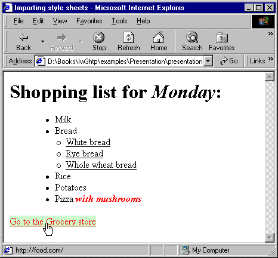</div>    

<!-- section start -->
<!-- attr: { class:'slide-section', showInPresentation:true, hasScriptWrapper:true, style:'' } -->
# Attribute Selectors
## Picking Elements with Certain Attributes


<!-- attr: { hasScriptWrapper: true, showInPresentation:true, style:'font-size: 36px' } -->

# Attribute Selectors
- `[ ]`selects elements based on attributes
  - Element with a given attributeSelects `<a>` elements with `title`

  ```css
  a[title] {color:black}
  ```

  - Elements with a concrete attribute value
  - Selects `<input>` elements with `type=text`

  ```css
  input[type=text] { font-family:Consolas}
  ```

  - Elements whose attribute values contain a word
  - Selects `<a>` elements whose title attribute value contains `logo`

  ```css
  a[titlex=logo] {border: none}
  ```

<!-- attr: { class:'slide-section demo', showInPresentation:true, hasScriptWrapper:true, style:'' } -->
# Attribute Selectors
## [Demo]()


<!-- section start -->
<!-- attr: { class:'slide-section', showInPresentation:true, hasScriptWrapper:true, style:'' } -->
# Pseudo Selectors
## Relative to Element Content or State


<!-- attr: { hasScriptWrapper: true, showInPresentation:true, style:'font-size: 40px' } -->

# Common Pseudo Selectors
- Pseudo-classes define state
  - `:hover`, `:visited`, `:active` , `:lang`

- Pseudo-elements define element "parts" or are used to generate content
  - `:first-line` , `:before`, `:after`

```css
a:hover { color: red; }
p:first-line { text-transform: uppercase; }
.title:before { content: "»"; }
.title:after { content: "«"; }
```

<!-- attr: { class:'slide-section demo', showInPresentation:true, hasScriptWrapper:true, style:'' } -->
<!-- # Common Pseudo Selectors -->
## [Demo]()

<!-- attr: { hasScriptWrapper: true, showInPresentation:true, style:'font-size: 40px' } -->

# Structural Pseudo-classes
- `:root`
  - The root of the document

- `E:nth-child(n)`
  - An `E` element, the n-th child of its parent

- `E:nth-last-child(n)`
  - An `E` element, the n-th child of its parent, counting from the last on

- `E:nth-of-type(n)`
  - An `E` element, the n-th sibling of its type

<!-- attr: { hasScriptWrapper: true, showInPresentation:true, style:'font-size: 40px' } -->

# Structural Pseudo-classes (2)
- `E:nth-last-of-type(n)`
  - An `E` element, the n-th sibling of its type, counting from the last one

- `E:last-child`
  - An `E` element, last child of its parent

- `E:first-of-type`
  - An `E` element, first sibling of its type

- `E:last-of-type`
  - An `E` element, last sibling of its type

<!-- attr: { hasScriptWrapper: true, showInPresentation:true, style:'font-size: 40px' } -->

# Structural Pseudo-classes (3)
- `E:only-child`
  - An `E` element, only child of its parent

- `E:only-of-type`
  - An `E` element, only sibling of its type

- `E:empty`
  - An `E` element that has no children (including text nodes)

- More detailed descriptions:

[http://www.w3.org/TR/css3-selectors/#structural-pseudos](http://www.w3.org/TR/css3-selectors/#structural-pseudos)

<!-- attr: { class:'slide-section demo', showInPresentation:true, hasScriptWrapper:true, style:'' } -->
<!-- # Structural Selectors -->
## [Demo]()

<!-- attr: { hasScriptWrapper: true, showInPresentation:true, style:'font-size: 40px' } -->

# The UI Element StatesPseudo-Classes
- `E:enabled`
  - A user interface element `E` which is enabled

- `E:disabled`
  - A user interface element `E` which is disabled

- `E:checked`
  - A user interface element `E` which is checked (for instance a radio-button or checkbox)
  - Currently supported only in Opera and IE10 !

<!-- attr: { class:'slide-section demo', showInPresentation:true, hasScriptWrapper:true, style:'' } -->
<!-- # UI Selectors -->
## [Demo]()

<!-- attr: { hasScriptWrapper: true, showInPresentation:true, style:'font-size: 40px' } -->

# Other CSS 3 Selectors
- `E:target`
  - An `E` element being the target of the referring URI

- `E:not(s)`
  - An `E` element that does not match simple selector

- `E ~ F`
  - An `F` element preceded by an `E` element


<!-- attr: { class:'slide-section demo', showInPresentation:true, hasScriptWrapper:true, style:'' } -->
<!-- # Other CSS 3 Selectors -->
## [Demo]()

<!-- section start -->
<!-- attr: { class:'slide-section', showInPresentation:true, hasScriptWrapper:true, style:'' } -->

# CSS Values
## Types, Ranges, Units

<!-- attr: { hasScriptWrapper: true, showInPresentation:true, style:'font-size: 40px' } -->

# CSS Values
- All values in CSS are strings
  - They can represent values that are not strings
  - I.e. `14px` means size 14 pixels

- Colors are set in a red-green-blue format (RGB)
  - Both in hex and decimal

```css
li.nav-item {
  color: #44f1e1}
```

```css
li.nav-item {
  color: rgb(68, 241, 255)}
```

<!-- attr: { hasScriptWrapper: true, showInPresentation:true, style:'font-size: 40px' } -->

# Size Values
- When setting a size (width, height, font-size...) the values are given as numbers
  - Multiple formats / metrics may be used
  - Pixels, ems, e.g. `12px` , `1.4em`
  - Points, inches, centimeters, millimeters
    - E.g. `10pt` , `1in`, `1cm`, `1mm`

  - Percentages, e.g. `50%`
    - Of the size of the container/font size

  - Zero can be used with no unit: `border: 0;`

<!-- attr: { class:'slide-section demo', showInPresentation:true, hasScriptWrapper:true, style:'' } -->
<!-- # Size Values -->
## [Demo]()


<!-- attr: { hasScriptWrapper: true, showInPresentation:true, style:'font-size: 40px' } -->


# Color Values
- Colors in CSS can be represented in few ways
  - Using red-green-blue
    - Or red-green-blue-alpha
<div class="balloon fragment" style="top:41%; left:45%; z-index:1; opacity: 0.7">The opacity values are from 0.0 to 1.0</div>

```css
color: #f1a2ff
color: rgb(241, 162, 255)
color: rgba(241, 162, 255, 0.1)
```

  - Using hue-saturation-light
    - Or hue-saturation-light-alpha

```css
color: hsl(291, 85%, 89%);
color: hsl(291, 85%, 89%, 0.1);
```

<!-- attr: { hasScriptWrapper: true, showInPresentation:true, style:'font-size: 40px' } -->

# RGB Colors
- RGB colors are defined with values for red, green and blue intensity
- Syntax:` `
  - `#44fa36` – values are in hex
  - `rgb(<red>, <green>, <blue>)`– decimal values
  <div class="fragment">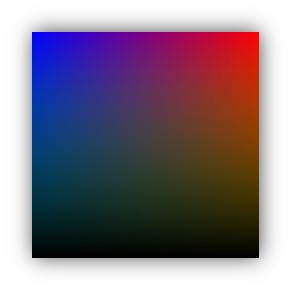</div>    

- The range for `red`, `green` and `blue` is between integers `0` and `255`
<div class="fragment"></div>    

```css
color: #07f2b3
  <!– or -->
color: rgb (7, 242, 179)
```

<!-- attr: { hasScriptWrapper: true, showInPresentation:true, style:'font-size: 40px' } -->

# RGBA Colors
- Standard RGB colors with an opacity value for the color (alpha channel)
<div class="fragment"></div>    

- Syntax:`rgba(<red>, <green>,`
    </br>`<blue>, <alpha>)`
- The range for `red`, `green` and `blue` is between integers `0` and `255`
- The range for the alpha channel is between `0.0` and `1.0`
- Example: `rgba(255, 0, 0, 0.5)`
<div class="fragment"></div>    


<!-- attr: { hasScriptWrapper: true, showInPresentation:true, style:'font-size: 40px' } -->

# HSL Colors
- Hue is a degree on the color wheel
  - `0` (or `360`) is red, `120` is green, `240` is blue

- Saturation is a percentage value
  - `100%` is the full color

- Lightness is also a percentage
  - `0%` is dark (black)
  - `100%` is light (white)
  - `50%` is the average
<div class="fragment">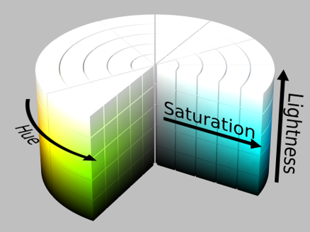</div>    

<!-- attr: { hasScriptWrapper: true, showInPresentation:true, style:'font-size: 40px' } -->

# HSLA Colors
- HSLA allows a fourth value, which sets the Opacity (via the Alpha channel) of the element
- As RGBA is to RGB, HSLA is to HSL
- Supported in IE9+, Firefox 3+, Chrome, Safari, and in Opera 10+
- Example:
  - `hsla(0, 100%, 50%, 0.5)`
  - Result:` `

<div class="fragment"></div>    
<div class="fragment">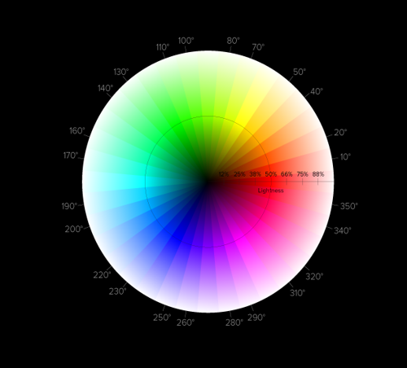</div>    


<!-- attr: { class:'slide-section demo', showInPresentation:true, hasScriptWrapper:true, style:'' } -->
<!-- # Color Values -->
## [Demo]()

<!-- section start --> <!-- attr: { class:'slide-section', showInPresentation:true, hasScriptWrapper:true, style:'' } -->
# Default Browser Styles
## Why Things Look Different on Different Browsers?

<!-- attr: { hasScriptWrapper: true, showInPresentation:true, style:'font-size: 40px' } -->

# Default Browser Styles
- Browsers have predefined CSS styles
  - Used when there is no CSS information or any other style information in the document

- `Caution`: default styles differ in browsers
  - E.g. `margins`, `paddings`and `font sizes` differ most often
  - Usually developers reset them

```css
x { margin: 0; padding: 0; }
```

```css
body, h1, p, ul, li { margin: 0; padding: 0; }
```

<!-- attr: { hasScriptWrapper: true, showInPresentation:true, style:'font-size: 40px' } -->

# CSS Cascade (Precedence)
- There are browser, user and author stylesheets with "`normal`" and "`important`" declarations
  - Browser styles (least priority)
  - Normal user styles
  - Normal author styles (external, in head, inline)
  - Important author styles
  - Important user styles (max priority)

```css
a { color: red !important ; }
```

[http://www.slideshare.net/maxdesign/css-cascade-1658158](http://www.slideshare.net/maxdesign/css-cascade-1658158)

<!-- attr: { hasScriptWrapper: true, showInPresentation:true, style:'font-size: 40px' } -->

# CSS Specificity
- CSS specificity is used to determine the precedence (priority) of the CSS style declarations with the same origin
  - Simple calculation: `#id = 100`, `.class = 10`, `:pseudo = 10`, `[attr] = 10`, `tag = 1`, `x = 0`
  - Same number of points? Order matters!
  - See also:
    - [http://www.smashingmagazine.com/2007/07/27/css-specificity-things-you-should-know/](http://www.smashingmagazine.com/2007/07/27/css-specificity-things-you-should-know/)
    - [http://css.maxdesign.com.au/selectutorial/advanced_conflict.htm](http://css.maxdesign.com.au/selectutorial/advanced_conflict.htm)

<!-- attr: { class:'slide-section demo', showInPresentation:true, hasScriptWrapper:true, style:'' } -->
<!-- # CSS Rules Precedence  -->
## [Demo]()


<!-- attr: { hasScriptWrapper: true, showInPresentation:true, style:'font-size: 40px' } -->

# CSS References
- The CSS documentation at WebPlatform.org:
  - [http://docs.webplatform.org/wiki/css](http://docs.webplatform.org/wiki/css)

- CSS documentation at Mozilla
  - [https://developer.mozilla.org/en-US/docs/CSS](https://developer.mozilla.org/en-US/docs/CSS)

- CSS3 tutorial
  - [http://www.w3schools.com/css3/](http://www.w3schools.com/css3/)

- A list of all CSS 2.1 properties is available at [http://www.w3.org/TR/CSS2/propidx.html](http://www.w3.org/TR/CSS2/propidx.html)

<!-- attr: { class:'slide-section', showInPresentation: true } -->
<!-- # Questions
##  CSS Overview -->
