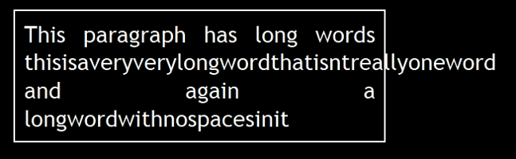

<!-- section start -->
<!-- attr: { class:'slide-title', showInPresentation:true, hasScriptWrapper:true, style:'' } -->
# CSS Presentation
##  How to make things shiny?
<div class="signature">
    <p class="signature-course">HTML, CSS & JavaScript</p>
    <p class="signature-initiative">Telerik School Academy</p>
    <a href="http://academy.telerik.com" class="signature-link">http://academy.telerik.com</a>
</div>

<!-- attr: { showInPresentation:true, hasScriptWrapper:true, style:'font-size: 40px' } -->
# Table of Contents
- Text-related Properties
- Borders
- Backgrounds
  - Background color
  - Background image
  - Gradient Background
- Opacity


<!-- section start -->
<!-- attr: { class:'slide-section', showInPresentation:true, hasScriptWrapper:true, style:'font-size: 40px' } -->
# Text-related Properties


<!-- attr: { showInPresentation:true, hasScriptWrapper:true, style:'font-size: 40px' } -->
# Text-related CSS Properties
- `color` – specifies the color of the text
- `font-size` – size of font: `xx-small`, `x-small`, `small`, `medium`, `large`, `x-large`, `xx-large`, `smaller`, `larger` or numeric value
- `font-family` – comma separated font names
  - Example: `verdana`, `sans-serif`, etc.
  - The browser loads the first one that is available
  - There should always be at least one generic font
- `font-weight` can be `normal`, `bold`, `bolder`, `lighter` or a number in range [100 … 900]

<!-- attr: { showInPresentation:true, hasScriptWrapper:true, style:'font-size: 40px' } -->
# CSS Rules for Fonts (2)
- `font-style` – styles the font
  - Values: `normal`, `italic`, `oblique`
- `text-decoration` – decorates the text
  - Values: `none`, `underline`, `line-trough`, `overline`, `blink`
- `text-align` – defines the alignment of text or other content
  - Values: `left`, `right`, `center`, `justify`

<!-- attr: { showInPresentation:true, hasScriptWrapper:true, style:'font-size: 40px' } -->
# Shorthand Font Property
- `font`
  - Shorthand rule for setting multiple font properties at the same time

```
font:italic normal bold 12px/16px verdana
```
  - is equal to writing this:

```
font-style: italic;
font-variant: normal;
font-weight: bold;
font-size: 12px;
line-height: 16px;
font-family: verdana;
```

<!-- attr: { class:'slide-section demo', showInPresentation:true, hasScriptWrapper:true, style:'font-size: 40px' } -->
<!-- # Text-related Properties -->
##  [Demo]()

<!-- section start -->
<!-- attr: { class:'slide-section', showInPresentation:true, hasScriptWrapper:true, style:'font-size: 40px' } -->
# More Fonts


<!-- attr: { showInPresentation:true, hasScriptWrapper:true, style:'font-size: 40px' } -->

# Font Embeds
- Use `@font-face` to declare font
- Point to font file on server
- Call font with font-family
- Currently not supported in IE
- Use font embedding instead of images
```css
@font-face {
	font-family: SketchRockwell;
	src: url('SketchRockwell-Bold.ttf');
}
.my_CSS3_class {
	font-family: SketchRockwell;
	font-size: 3.2em;
}
```

<!-- attr: { showInPresentation:true, hasScriptWrapper:true, style:'font-size: 40px' } -->
# Text Shadow
- Applies shadow to text
- Syntax: `text-shadow: <horizontal-distance> <vertical-distance><blur-radius> <shadow-color>;`
- Do not alter the size of a box
<div class="fragment"></div>    
<div class="fragment"></div>    

</br>
```
- text-shadow: 2px 2px 7px #000000;
```


<<!-- attr: { showInPresentation:true, hasScriptWrapper:true, style:'font-size: 40px' } -->
# Text Overflow
- Specifies what should happen when text overflows the containing element
- Syntax:` text-overflow: <value>;`
- Possible values:
  - `ellipsis` - Display ellipses to represent clipped text  </br>  </br>  </br>
  - `clip` - Default value, clips text  </br>  </br>
  <div class="fragment"></div>    
  <div class="fragment"></div>

- Currently not supported in Firefox and IE


<<!-- attr: { showInPresentation:true, hasScriptWrapper:true, style:'font-size: 40px' } -->

# Word Wrapping
- Allows long words to be able to be broken and wrap onto the next line
- Syntax:` word-wrap: <value>;`
- Possible values:
  - `normal`</br></br></br>
  - `break-word`</br></br>
  <div class="fragment"></div>    
  <div class="fragment"></div>
- Supported in all major browsers


<!-- attr: { class:'slide-section demo', showInPresentation:true, hasScriptWrapper:true, style:'' } -->
<!-- # More Fonts -->
##  [Demo]()

<!-- section start -->
<!-- attr: { class:'slide-section', showInPresentation:true, hasScriptWrapper:true, style:'' } -->
# Borders


<!-- attr: { showInPresentation:true, hasScriptWrapper:true, style:'font-size: 40px' } -->

# Borders
- `border-width`: `thin`, `medium`, `thick` or numerical value (e.g. `10px`)
- `border-color`: color alias or RGB value
- `border-style`: `none`, `hidden`, `dotted`, `dashed`, `solid`, `double`, `groove`, `ridge`, `inset`, `outset`
- Each property can be defined separately for left, top, bottom and right
  - `border-top-style`, `border-left-color`, …

<!-- attr: { showInPresentation:true, hasScriptWrapper:true, style:'font-size: 40px' } -->

# Border Shorthand Property
- `border`: shorthand rule for setting border properties at once:

```
border: 1px solid red
```

- 	is equal to writing:

```
border-width:1px;
border-color:red;
border-style:solid;
```

- Specify different borders for the sides via shorthand rules: `border-top`, `border-left`, `border-right`, `border-bottom`
  - `border:none` or `border:0`?


<!-- attr: { class:'slide-section demo', showInPresentation:true, hasScriptWrapper:true, style:'' } -->
<!-- # Borders -->
##  [Demo]()


<!-- attr: { showInPresentation:true, hasScriptWrapper:true, style:'font-size: 40px' } -->
# Border color

- Allows you to create cool colored borders
- Only Firefox supports this type of coloring

```
border: 8px solid #000;
-moz-border-bottom-colors: #555 #666 #777 #888 #999 #aaa #bbb #ccc;
-moz-border-top-colors: #555 #666 #777 #888 #999 #aaa #bbb #ccc;
-moz-border-left-colors: #555 #666 #777 #888 #999 #aaa #bbb #ccc;
-moz-border-right-colors: #555 #666 #777 #888 #999 #aaa #bbb #ccc;
```

<div class="fragment"></div>


<!-- attr: { showInPresentation:true, hasScriptWrapper:true, style:'font-size: 40px' } -->
# Box shadow
- Allows to easily implement multiple drop shadows (outer or inner) on box elements
- Specifying values for color, size, blur and offset
- Example:
- -moz-box-shadow: 10px 10px 5px #888;-webkit-box-shadow: 10px 10px 5px #888;box-shadow: 10px 10px 5px #888;

<div class="fragment"></div>


<!-- attr: { showInPresentation:true, hasScriptWrapper:true, style:'font-size: 40px' } -->

# Rounded Corners
- Rounded corners are a part of CSS 3
  - Supported in all major browsers
  - Firefox, IE 9, Chrome, Opera and Safari
- Done by the `border-radius` property

```
border-radius: [<length>|<%>][<length>|<%>]?
```
- Three ways to define corner radius:

```
border-radius: 15px;
```

```
border-radius: 15px 20px;
```

```
border-radius: 15px 15px 15px 10px;
```

<!-- attr: { class:'slide-section demo', showInPresentation:true, hasScriptWrapper:true, style:'' } -->
<!-- # Other Border Styles -->
##  [Demo]()


<!-- section start -->
<!-- attr: { class:'slide-section', showInPresentation:true, hasScriptWrapper:true, style:'' } -->
# Background Properties


<!-- attr: { showInPresentation:true, hasScriptWrapper:true, style:'font-size: 40px' } -->
# Backgrounds
- `background-image`
  - URL of image to be used as background, e.g.:

```
background-image:url("back.gif");
```

- `background-color`
  - Using color and image and the same time
- `background-repeat`
  - `repeat-x`, `repeat-y`, `repeat`, `no-repeat`
- `background-attachment`
  - `fixed` / `scroll`


  <!-- attr: { showInPresentation:true, hasScriptWrapper:true, style:'font-size: 40px' } -->
# Backgrounds (2)
- `background-position`: specifies vertical and horizontal position of the background image
  - Vertical position: `top`, `center`, `bottom`
  - Horizontal position: `left`, `center`, `right`
  - Both can be specified in percentage or other numerical values
  - Examples:

```
background-position: top left;
```

```
background-position: -5px 50%;
```

<!-- attr: { showInPresentation:true, hasScriptWrapper:true, style:'font-size: 40px' } -->
# Background Shorthand Property
- `background`: shorthand rule for setting background properties at the same time:

```
background: #FFF0C0 url("back.gif") no-repeat fixed top;
```
- 	is equal to writing:

```
background-color: #FFF0C0;
background-image: url("back.gif");
background-repeat: no-repeat;
background-attachment: fixed;
background-position: top;
```
  - Some browsers will not apply BOTH color and image for background if using shorthand rule


<!-- attr: { showInPresentation:true, hasScriptWrapper:true, style:'font-size: 40px' } -->
# Background-image or ``?
- Background images allow you to save many image tags from the HTML
  - Leads to less code
  - More content-oriented approach
- All images that are not part of the page content (and are used only for "beautification") should be moved to the CSS

<!-- attr: { class:'slide-section demo', showInPresentation:true, hasScriptWrapper:true, style:'' } -->
<!-- # Background Styles -->
##  [Demo]()


<!-- attr: { showInPresentation:true, hasScriptWrapper:true, style:'font-size: 40px' } -->
# Gradient Backgrounds
- Gradients are smooth transitions between two or more specified colors
- Use of CSS gradients can replace images and reduce download time
  - Lots of gradient generators on the WEB
- Create a more flexible layout, and look better while zooming
- Supported in all major browsers via different keywords
- This is still an experimental feature


<!-- attr: { showInPresentation:true, hasScriptWrapper:true, style:'font-size: 40px' } -->
# Gradient Backgrounds Example

```
/x Firefox 3.6+ x/
background: -moz-linear-gradient(100% 100% 90deg,   
  #FFFF00, #0000FF);
/x Safari 4-5, Chrome 1-9 x/
background: -webkit-gradient(linear, 0% 0%, 0%
  100%, from(#0000FF), to(#FFFF00));
/x Safari 5.1+, Chrome 10+ x/
background: -webkit-linear-gradient(#FFFF00,
  #0000FF);
/x Opera 11.10+ x/
background: -o-linear-gradient(#2F2727, #0000FF);
```

<div class="fragment"></div>

<!-- attr: { class:'slide-section demo', showInPresentation:true, hasScriptWrapper:true, style:'' } -->
<!-- # Gradient Background  -->
##  [Demo]()


<!-- attr: { showInPresentation:true, hasScriptWrapper:true, style:'font-size: 40px' } -->
# Multiple Backgrounds
- CSS3 allows multiple background images
- Simple comma-separated list of images
- Supported in Firefox (3.6+), Chrome (1.0/1.3+), Opera (10.5+) and Internet Explorer (9.0+)
- Comma separated list for the other properties

```
background-image: url(sheep.png), url(grass.png);
```
<div class="fragment"></div>


<!-- attr: { class:'slide-section demo', showInPresentation:true, hasScriptWrapper:true, style:'' } -->
<!-- # Multiple Backgrounds -->
##  [Demo]()


<!-- section start -->
<!-- attr: { class:'slide-section', showInPresentation:true, hasScriptWrapper:true, style:'' } -->
# Opacity


<!-- attr: { showInPresentation:true, hasScriptWrapper:true, style:'font-size: 40px' } -->
# Opacity
- `opacity`: specifies the opacity of the element
  - Floating point number from 0 to 1
  - For old Mozilla browsers use `–moz-opacity`
  - For IE use `filter:alpha(opacity=value)` where value is from 0 to 100; also, "binary and script behaviors" must be enabled and `hasLayout` must be triggered, e.g. with `zoom:1`

<!-- attr: { class:'slide-section demo', showInPresentation:true, hasScriptWrapper:true, style:'' } -->
<!-- # Opacity -->
##  [Demo]()


<!-- attr: { class:'slide-section', showInPresentation: true } -->
<!-- # Questions
##  CSS Presentation -->
