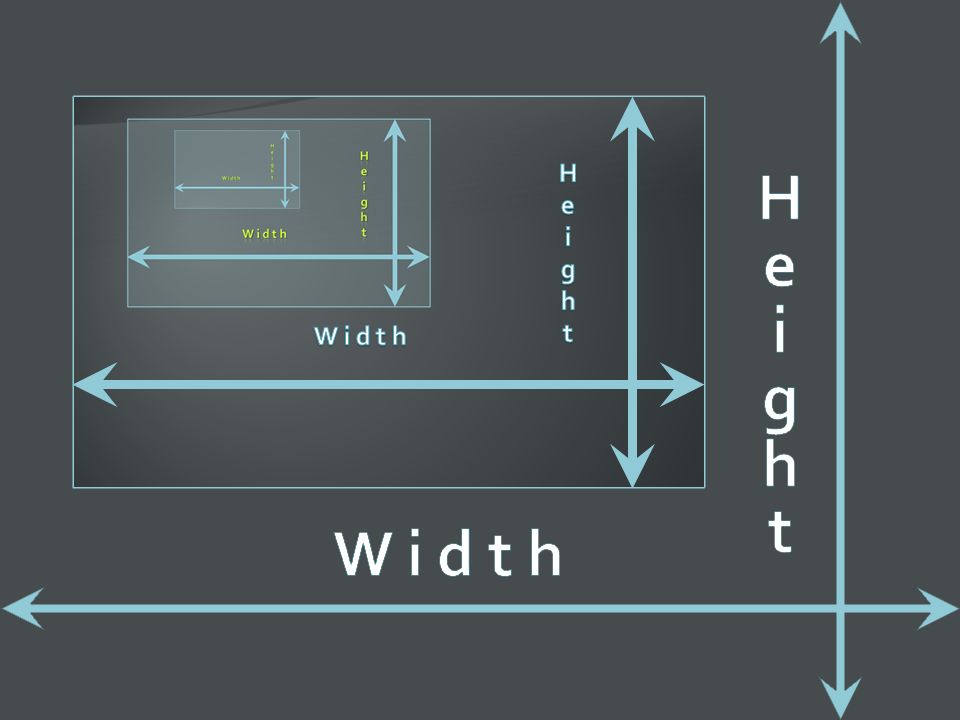
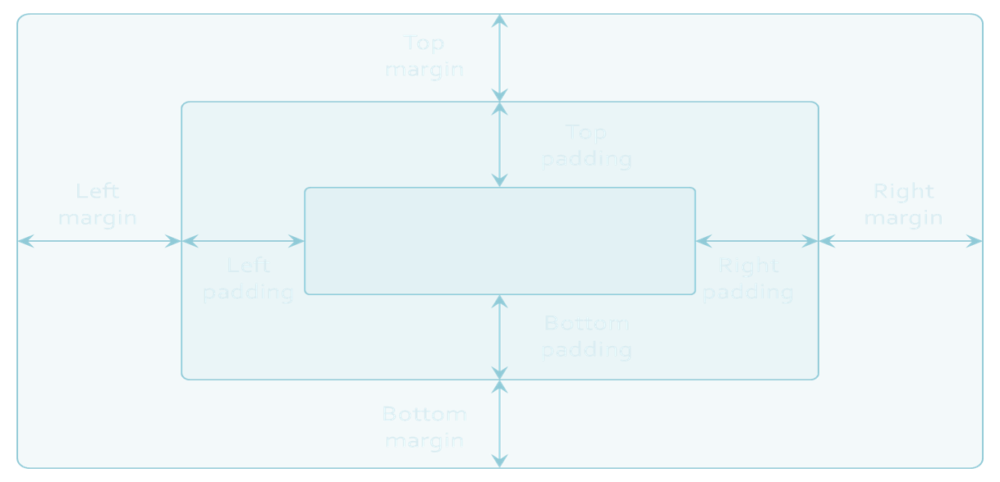
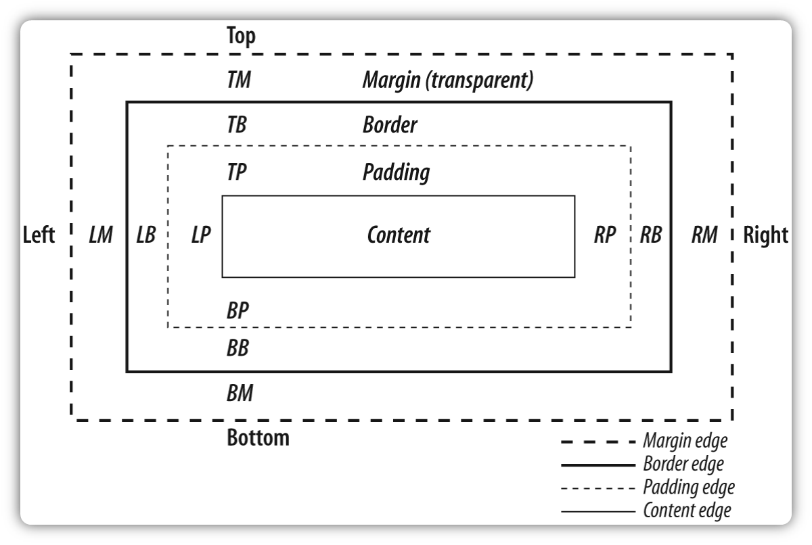
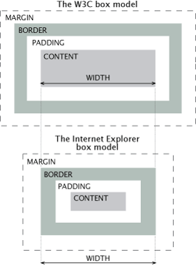
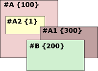
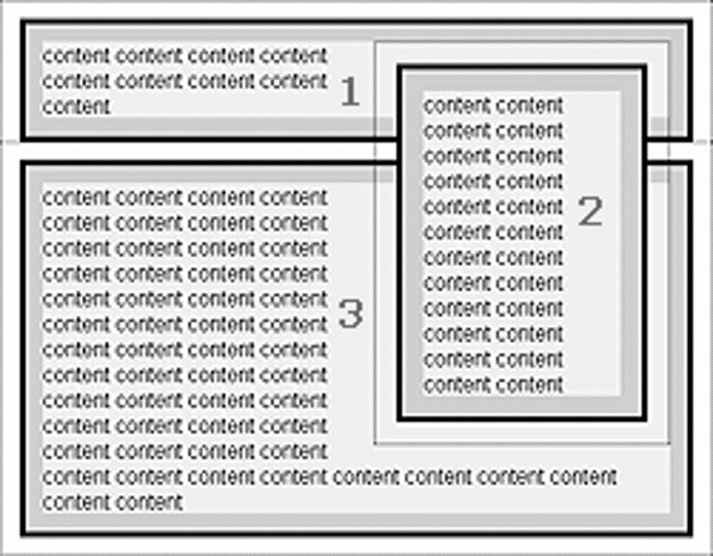

<!-- section start -->
<!-- attr: { class:'slide-title', showInPresentation:true, hasScriptWrapper:true, style:'' } -->
# CSS Layout
##  Control the arrangement of the HTML elements
<div class="signature">
    <p class="signature-course">HTML, CSS & JavaScript</p>
    <p class="signature-initiative">Telerik School Academy</p>
    <a href="http://academy.telerik.com" class="signature-link">http://academy.telerik.com</a>
</div>


<!-- attr: { showInPresentation:true, hasScriptWrapper:true, style:'font-size: 40px' } -->
# Table of Contents
- Width and Height
- Overflow
- Display
- Visibility
- Margins and Paddings
- CSS Box Model
- Position
- Float


<!-- section start -->
<!-- attr: { class:'slide-section', showInPresentation:true, hasScriptWrapper:true, style:'' } -->
# A


<!-- attr: { showInPresentation:true, hasScriptWrapper:true, style:'font-size: 40px' } -->
# Width
- `width` – defines numerical value for the width of element, e.g. `200px`
- `width` applies only for block elements
  - Their with is 100% by default
  - The width of inline elements is always the width of their content, by concept
- `min-width` - defines the minimal width
  - `min-width` overrides width if (`width<min-width`)
- `max-width` - defines the maximal width
  - `max-width` overrides width if (`width>max-width`)

<!-- attr: { class:'slide-section demo', showInPresentation:true, hasScriptWrapper:true, style:'' } -->
<!-- # Width -->
##  [Demo]()


<!-- attr: { showInPresentation:true, hasScriptWrapper:true, style:'font-size: 40px' } -->
# Height
- `height` – defines numerical value for the height of element, e.g. `100px`
- `height` applies only on block elements
  - The `height` of inline elements is always the height of their content
- `min-height` - defines the minimal height
  - `min-height` overrides height
- `max-height` - defines the maximal height
  - `max-height `overrides height

  <!-- attr: { showInPresentation:true, hasScriptWrapper:true, style:'font-size: 40px' } -->
# Width and Height Values
- The values of the `width` and `height` properties are numerical:
  - Pixels (px)
  - Centimeters (cm)
  - Or percentages
    - A percent of the available width

<!-- attr: { class:'slide-section demo', showInPresentation:true, hasScriptWrapper:true, style:'' } -->
<!-- # Height -->
##  [Demo]()

<!-- section start -->
<!-- attr: { class:'slide-section', showInPresentation:true, hasScriptWrapper:true, style:'' } -->
# Overflow


<!-- attr: { showInPresentation:true, hasScriptWrapper:true, style:'font-size: 40px' } -->
# Overflow
- `overflow` defines the behavior of element when content needs more space than the available
- `overflow` values:
  - `visible` (default) – content spills out of the element
  - `auto` – show scrollbars if needed
  - `scroll` – always show scrollbars
  - `hidden` – any content that cannot fit is clipped

<!-- attr: { class:'slide-section demo', showInPresentation:true, hasScriptWrapper:true, style:'' } -->
<!-- # Overflow -->
##  [Demo]()


<!-- section start -->
<!-- attr: { class:'slide-section', showInPresentation:true, hasScriptWrapper:true, style:'' } -->
# Display


<!-- attr: { showInPresentation:true, hasScriptWrapper:true, style:'font-size: 40px' } -->
# Display
- `display` controls the display of the element and the way it is rendered and if breaks should be placed before and after the element
- `display` values:
  - `inline`: no breaks are placed before or after (`<span>` is an inline element)
    - `height` and `width` depend on the content
  - `block`:  breaks are placed before AND after the element (`<div>` is a block element)
    - `height` and `width` may not depend on the size of the content

<!-- attr: { showInPresentation:true, hasScriptWrapper:true, style:'font-size: 40px' } -->

# Display Values
- `display` values:
  - `none`: element is hidden and its dimensions are not used to calculate the surrounding elements rendering
    - differs from `visibility: hidden`!
  - `inline-block`: no breaks are placed before and after (like `inline`)
    - `height` and `width` can be applied (like `block`)
  - `table`, `table-row`, `table-cell`: the elements are arranged in a table-like layout

<!-- attr: { class:'slide-section demo', showInPresentation:true, hasScriptWrapper:true, style:'' } -->
<!-- # Display -->
##  [Demo]()


<!-- section start -->
<!-- attr: { class:'slide-section', showInPresentation:true, hasScriptWrapper:true, style:'' } -->
# Visibility

<!-- attr: { showInPresentation:true, hasScriptWrapper:true, style:'font-size: 40px' } -->
# Visibility
- `visibility`
  - Determines whether the element is visible
  - `hidden`: element is not rendered, but still occupies place on the page
    - similar to `opacity:0`
  - `visible`: element is rendered normally
  - `collapse`: collapse removes a row or column, but it does not affect the table layout
    - only for table elements
    - The space taken up by the row or column will be available for other content

<!-- attr: { class:'slide-section demo', showInPresentation:true, hasScriptWrapper:true, style:'' } -->
<!-- # Visibility -->
##  [Demo]()

<!-- section start -->
<!-- attr: { class:'slide-section', showInPresentation:true, hasScriptWrapper:true, style:'' } -->
# Margins and Paddings



<!-- attr: { showInPresentation:true, hasScriptWrapper:true, style:'font-size: 40px' } -->
# Margin and Padding
- `margin` and `padding` define the spacing around the element
  - Numerical value, e.g. `10px` or `-5px`
  - Can be defined for each of the four sides separately – `margin-top`, `padding-left`, …
  - `margin` is the spacing outside of the border
  - `padding` is the spacing between the border and the content
- Collapsing margins
  - When the vertical margins of two elements are touching, only the margin of the element with the largest margin value will be honored

  <!-- attr: { showInPresentation:true, hasScriptWrapper:true, style:'font-size: 40px' } -->
# Margin and Padding: Short Rules
- `margin: 5px`;
  - Sets all four sides to have margin of 5 px;
- `margin: 10px 20px;`
  - top and bottom to 10px, left and right to 20px;
- `margin: 5px 3px 8px;`
  - top 5px, left/right 3px, bottom 8px
- `margin: 1px 3px 5px 7px;`
  - top, right, bottom, left (clockwise from top)
- Same for `padding`

<!-- attr: { class:'slide-section demo', showInPresentation:true, hasScriptWrapper:true, style:'' } -->
<!-- # Margins and Paddings -->
##  [Demo]()


<!-- section start -->
<!-- attr: { class:'slide-section', showInPresentation:true, hasScriptWrapper:true, style:'' } -->
# Box Model



<!-- attr: { showInPresentation:true, hasScriptWrapper:true, style:'font-size: 40px' } -->
# CSS3 box-sizing
- Determine whether you want an element to render it's borders and padding within its specified width, or outside of it.
- Possible values:
  - `box-sizing: content-box `(default)box width: 288px + 10px padding + 1px border on each side = 300px
  - `box-sizing: border-box`box width: 300px, including padding and borders

  <!-- attr: { showInPresentation:true, hasScriptWrapper:true, style:'font-size: 40px' } -->
# CSS3 box-sizing (Example)
- Example: Box with total width of 300px (including paddings and borders)
```
width: 300px;
border: 1px solid black;
padding: 5px;
/x Firefox x/
-moz-box-sizing: border-box;
/x WebKit x/
-webkit-box-sizing: border-box;
/x Opera 9.5+, Google Chrome x/
box-sizing: border-box;
```

<!-- attr: { showInPresentation:true, hasScriptWrapper:true, style:'font-size: 40px' } -->
# IE Quirks Mode
- When using quirks mode (pages with no DOCTYPE or with a HTML 4 Transitional DOCTYPE)
    - Internet Explorer violates the box model standard!

    


<!-- attr: { class:'slide-section demo', showInPresentation:true, hasScriptWrapper:true, style:'' } -->
<!-- # Box Model -->
##  [Demo]()


<!-- section start -->
<!-- attr: { class:'slide-section', showInPresentation:true, hasScriptWrapper:true, style:'' } -->
# Positioning


<!-- attr: { showInPresentation:true, hasScriptWrapper:true, style:'font-size: 40px' } -->

# Positioning
- `position`: defines the positioning of the element in the page content flow
-  The value is one of:
  - `static` (default)
  - `relative` – relative position according to where the element would appear with static position
  - `absolute` – relative to the first parent element that has a position other than static
  - `fixed` – relative to the browser window, but ignores page scrolling

<!-- attr: { showInPresentation:true, hasScriptWrapper:true, style:'font-size: 40px' } -->

# Positioning (2)
- Margin VS relative positioning
- Fixed and absolutely positioned elements do not influence the page normal flow and usually stay on top of other elements
  - Their position and size are ignored when calculating the size of parent element or position of surrounding elements
  - Overlaid according to their `z-index`
  - Inline fixed or absolutely positioned elements can apply height like block-level elements

<!-- attr: { showInPresentation:true, hasScriptWrapper:true, style:'font-size: 40px' } -->
# Positioning (3)
- `top`, `left`, `bottom`, `right`: specifies offset of absolute/fixed/relative positioned element as numerical values
- `z-index` : specifies the stack level of positioned elements
  - Understanding stacking context
    - Each positioned element creates a stacking context.
    - Elements in different stacking contexts are overlapped according to the stacking order of their containers. For example, there is no way for #A1 and #A2 (children of #A) to be placed over #B without increasing the z-index of #A.




<!-- attr: { class:'slide-section demo', showInPresentation:true, hasScriptWrapper:true, style:'' } -->
<!-- # Positioning -->
##  [Demo]()

<!-- attr: { showInPresentation:true, hasScriptWrapper:true, style:'font-size: 40px' } -->
# Inline element positioning
- `vertical-align`: sets the vertical-alignment of an inline element, according to the line height
  - Values: `baseline`, `sub`, `super`, `top`, `text-top`, `middle`, `bottom`, `text-bottom` or numeric
  - Also used for content of table cells (which apply `middle` alignment by default)

<!-- attr: { class:'slide-section demo', showInPresentation:true, hasScriptWrapper:true, style:'' } -->
<!-- # Alignment and Z-Index -->
##  [Demo]()

<!-- section start -->
<!-- attr: { class:'slide-section', showInPresentation:true, hasScriptWrapper:true, style:'' } -->
# Floating

<!-- attr: { showInPresentation:true, hasScriptWrapper:true, style:'font-size: 40px' } -->
# Float
- `float`: the element “floats” to one side
  - `left`: places the element on the left and following content on the right
  - `right`: places the element on the right and following content on the left
  - floated elements should come before the content that will wrap around them in the code
  - margins of floated elements do not collapse
  - floated inline elements can apply height

<!-- attr: { showInPresentation:true, hasScriptWrapper:true, style:'font-size: 40px' } -->
# Float (2)
- How floated elements are positioned




<!-- attr: { showInPresentation:true, hasScriptWrapper:true, style:'font-size: 40px' } -->
# Clear
- `clear`
  - Sets the sides of the element where other floating elements are NOT allowed
  - Used to "drop" elements below floated ones or expand a container, which contains only floated children
  - Values: `left`, `right`, `both`
- Clearing floats
  - Clear using pseudo-class `:after`
  - Additional element (`<div>`) with a clear style
    - Deprecated - semantically unused div
- [https://css-tricks.com/all-about-floats/](https://css-tricks.com/all-about-floats/)
- IE: [positioniseverything.net/easyclearing.html](positioniseverything.net/easyclearing.html)

<!-- attr: { class:'slide-section demo', showInPresentation:true, hasScriptWrapper:true, style:'' } -->
<!-- # Floating Elements -->
##  [Demo]()

<!-- attr: { class:'slide-section', showInPresentation: true } -->
<!-- # Questions
##  CSS Layout -->
