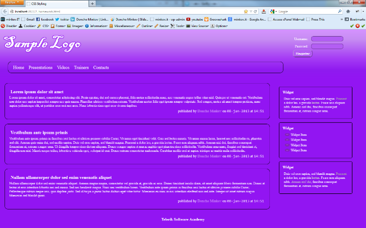
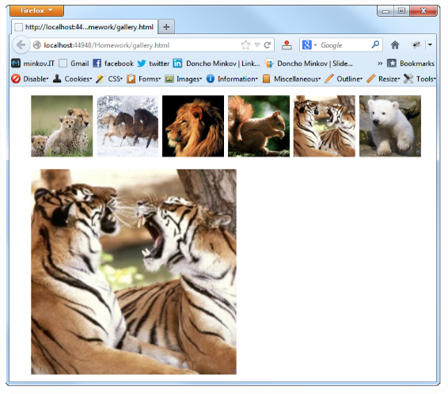

<!-- section start -->
<!-- attr: { class:'slide-title', showInPresentation:true, hasScriptWrapper:true, style:'' } -->
# LESS
##  The Dynamic Stylesheet Language
<div class="signature">
    <p class="signature-course">HTML, CSS & JavaScript</p>
    <p class="signature-initiative">Telerik School Academy</p>
    <a href="http://academy.telerik.com" class="signature-link">http://academy.telerik.com</a>
</div>

<!-- attr: { showInPresentation:true, hasScriptWrapper:true, style:'font-size: 40px' } -->
# Table of Contents
- LESS Overview
- Working with LESS
- Using LESS
  - On the Client
  - On the Server
- LESS Features
  - Selector nesting
  - Mixins and Functions
  - Variables and Interpolation

<!-- section start -->
<!-- attr: { class:'slide-section', showInPresentation:true, hasScriptWrapper:true, style:'' } -->
# LESS Overview
##  What is LESS?


<!-- attr: { showInPresentation:true, hasScriptWrapper:true, style:'font-size: 40px' } -->
# LESS Overview
- Preprocessor to CSS
  - [http://lesscss.org](http://lesscss.org)
  - Can be compiled both in the browser or the server
    - Using a LESS parser written in JavaScript
- LESS Features include
  - Variables
  - Mixins
  - Color editing functions
  - Selector nesting

<!-- section start -->
<!-- attr: { class:'slide-section', showInPresentation:true, style:'' } -->
# Working with LESS
##  Client and Server Side

<!-- attr: { showInPresentation:true, hasScriptWrapper:true, style:'font-size: 36px' } -->
# Using LESS on the Client
- LESS can be compiled in the client (browser)
  - Include a JavaScript file, the compiles it to CSS
- Steps:
    1. Write your LESS, download `less.js`

    1. Link LESS in the html  
```html
<link rel="stylesheet/less" type="text/css" href="styles.less"/>
<script src="less.js">< /script> //after the less link
```
    1. If using Visual Studio, you should add a mime type for the LESS in web.config
```html
<configuration> <system.webServer> <staticContent>
      <mimeMap fileExtension=".less" mimeType="text/css" />   
    </staticContent> </system.webServer> </configuration>
```
    1. You are ready to go


<!-- attr: { class:'slide-section demo', showInPresentation:true, style:'' } -->
<!-- # Using LESS on the Client -->
##  [Demo]()

<!-- attr: { showInPresentation:true, hasScriptWrapper:true, style:'font-size: 40px' } -->
# Using LESS on the Client
- How client-side LESS works?
  - The JavaScript performs a AJAX GET request to the LESS file
  - Then it compiles the LESS code into pure CSS
  - The CSS is appended to the HEAD of the page
- Using client-side LESS is `slow`
  - All the compiling is done by the client
  - i.e. the browser spends recourses and time for the LESS compiling
  - Imagine a 2000-lines-long LESS file…

<!-- attr: { showInPresentation:true, hasScriptWrapper:true, style:'font-size: 40px' } -->
# Parsing LESS on the Server
- LESS can be compiled on the server
  - Using the client approach and copy the CSS
    - Not good enough, lots of copy-pastying
  - Using `Node.js` to do the parsing
    - Better solution - the parsing is automated
  - Using plugins for your favorite Web editor
    - `Web Essentials` for Visual Studio
    - `LESS` and `LESS2CSS `for Sublime Text

<!-- attr: { class:'slide-section demo', showInPresentation:true, style:'' } -->
<!-- # Compiling LESS on the Server -->
##  [Demo]()

<!-- section start -->
<!-- attr: { class:'slide-section', showInPresentation:true, hasScriptWrapper:true, style:'' } -->
# LESS Features
##  Selector Nesting, Mixins, Variables, etc…


<!-- attr: { showInPresentation:true, hasScriptWrapper:true, style:'font-size: 34px' } -->
# Selector Nesting
- LESS introduces selector nesting
- This

```css
body {
  font: normal 16px arial;
  color: #fff;
  background-color: #011b63;
  h1 {
    font-size: 2.3em;
    font-weight: bold;
  }
}
```

- Compiles to this

```css
body {
  font: normal 16px arial;
  color: #fff;
  background-color: #011b63;
}
  body h1 {
    font-size: 2.3em;
    font-weight: bold;
}
```

<!-- attr: { showInPresentation:true, hasScriptWrapper:true, style:'font-size: 32px' } -->
# Selector Nesting (2)
- All selectors inside a selector are translated to nested selectors

```css
body {…
  h1 {…}
}
```

```css
body {…}
body h1{…}
```

- Selectors can also reference themselves inside their selector using the symbol `& `(`AND`)

```css
…
 a{
   &:hover{…}
 }
…
```

```css
…
 a{…}
   a:hover{…}
…
```

<!-- attr: { class:'slide-section demo', showInPresentation:true, hasScriptWrapper:true, style:'' } -->
<!-- # Selector Nesting -->
##  [Demo]()


<!-- attr: { showInPresentation:true, hasScriptWrapper:true, style:'font-size: 34px' } -->
# LESS Variables
- LESS also has variables
  - Using the `@` (at) symbol
  - Can be used to store colors, size, etc…
- Usable to set default background color, font color, font size, border, etc…

```css
@link-color: #ffffff;
@v-link-color: #646363;
a {
  color: @link-color;
  &:visited {
    color: @v-link-color;
}
```

```css
body a {
  color: white; }
  body a:visited {
    color: #646363; }
```

<!-- attr: { class:'slide-section demo', showInPresentation:true, hasScriptWrapper:true, style:'' } -->
<!-- # Variables -->
##  [Demo]()


<!-- attr: { showInPresentation:true, hasScriptWrapper:true, style:'font-size: 40px' } -->
# Interpolation
- LESS variables can be inserted as CSS properties
  - Using `@{variable_name}`
  - Usable with mixins

```css
@border-side:top;
@border-color:blue;
@border-style:ridge;
@border-width:15px;
…
border-@{border-side} :
  @border-width @border-style @border-color;
```

```css
border-top : 15px ridge blue
```

<!-- attr: { class:'slide-section demo', showInPresentation:true, style:'' } -->
<!-- # Interpolation -->
##  [Demo]()

<!-- attr: { showInPresentation:true, hasScriptWrapper:true, style:'font-size: 40px' } -->
# Functions
- LESS support predefined functions
  - For operations with colors
  - For sizes (percentages)
  - Find all the functions at [http://lesscss.org/functions/](http://lesscss.org/functions/)

```css
@color: #ffffff;
background-color:lighten(@color);
color:darken(@color);
percentage(0.5); //returns 50%
```

<!-- attr: { class:'slide-section demo', showInPresentation:true, style:'' } -->
<!-- # Functions  -->
##  [Demo]()

<!-- attr: { showInPresentation:true, hasScriptWrapper:true, style:'font-size: 40px' } -->
# Mixins
- Mixins are kind of developer defined functions
  - Used to extend abstraction and repeating code
- Two kind of mixins
  - Parameterless
    - Get a the same styles every time
  - With parameters
    - Get style based on some parameters
    - Gradient, borders, etc…

<!-- attr: { showInPresentation:true, hasScriptWrapper:true, style:'font-size: 40px' } -->
# Mixins (2)
- How to define mixins?
  - Use `.mixin-name`
  - Then the styles are normal LESS

```css
.clearfix{
  zoom:1;
  &:after{
    display:block; content:"";
    height:0; clear:both; } }
```

- How to use the mixin?
  - Place use `.mixin-name`

```css
ul#main-nav{
  .clearfix;
}
```


<!-- attr: { class:'slide-section demo', showInPresentation:true, style:'' } -->
<!-- # Basic Mixins -->
##  [Demo]()

<!-- attr: { showInPresentation:true, hasScriptWrapper:true, style:'font-size: 40px' } -->
# Mixins with Arguments
- Mixins can also be defined with parameters
  - i.e. for gradient-background
- Use the arguments like a C#/JS method

```css
.opacity(@value){
  …
}
//arguments can take default values
.box(@border:none,@bg:rgba(0,0,0,0.7),@size:200px) {
  …
}
…
  div.box-div{
    .box;  //using the mixin with default parameter values
    .opacity(0.5);  //using the mixin with 0.5 value
  }
…
```

<!-- attr: { class:'slide-section demo', showInPresentation:true, style:'' } -->
<!-- # Mixins with Arguments -->
##  [Demo]()

<!-- attr: { class:'slide-section', showInPresentation: true } -->
<!-- # Questions
##  LESS -->

<!-- attr: { showInPresentation:true, hasScriptWrapper:true, style:'font-size: 40px' } -->
# Homework
`1.` Implement the following using either LESS or SASS
  - Use the HTML code from homework.html
    - Create the LESS/SASS easy to change (colors, fonts)
    - Use mixins for clears, gradients)
    - Source can be found in `Preprocessors-homework.zip`



<!-- attr: { showInPresentation:true, hasScriptWrapper:true, style:'font-size: 40px' } -->
# Homework (2)
`2.` Create a web gallery
  - Use only HTML, LESS or SASS
  - List images
  - When a image is selected, show it zoomed


