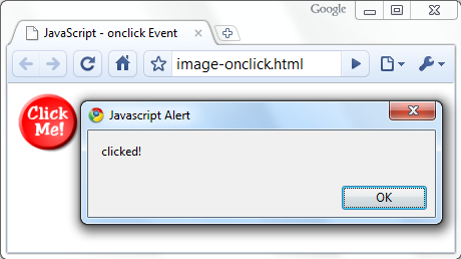

<!-- section start -->
<!-- attr: { class:'slide-title', showInPresentation:true, hasScriptWrapper:true, style:'' } -->
# JavaScript Fundamentals
##  All in one place
<div class="signature">
    <p class="signature-course">HTML, CSS & JavaScript</p>
    <p class="signature-initiative">Telerik School Academy</p>
    <a href="http://academy.telerik.com" class="signature-link">http://academy.telerik.com</a>
</div>


<!-- attr: { showInPresentation:true, hasScriptWrapper:true, style:'font-size: 40px' } -->
# Table of Contents
- JavaScript Overview
  - JavaScript history
  - Usage in Web
- JavaScript features
  - Variables, operators
  - Conditionals, loops
  - Functions


<!-- section start -->
<!-- attr: { class:'slide-section', showInPresentation:true, hasScriptWrapper:true, style:'' } -->
<!-- # JavaScript
##  Dynamic Behavior in a Web Page -->


<!-- attr: { showInPresentation:true, hasScriptWrapper:true, style:'font-size: 40px' } -->
# JavaScript
- `JavaScript` is a scripting language developed by Netscape
  - Intended for a front-end, now is a full server language
  - Lightweight and fast
- JavaScript can be:
  - Embedded in your HTML page
  - Interpreted by the Web browser
- Simple and flexible
- Powerful to manipulate the DOM


<!-- attr: { showInPresentation:true, hasScriptWrapper:true, style:'font-size: 40px' } -->
# JavaScript Advantages
- JavaScript allows interactivity such as:
  - Implementing form validation
  - React to user actions, e.g. handle keys
  - Changing an image on moving mouse over it
  - Sections of a page appearing and disappearing
  - Content loading and changing dynamically
  - Performing complex calculations
  - Custom HTML controls, e.g. scrollable table
  - Implementing AJAX functionality

<!-- attr: { showInPresentation:true, hasScriptWrapper:true, style:'font-size: 40px' } -->
# What Can JavaScript Do?
- Can handle events
- Can read and write HTML elements and modify the DOM tree
- Can validate form data
- Can access / modify browser cookies
- Can detect the user’s browser and OS
- Can be used as object-oriented language
- Can handle exceptions
- Can perform asynchronous server calls (AJAX)

<!-- attr: { showInPresentation:true, hasScriptWrapper:true, style:'font-size: 40px' } -->
# The First Script

```html
<html>
<body>
  <script type="text/javascript">
    var name = "Doncho Minkov";
    var greeting = "Hello, " + name;
    alert(greeting);
  < /script>
</body>
</html>
```

- Create a `<script>` HTML tag, and write your JavaScript inside

<!-- attr: { class:'slide-section demo', showInPresentation:true, style:'font-size: 40px' } -->
<!-- # First JavaScript -->
##  [Demo]()

<!-- attr: { showInPresentation:true, hasScriptWrapper:true, style:'font-size: 40px' } -->

# Using JavaScript Code
- The JavaScript code can be placed in:
  - `<script>` tag in the head
  - `<script>` tag in the body
  - External files, linked via `<script>` tag
    - Can be done in the head or in the body,depending on the case
    - JavaScript files have an extentions `.js`

```html
<script src="scripts.js" type="text/javscript">
<!– code placed here will not be executed! -->
< /script>
```
- Highly recommended
- The `.js` files are being cached by the browser


<!-- attr: { showInPresentation:true, hasScriptWrapper:true, style:'font-size: 40px' } -->
# JavaScript – When is Executed?
- JavaScript code is executed during the page loading or when the browser fires an event
  - All statements are executed at page loading
  - Some statements just define functions that can be called later
- Function calls or code can be attached as "event handlers" via tag attributes or in code
  - Executed when the event is fired by the browser

```html

```

<!-- attr: { showInPresentation:true, hasScriptWrapper:true, style:'font-size: 40px' } -->
# Calling a JavaScript Function from Event Handler – Example

```html
<html>
<head>
<script>
  function printMessage (message) {
    alert(message);
  }
< /script>
</head>
<body>
  
</body>
</html>
```

<div class="fragment"></div>


<!-- attr: { showInPresentation:true, hasScriptWrapper:true, style:'font-size: 40px' } -->
# Using External Script Files
- Using external script files:

```html
<html>
<head>
  <script src="external.js">
  < /script>
</head>
<body>
  <button onclick="printMessage('Hello from file')"  
          value="Call js function from external file" />
</body>
</html>
```
- External JavaScript file:

```js
function printMessage(message) {
  alert(message)
}
```
<div class="fragment balloon" style="width:250px; top:33%; left:22%; opacity: 0.7">The `<script>` tag is always empty.</div>

<!-- section start -->
<!-- attr: { class:'slide-section', showInPresentation:true, hasScriptWrapper:true, style:'' } -->
<!-- The JavaScript Syntax -->


<!-- attr: { showInPresentation:true, hasScriptWrapper:true, style:'font-size: 40px' } -->
# JavaScript Syntax
- The JavaScript syntax is similar to C# and Java
  - Operators (`+`, `x`, `=`, `!=`, `&&`, `++`, …)
  - Variables (typeless)
  - Conditional statements (`if`, `else`)
  - Loops (`for`, `while`)
  - Arrays (`myArray[]`) and associative arrays (`myHash['abc']`)
  - Functions (can return value)
  - Function expressions (like the C# delegates)

<!-- attr: { showInPresentation:true, hasScriptWrapper:true, style:'font-size: 36px' } -->
# Data Types
- JavaScript data types:
  - Numbers (integer, floating-point)
  - Boolean (true / false)
- String type – string of characters

```js
var message = 'You can use both single or double quotes for strings, yet use single quotes';
```

- Arrays contain items of mixed types:

```js
var mixedArray = [1, 5.3, 'aaa'];
```
- Associative arrays (hash tables):

```js
var location = {
                street: '22 Al. Malinov str.',
                city: 'Sofia',
                country: 'Bulgaria'
               };
```

<!-- attr: { showInPresentation:true, hasScriptWrapper:true, style:'font-size: 40px' } -->
# Everything is Object
- Every variable is an object
  - Strings have functions:

```js
var name = 'Doncho Minkov';
console.log(name[7]); // shows 'M'
console.log(name.substring(7,13)//shows 'Minkov'
console.log(name.substr(7, 6)); //shows 'Minkov'
```
 - Arrays have functions:

```js
var numbers = [1, 3, 4];
console.log (arr.length); // shows 3
arr.push(7); // appends 7 to end of array
arr.unshinf(-5); //adds -5 to the head of the array
console.log (arr[3]); // shows 4
```


<!-- attr: { showInPresentation:true, hasScriptWrapper:true, style:'font-size: 40px' } -->
# String Operations
- The `+` operator joins strings

```js
string1 = 'fat ';
string2 = 'cats';
console.log(string1 + string2);  // fat cats
```
- What is '9' + 9?

```js
console.log('9' + 9);  // 99
```
- Converting string to number:

```js
console.log(parseInt('9') + 9);  // 18
```
  - or

```js
console.log('9' x 1 + 9);  // 18
```

<!-- attr: { showInPresentation:true, hasScriptWrapper:true, style:'font-size: 30px' } -->
# Arrays Operations and Properties
- Declaring new empty array:

```js
var arr = []
```
- Declaring an array holding few elements:

```js
var arr = [1, 2, 3, 4, 5];
```
- Appending an element / getting the last element:

```js
arr.push(3);
var element = arr.pop();
```
- Reading the number of elements (array length):

```js
arr.length;
```
- Finding element's index in the array:

```js
arr.indexOf(1);
```

<!-- attr: { showInPresentation:true, hasScriptWrapper:true, style:'font-size: 40px' } -->
# Sum of Numbers – Example

```html
<html>
<head>
  <title>JavaScript Demo</title>
  <script type="text/javascript">
    function calcSum() {
      value1 =
        parseInt(document.mainForm.textBox1.value);
      value2 =
        parseInt(document.mainForm.textBox2.value);
      sum = value1 + value2;
      document.mainForm.textBoxSum.value = sum;
    }
  < /script>
</head>
```


<!-- attr: { showInPresentation:true, hasScriptWrapper:true, style:'font-size: 40px' } -->
# Sum of Numbers – Example (2)

```html
<body>
  <form name="mainForm">
    <input type="text" name="textBox1" /> <br/>
    <input type="text" name="textBox2" /> <br/>
    <input type="button" value="Process"
      onclick="javascript: calcSum()" />
    <input type="text" name="textBoxSum"
      readonly="readonly"/>
  </form>
</body>
</html>
```


<!-- attr: { class:'slide-section demo', showInPresentation:true, style:'' } -->
<!-- # Sum of Numbers -->
##  [Demo]()

<!-- attr: { showInPresentation:true, hasScriptWrapper:true, style:'font-size: 40px' } -->

# Conditional Statement (if)

```html
unitPrice = 1.30;
if (quantity > 100) {
  unitPrice = 1.20;
}
```

|         **Symbol**      |         **Meaning**       |
|:-----------------------:|:-------------------------:|
|            >            |        Greater than       |
|            <            |          Less than        |
|            >=           | Greater than or equal to  |
|            <=           |   Less than or equal to   |
|            ==           |           Equal           |
|            !=           |         Not equal         |


<!-- attr: { showInPresentation:true, hasScriptWrapper:true, style:'font-size: 40px' } -->

# Conditional Statement (if) (2)
- The condition may be of Boolean or any other type:

```html
var a = 0;
var b = true;
if (typeof(a)=='undefined' || typeof(b)=='undefined') {
  document.write('Variable a or b is undefined.');
}
else if (!a && b) {
  document.write('a==0; b==true;');
} else {
  document.write("a==" + a + "; b==" + b + ";");
}
```


<!-- attr: { class:'slide-section demo', showInPresentation:true, style:'' } -->
<!-- # Conditional Statements -->
##  [Demo]()

<!-- attr: { showInPresentation:true, hasScriptWrapper:true, style:'font-size: 40px' } -->

# Switch Statement
- The `switch` statement works like in C#:

```html
switch (variable) {
  case 1:
    // do something
    break;
  case 'a':
    // do something else
    break;
  case 3.14:
    // another code
    break;
  default:
    // something completely different
}
```

<!-- attr: { class:'slide-section demo', showInPresentation:true, style:'' } -->
<!-- # Switch-case -->
##  [Demo]()

<!-- attr: { showInPresentation:true, hasScriptWrapper:true, style:'font-size: 40px' } -->
# Loops
- Like in C#
    - `for` loop
    - `while` loop
    - `do … while` loop

```html
var counter;
for (counter=0; counter<4; counter++) {
  alert(counter);
}
while (counter < 5) {
  alert(++counter);
}
```

<!-- attr: { class:'slide-section demo', showInPresentation:true, style:'' } -->
<!-- # Loops -->
##  [Demo]()

<!-- attr: { showInPresentation:true, hasScriptWrapper:true, style:'font-size: 40px' } -->
# Functions
- Code structure – splitting code into parts
- Data comes in, processed, result returned

```html
function average(a, b, c)
{
    var total;
    total = a+b+c;
    return total/3;
}
```
<div class="fragment balloon" style="width:280px; top:29%; left:38%; opacity: 0.7">Parameters come in here.</div>
<div class="fragment balloon" style="width:580px; top:35%; left:25%; opacity: 0.7">Declaring variables is optional. Type is never declared.</div>
<div class="fragment balloon" style="width:220px; top:47%; left:10%; opacity: 0.7">Value returned here.</div>

<!-- attr: { showInPresentation:true, hasScriptWrapper:true, style:'font-size: 40px' } -->
# Function Arguments and Return Value
- Functions are not required to return a value
- When calling function it is not obligatory to specify all of its arguments
  - The function has access to all the arguments passed via `arguments` object

```html
function sum() {
  var sum = 0;
  for (var i = 0; i < arguments.length; i ++)
    sum += parseInt(arguments[i]);
  return sum;
}
alert(sum(1, 2, 4));
```

<!-- attr: { class:'slide-section demo', showInPresentation:true, style:'' } -->
<!-- # Functions -->
##  [Demo]()

<!-- attr: { class:'slide-section', showInPresentation: true } -->
<!-- # Questions
##  JavaScript Fundamentals -->
