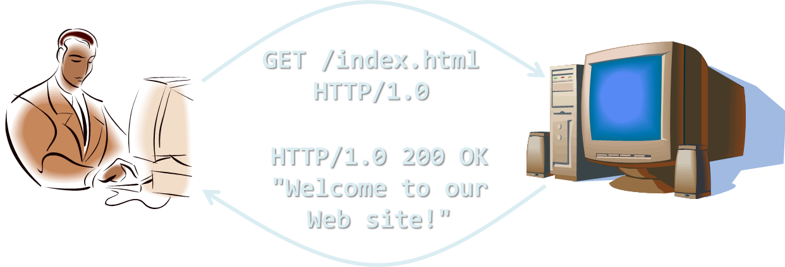

<!-- section start -->
<!-- attr: { class:'slide-title', showInPresentation:true, hasScriptWrapper:true, style:'' } -->
# AJAX with jQuery
##  HTTP, AJAX  and jQuery
<div class="signature">
    <p class="signature-course">HTML, CSS & JavaScript</p>
    <p class="signature-initiative">Telerik School Academy</p>
    <a href="http://academy.telerik.com" class="signature-link">http://academy.telerik.com</a>
</div>


<!-- attr: { showInPresentation:true, hasScriptWrapper:true, style:'font-size: 40px' } -->
# Table of Contents
- WWW and URL
- The HTTP Protocol
  - HTTP Request
  - HTTP Response
- AJAX Requests
- jQuery Ajax
  - jQuery.ajax()
  - jQuery.getJSON() and jQuery.postJSON()
  - jQuery.load()
  - jQuery.get();


<!-- section start -->
<!-- attr: { class:'slide-section', showInPresentation:true, hasScriptWrapper:true, style:'' } -->
<!-- # WWW and URL
##  What is WWW? What is URL? -->


<!-- attr: { showInPresentation:true, hasScriptWrapper:true, style:'font-size: 40px' } -->
# What is WWW?
- WWW = `World Wide Web` = Web
  - Global distributed information system in Internet
    - A service in Internet (like E-mail, DNS, ...)
  - Consists of set of documents (and other resources) located on different Internet servers
    - Accessed through standard protocols like HTTP, HTTPS and FTP by their URL
  - `Web servers` provide Web content
  - `Web browsers` display the Web content

<!-- attr: { showInPresentation:true, hasScriptWrapper:true, style:'font-size: 40px' } -->
# WWW Components
- Structural components
  - Internet – provides data transfer channels over the TCP and HTTP protocols
  - Clients (Web browsers) – display Web content
  - Web servers – IIS, Apache, Tomcat, GWS, etc.
- Semantic components
  - Hyper Text Transfer Protocol (`HTTP`)
  - Hyper Text Markup Language (`HTML`)
  - Uniform Resource Locator (`URL`)
    - Uniform Resource Identifiers (`URIs`)

<!-- attr: { showInPresentation:true, hasScriptWrapper:true, style:'font-size: 40px' } -->
# WWW Infrastructure
- Clients use Web browser application to request resources from the Web servers via HTTP
  - Resources have unique URL address
- Servers send the requested resource as a response
  - Or reply with an error message
- Web pages are resources in WWW
  - HTML text, graphics, animations and other files
- Web sites
  - Web sites are sets of Web pages in WWW

<!-- attr: { showInPresentation:true, hasScriptWrapper:true, style:'font-size: 40px' } -->
# WWW Infrastructure (2)
- Client’s browser renders Web pages returned by the Web servers
  - Pages are in HTML (Hyper Text Markup Language)
  - Browsers show the text, graphics, sounds, etc.
  - HTML pages contain hyperlinks to other pages
- The entire WWW system runs over standard networking protocols
  - TCP, DNS, HTTP, FTP, …
- The HTTP protocol is fundamental for WWW

<!-- attr: { showInPresentation:true, hasScriptWrapper:true, style:'font-size: 40px' } -->
# URL
- Uniform Resource Locator (URL)
  - Unique resource location in WWW, e.g.

  ```html
  http://yoursite.com:8080/path/index.php?id=27&lang=en
  ```
- It is just a formatted string, consisting of:
  - Protocol for communicating with the server (e.g., `http`, `ftp`, `https`, ...)
  - Name of the server or IP address + optional port (e.g. `www.telerik.com`, `mail.bg:8080`)
  - Path and name of the resource (e.g. `index.php`)
  - Parameters (optional, e.g. `?id=27&lang=en`)


<!-- attr: { showInPresentation:true, hasScriptWrapper:true, style:'font-size: 40px' } -->
# URL Encoding
- URLs are encoded according RFC 1738:

```html
“... Only alphanumeric [0-9a-zA-Z], the special characters $-_.+!x'()
and reserved characters used for their reserved purposes may
be used unencoded within an URL.”
```
- All other characters are escaped with the formula:
  - Example: space has decimal code 32, in hex – 20, so space in URL becomes `%20`
  - Space can also be encoded as "`+`"

```html
%[character hex code in ISO-Latin character set]
```

<!-- attr: { showInPresentation:true, hasScriptWrapper:true, style:'font-size: 40px' } -->
# URL – Examples
- Some valid URLs:

```html
http://www.google.bg/search?sourceid=navclient&ie=UTF-8&rlz=1T4GGLL_enBG369BG369&q=http+get+vs+post
```

```html
http://bg.wikipedia.org:80/wiki/%D0%A2%D0%B5%D0%BB%D0%B5%D1%80%D0%B8%D0%B3
```

- Some invalid URLs:

```html
http://www.google.bg/search?&q=C# .NET 4.0
```
<div class="fragment balloon" style="width:325px; position:absolute; top:51%; left:37%">Should be: ?q=C%23+.NET+4.0</div>

```html
http://www.google.bg/search?&q=бира
```
<div class="fragment balloon" style="width:575px; position: absolute; top:62%; left:37%">Should be: ?q=%D0%B1%D0%B8%D1%80%D0%B0</div>

<!-- section start -->
<!-- attr: { class:'slide-section', showInPresentation:true, hasScriptWrapper:true, style:'' } -->
<!-- # The HTTP Protocol
## How HTTP Works? -->


<!-- attr: { showInPresentation:true, hasScriptWrapper:true, style:'font-size: 40px' } -->
# HTTP
- `Hyper Text Transfer Protocol (HTTP)`
  - Client-server protocol for transferring Web resources (HTML files, images, styles, etc.)
- Important properties of HTTP
  - Request-response model
  - Text-based format
  - Relies on unique resource URLs
  - Provides resource metadata (e.g. encoding)
  - Stateless (cookies can overcome this)

<!-- attr: { showInPresentation:true, hasScriptWrapper:true, style:'font-size: 40px' } -->
# HTTP: Request-Response Protocol
- Client program
  - Running on end host
  - E.g. Web browser
  - Requests a resource
- Server program
  - Running at the server
  - E.g. Web server
  - Provides resources



<!-- attr: { showInPresentation:true, hasScriptWrapper:true, style:'font-size: 40px' } -->
# Example: Hyper Text Transfer Protocol
- HTTP request:

```html
GET /academy/about.aspx HTTP/1.1
Host: www.telerik.com
User-Agent: Mozilla/5.0
<CRLF>
```

- HTTP response:

```html
HTTP/1.1 200 OK
Date: Mon, 5 Jul 2010 13:09:03 GMT
Server: Microsoft-HTTPAPI/2.0
Last-Modified: Mon, 12 Jul 2010 15:33:23 GMT
Content-Length: 54
<CRLF>
<html><title>Hello</title>
Welcome to our site</html>
```

<div class="fragment balloon" style="width:560px; top:43%; left:14%; position: absolute;">The empty line denotes the end of the request header</div>
<div class="fragment balloon" style="width:590px; top:43%; left:14%; position: absolute;">The empty line denotes the end of the response header</div>


<!-- attr: { showInPresentation:true, hasScriptWrapper:true, style:'font-size: 40px' } -->
# HTTP Request Message
- Request message sent by a client consists of
  - Request line – request method (GET, POST, HEAD, ...), resource URI, and protocol version
  - Request headers – additional parameters
  - Body – optional data
    - E.g. posted form data, files, etc.

```html
<request method> <resource> HTTP/<version>
<headers>
<empty line>
<body>
```

<!-- attr: { showInPresentation:true, hasScriptWrapper:true, style:'font-size: 40px' } -->
# HTTP GET Request – Example

```html
GET /academy/winter-2009-2010.aspx HTTP/1.1
Host: www.telerik.com
Accept: x/x
Accept-Language: bg
Accept-Encoding: gzip, deflate
User-Agent: Mozilla/4.0(compatible;MSIE 6.0; Windows NT 5.0)
Connection: Keep-Alive
Cache-Control: no-cache
<CRLF>
```
- Example of HTTP GET request:
<div class="fragment balloon" style="width:190px; top:15%; left:60%">HTTP request line</div>
<div class="fragment balloon" style="width:160px; top:25%; left:45%">HTTP headers</div>
<div class="fragment balloon" style="width:280px; top:44%; left:15%">The request body is empty</div>

<!-- attr: { showInPresentation:true, hasScriptWrapper:true, style:'font-size: 40px' } -->
# HTTP POST Request – Example

```html
POST /webmail/login.phtml HTTP/1.1
Host: www.abv.bg
Accept: x/x
Accept-Language: bg
Accept-Encoding: gzip, deflate
User-Agent: Mozilla/4.0(compatible;MSIE 6.0; Windows NT 5.0)
Connection: Keep-Alive
Cache-Control: no-cache
Content-Length: 59
<CRLF>
LOGIN_USER=mente
DOMAIN_NAME=abv.bg
LOGIN_PASS=topxsecret!
<CRLF>
```
- Example of HTTP POST request:
<div class="fragment balloon" style="width:190px; top:15%; left:50%">HTTP request line</div>
<div class="fragment balloon" style="width:160px; top:25%; left:45%">HTTP headers</div>
<div class="fragment balloon" style="width:450px; top:50%; left:35%">The request body contains the submitted form data</div>

<!-- attr: { showInPresentation:true, hasScriptWrapper:true, style:'font-size: 40px' } -->
# Conditional GET – Example
- Example of HTTP conditional GET request:

```html
GET /academy/join.aspx HTTP/1.1
Host: www.telerik.com
User-Agent: Gecko/20100115 Firefox/3.6
If-Modified-Since: Tue, 9 Mar 2010 11:12:23 GMT
<CRLF>
```
- Fetches the resource only if it has been changed at the server
  - Server replies with “`304 Not Modified`” if the resource has not been changed
  - Or “`200 OK`” with the latest version otherwise

<!-- attr: { showInPresentation:true, hasScriptWrapper:true, style:'font-size: 40px' } -->
# HTTP Response Message
- Response message sent by the server
  - Status line – protocol version, status code, status phrase
  - Response headers – provide meta data
  - Body – the contents of the response (the requested resource)

```html
HTTP/<version> <status code> <status text>
<headers>
<CRLF>
<response body – the requested resource>
```

<!-- attr: { showInPresentation:true, hasScriptWrapper:true, style:'font-size: 40px' } -->
- Example of HTTP response from the Web server:
# HTTP Response – Example

```html
HTTP/1.1 200 OK
Date: Fri, 17 Jul 2010 16:09:18 GMT+2
Server: Apache/2.2.14 (Linux)
Accept-Ranges: bytes
Content-Length: 84
Content-Type: text/html
<CRLF>
<html>
  <head><title>Test</title></head>
  <body>Test HTML page.</body>
</html>
```
<div class="fragment balloon" style="width:275px; top:13%; left:26%">HTTP response status line</div>
<div class="fragment balloon" style="width:250px; top:27%; left:33%">HTTP response headers</div>
<div class="fragment balloon" style="width:250px; top:42%; left:50%">The HTTP response body</div>

<!-- attr: { showInPresentation:true, hasScriptWrapper:true, style:'font-size: 40px' } -->
# HTTP Response – Example
- Example of HTTP response with error result:

```html
HTTP/1.1 404 Not Found
Date: Fri, 17 Jul 2010 16:09:18 GMT+2
Server: Apache/2.2.14 (Linux)
Connection: close
Content-Type: text/html
<CRLF>
<HTML><HEAD>
<TITLE>404 Not Found</TITLE>
</HEAD><BODY>
<H1>Not Found</H1>
The requested URL /img/telerik-logo.gif was not found on this server.<P>
<HR><ADDRESS>Apache/2.2.14 Server at Port 80</ADDRESS>
</BODY></HTML>
```

<div class="fragment balloon" style="width:260px; top:20%; left:39%">Response status line</div>
<div class="fragment balloon" style="width:250px; top:32%; left:48%">HTTP response headers</div>
<div class="fragment balloon" style="width:270px; top:67%; left:28%">The HTTP response body</div>

<!-- attr: { showInPresentation:true, hasScriptWrapper:true, style:'font-size: 40px' } -->
# Content-Type and Disposition
- The Content-Type header at the server specifies how the output should be processed
- Examples:

```html
Content-Type: text/html; charset=utf-8
```
<div class="fragment balloon" style="width:250px; top:25%; left:55%">UTF-8 encoded HTML page. Will be shown in the browser.</div>

```html
Content-Type: application/pdf
Content-Disposition: attachment;
  filename="Financial-Report-April-2010.pdf"
```

<div class="fragment balloon" style="width:250px; top:57%; left:60%">This will download a PDF file named Financial-Report-April-2010.pdf</div>

<!-- attr: { showInPresentation:true, hasScriptWrapper:true, style:'font-size: 40px' } -->
# HTTP Request Methods
- HTTP request methods:
  - `GET`
    - Return the specified resource, run a program at the server, or just download file, …
  - `HEAD`
    - Return the meta-data associated with a resource (headers only)
  - `POST`
    - Update a resource, provide input data for processing at the server, …

<!-- attr: { showInPresentation:true, hasScriptWrapper:true, style:'font-size: 40px' } -->
# HTTP Response Codes
- HTTP response code classes
  - `1xx`: informational (e.g., “`100 Continue`”)
  - `2xx`: success (e.g., “`200 OK`”)
  - `3xx`: redirection (e.g., “`304 Not Modified`”, "`302 Found`")
  - `4xx`: client error (e.g., “`404 Not Found`”)
  - `5xx`: server error (e.g., “`503 Service Unavailable`”)
- "`302 Found`" is used for redirecting the Web browser to another URL

<!-- attr: { showInPresentation:true, hasScriptWrapper:true, style:'font-size: 40px' } -->
# Browser Redirection
- HTTP browser redirection example
  - HTTP GET requesting a moved URL:

```html
GET / HTTP/1.1
Host: academy.telerik.com
User-Agent: Gecko/20100115 Firefox/3.6
<CRLF>
```
  - The HTTP response says the browser should request another URL:

```html
HTTP/1.1 301 Moved Permanently
Location: http://www.telerik.com/academy/
…
```

<!-- section start -->
<!-- attr: { class:'slide-section', showInPresentation:true, hasScriptWrapper:true, style:'' } -->
<!-- # AJAX
##  Asynchronous JavaScript and XML -->


<!-- attr: { showInPresentation:true, hasScriptWrapper:true, style:'font-size: 40px' } -->
# AJAX
- AJAX is acronym of `Asynchronous JavaScript and XML`
  - Technique for background loading of dynamic content and data from the server side
  - Allows dynamic client-side changes
- Two types of AJAX
  - Partial page rendering – loading of HTML fragment and showing it in a `<div> `(AHAH)
  - JSON service – loading JSON object and client-side processing it with JavaScript / jQuery

<!-- attr: { showInPresentation:true, hasScriptWrapper:true, style:'font-size: 40px' } -->
# AJAX
- Technically, AJAX is a group of technologies working together
  - HTML & CSS for presentation
  - The DOM for data display & interaction
  - XML (or JSON) for data interchange
  - XMLHttpRequest for async communication
  - JavaScript to use the above

<!-- attr: { showInPresentation:true, hasScriptWrapper:true, style:'font-size: 40px' } -->
# AJAX
- AJAX uses HTTP
  - Requests have headers – GET, POST, HEAD, etc.
  - Requests have bodies – XML, JSON or plain text
  - The request must target a resource with a URI
  - The resource must understand the request
    - Server-side logic
  - Requests get a HTTP Response
    - Header with a body

<!-- section start -->
<!-- attr: { class:'slide-section', showInPresentation:true, hasScriptWrapper:true, style:'' } -->
<!-- # jQuery AJAX
##  The easier way of doing AJAX -->


<!-- attr: { showInPresentation:true, hasScriptWrapper:true, style:'font-size: 40px' } -->
# jQuery AJAX
- jQuery has a functionality for creating HTTP requests
  - A full support only for GET,  POST, PUT and DELETE methods
- jQuery AJAX methods:
  - jQuery.ajax(options)
  - jQuery.getJSON(url, success)
  - jQuery.postJSON(url, success)
  - jQuery(selector).load(url);

<!-- attr: { showInPresentation:true, hasScriptWrapper:true, style:'font-size: 40px' } -->
# jQuery.ajax()
- `jQuery.ajax()` is the primary method for creating HTTP requests
  - The options parameter contains all the data about building a complete HTTP request

```jQuery
$.ajax({
 url: endpointUrl,
 type: 'GET',
 timeout: 5000,
 success: function(data){ //handle success }
 error: function(err) { //handle error }
});
```

<!-- attr: { showInPresentation:true, hasScriptWrapper:true, style:'font-size: 40px' } -->
# jQuery.getJSON() and jQuery.postJSON()
- `jQuery.getJSON()` and `jQuery.post()` are shortcut methods to make an HTTP requests with GET and POST HTTP method
  - Takes as parameters URL of the resource and a success callback
    - An error handler should be set as a promise

```jQuery
$.getJSON(endpointUrl,
       successCallback)
  .error(errorCallback);
$.post(endpointUrl,
    data,
    successCallback,
    'json')
  .error(errorCallback);
```

<div class="fragment balloon" style="width:275px; top:84%; left:20%">Need to provide data type</div>

<!-- attr: { showInPresentation:true, hasScriptWrapper:true, style:'font-size: 40px' } -->
# jQuery.load()
- jQuery.load() is the only ajax method that is applied on a DOM element
  - Performs a GET HTTP request
  - Sets the innerHTML of the DOM element to the value of the response

```jQuery
$("#http-response").load("partials/details.html");
```

<!-- attr: { class:'slide-section', showInPresentation: true } -->
<!-- # Questions
##  AJAX with jQuery -->

<!-- attr: { showInPresentation:true, hasScriptWrapper:true, style:'font-size: 40px' } -->
# Homework
`1.` Create a module that exposes methods for performing HTTP requests by given URL and headers
  - getJSON and postJSON
    - Both methods should work with promises

`2.` Read the developer documentation of Twitter
  - Create a simple application that visualizes all public tweets for a given user (maybe from a textbox)

<!-- attr: { showInPresentation:true, hasScriptWrapper:true, style:'font-size: 40px' } -->
# Homework (2)
`3.` Using the REST API at 'localhost:3000/students' create a web application for managing students
  - The REST API provides methods as follows:
    - POST creates a new student
    - GET returns all students
    - DELETE deletes a student by Id
  - You may extend the demo for jQuery.ajax()
