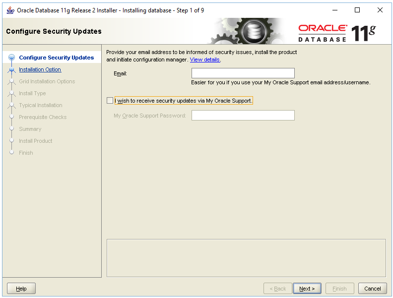
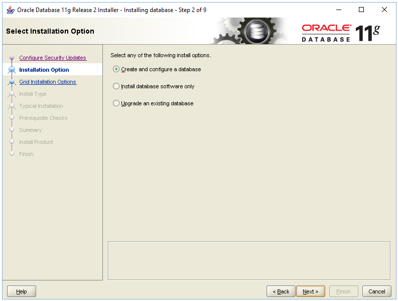
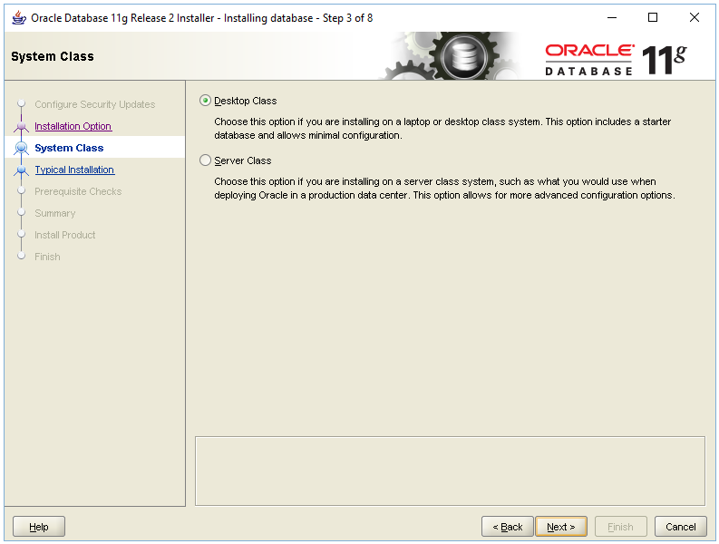
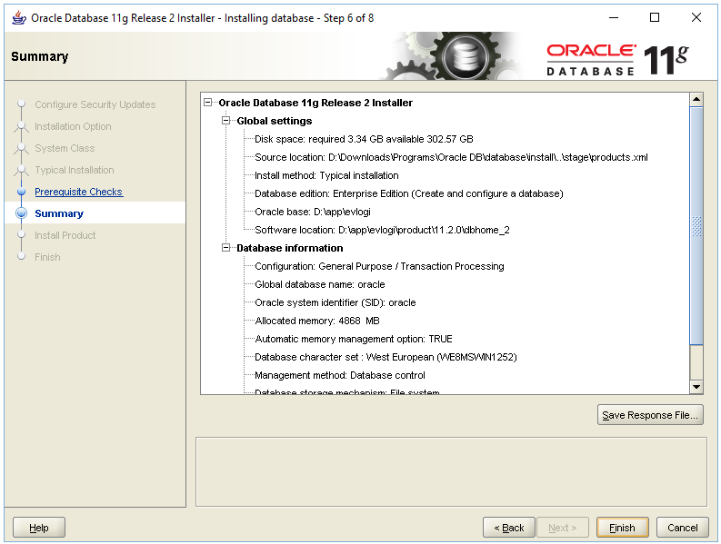
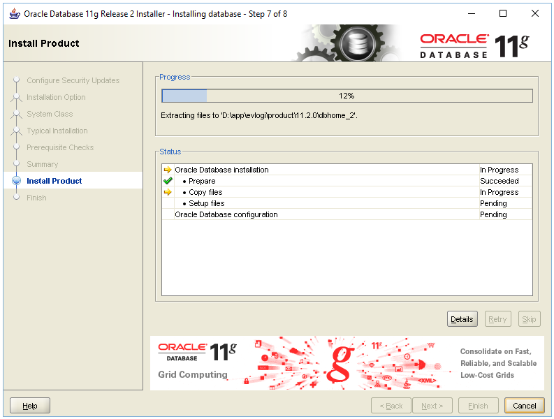
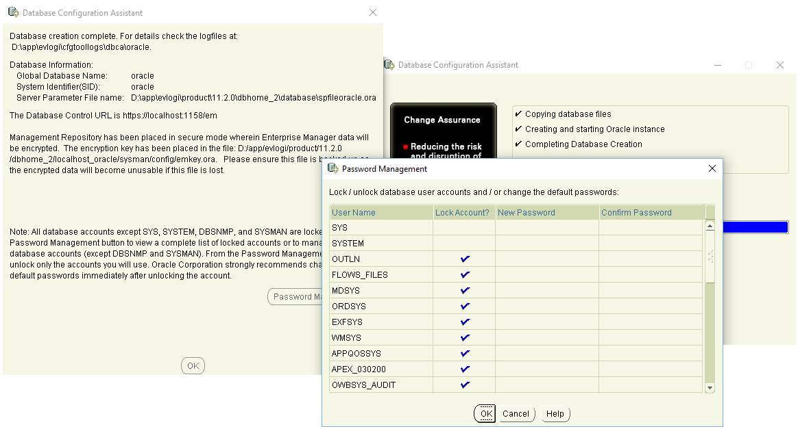
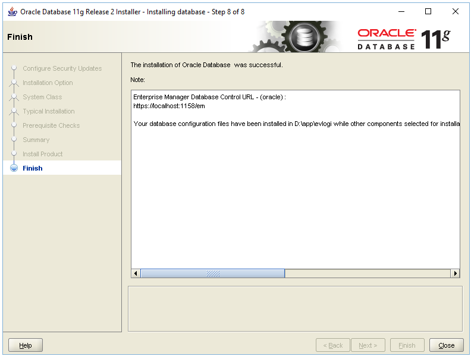
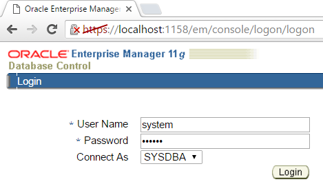
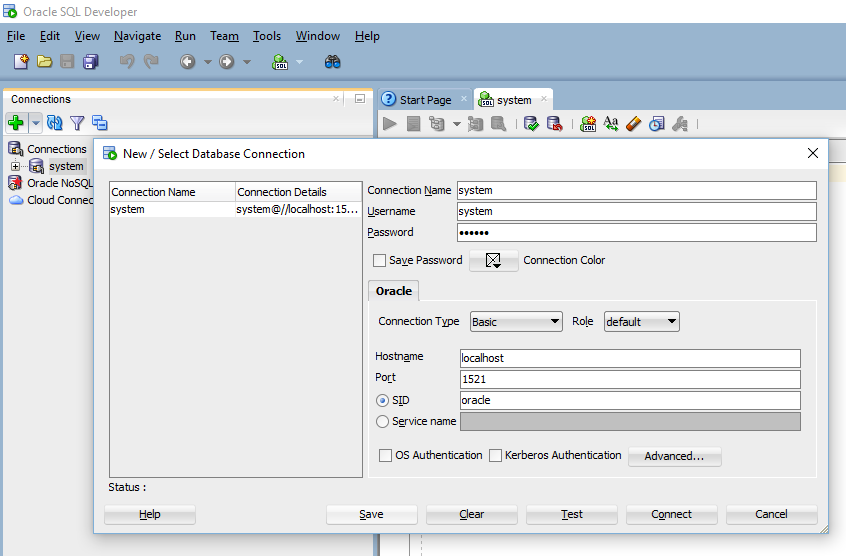

<!-- section start -->

<!-- attr: {id: 'title', class: 'slide-title', hasScriptWrapper: true} -->
# Environment Setup

    
Databses with Java

    
Telerik School Academy

    <a href="http://academy.telerik.com" class="signature-link">http://academy.telerik.com</a>

<!-- section start -->

<!-- attr: { id:'table-of-contents' } -->
# Table of Contents
- Prerequisites & Installation
- Installing useful tools
  - SQL Developer Tool

<!--  section start -->

<!-- attr: { class:'slide-section', showInPresentation:true } -->
<!-- # Prerequisites & Installation -->

# Prerequisites
- There is a minimum of `1` `GB` of physical memory
- Sufficient paging space is available
- The appropriate service packs or patches for your operating system are installed
- An appropriate file system format is being used
  - Must be on a `NTFS` partition
- [Database Installation Guide](http://www.oracle.com/pls/topic/choose?ctx=db112&ids=NTDBI+LADBI+AXDBI+HPDBI+SSDBI)

# Installation
- Log on to your computer as a member of the administrative group
- Installing Oracle Database
  - Go to [www.oracle.com](http://www.oracle.com/index.html) > Downloads
  - Download Oracle Database 11g Release 2 Standard Edition (SE2)
  - Extract zips and run `setup.exe`
- [Instalation notes](http://docs.oracle.com/cd/E11882_01/server.112/e10897/install.htm)
- [Oracle Database Online Documentation 12c](http://docs.oracle.com/database/121/index.htm)

<!-- attr: { showInPresentation:true, hasScriptWrapper:true } -->
<!-- # Installation -->

<!-- attr: { showInPresentation:true, hasScriptWrapper:true } -->
<!-- # Installation -->

<!-- attr: { showInPresentation:true, hasScriptWrapper:true } -->
<!-- # Installation -->

<!-- attr: { showInPresentation:true, hasScriptWrapper:true } -->
<!-- # Installation -->

<!-- attr: { showInPresentation:true, hasScriptWrapper:true } -->
<!-- # Installation -->
- Important to remember password

<!-- attr: { showInPresentation:true, hasScriptWrapper:true } -->
<!-- # Installation -->

<!-- attr: { showInPresentation:true, hasScriptWrapper:true } -->
<!-- # Installation -->

<!-- attr: { showInPresentation:true, hasScriptWrapper:true } -->
<!-- # Installation -->

<!--  section start -->

<!-- attr: { class:'slide-section', showInPresentation:true } -->
<!-- # Installing Tools -->

# Installing Tools
- SQL Developer Tool
  - Go to [SQL Developer > Downloads](http://www.oracle.com/technetwork/developer-tools/sql-developer/downloads/index.html)
  - Download & extract SQL Developer Tool
  - Create `new` Connection
    - username: **system**
    - password: **[your password]**

<!-- attr: { showInPresentation:true, hasScriptWrapper:true } -->
<!-- # SQL Developer Tool -->

<!-- attr: { class:'slide-section demo', showInPresentation:true } -->
<!-- # SQL Developer -->
## [Demo]()

<!-- # Errors
- Fix Listener
  - Run `Cmd` as administrator
  - type `lsnrclt status`
    - type `lsnrclt start` if an error occurs
- Fix connection
  - Open `D:\oraclexe\app\oracle\product\ 11.2.0\server\network\ADMIN\tnsnames.ora` -->

<!-- section start  -->

<!-- attr: { class:'slide-section', showInPresentation:true } -->
<!-- # Questions
##  HTML Fundamentals -->