<!-- section start -->

<!-- attr: {id: 'title', class: 'slide-title', hasScriptWrapper: true} -->

# Database Systems
##  DBMS Fundamental Concepts

<div class="signature">
    <p class="signature-course">Databses with Java</p>
    <p class="signature-initiative">Telerik School Academy</p>
    <a href="http://academy.telerik.com" class="signature-link">http://academy.telerik.com</a>
</div>

<!-- section start -->
<!-- attr: {id: 'table-of-contents'} -->
# Table of Contents

*	Database Models
*	Relational Database Model
*	DBMS & RDBMS Systems
*	Tables, Relationships, Multiplicity, E/R Diagrams
*	Normalization
*	Constraints
*	Indices
*	The SQL language

# Table of Contents

*	Stored Procedures
*	Views
*	Triggers
*	Transactions and Isolation Levels
*	NoSQL Databases

<!-- section start -->
<!-- attr: {class: 'slide-section', id: 'rdbms-systems'} -->
# RDBMS Systems
## Relational Databases, Database Servers and RDBMS

# Relational Databases
*	Database models 
	*	Hierarchical  (tree)
	*	Network / graph
	*	Relational (table)
	*	Object-oriented
*	Relational databases
	*	Represent a bunch of tables together with the relationships between them 
	*	Rely on a strong mathematical foundation: the relational algebra

# Relational Database Management System (RDBMS)
*	Relational Database Management Systems (`RDBMS`) manage data stored in tables
*	RDBMS systems typically implement
	*	Creating / altering / deleting tables and relationships between them (database schema)
	*	Adding, changing, deleting, searching and retrieving of data stored in the tables
	*	Support for the SQL language
	*	Transaction management (optional)

# RDBMS Systems
*	RDBMS systems are also known as:
	*	Database management servers
	*	Or just database servers
*	Popular RDBMS servers ([BG IT jobs stats 2015](https://github.com/NikolayIT/BgItJobsMarketShare/blob/master/Results/2015-09-30-Databases.md)):
	*	Microsoft SQL Server
	*	Oracle Database
	*	MySQL
	*	IBM DB2
	*	PostgreSQL
	*	SQLite
		
<!-- section start -->
<!-- attr: {class: 'slide-section', id: 'tables-and-relationships'} -->
# Tables and Relationships
## Database Tables, Relationships, Multiplicity

<!-- attr: {style: 'font-size:40px'} -->
# Tables
*	Database `tables` consist of data, arranged in rows and columns
	*	For example (table `Persons`):

| Id | First Name | Last Name | Employer |
|----|------------|-----------|----------|
| 1  | Steve | Jobs | Apple | 
| 2  | Bill | Gates | Microsoft |
| 3  | Jeff | Bezos | Amazon | 

*	All rows have the same structure
*	Columns have name and type (number, string, date, image, or other)

# Table Schema
*	The `schema of a table` is an ordered sequence of column specifications (name and type)
*	For example the `Persons` table has the following `schema`:

```xml
Persons (
  Id: number,
  FirstName: string,
  LastName: string,
  Employer: string
)
```

<!-- attr: {style: 'font-size:40px', hasScriptWrapper: true} -->
# Primary Key
*	Primary key is a column of the table that uniquely identifies its rows (usually its is a number)

| Id | First Name | Last Name | Employer |
|----|------------|-----------|----------|
| 1  | Steve | Jobs | Apple | 
| 2  | Bill | Gates | Microsoft |
| 3  | Jeff | Bezos | Amazon |

Primary key <!-- .element; class="balloon fragment" style="top:30%; left:-5%" -->

*	Two records (rows) are different if and only if their primary keys are different
*	The primary key can be composed by several columns (`composite primary key`)

<!-- attr: { hasScriptWrapper:true } -->
# Relationships
*	Relationships between tables are based on interconnections: primary key / foreign key

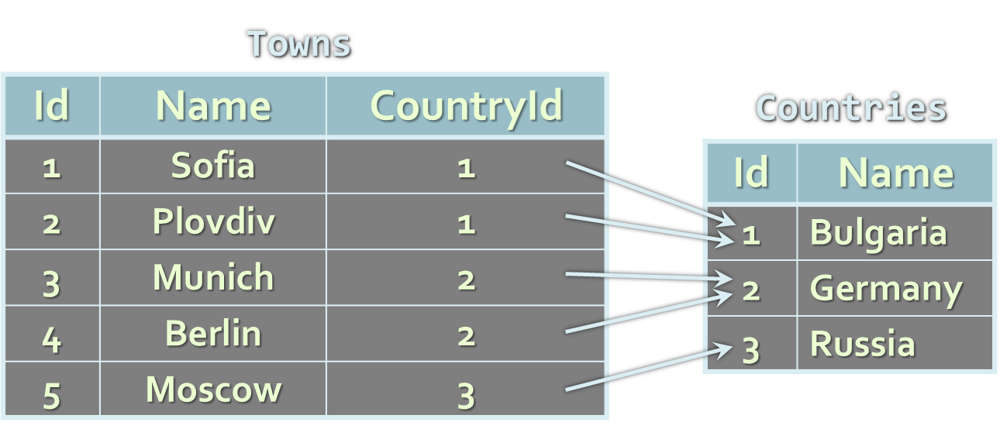
<div class="fragment">
  <div class="balloon" style="left:-7%; top:37%" >Primary key</div>
  <div class="balloon" style="left:40%; top:37%" >Foreign key</div>
  <div class="balloon" style="left:60%; top:45%" >Primary key</div>
</div>

<!-- attr: { showInPresentation:true, style:'font-size:0.95em' } -->
<!-- # Relationships -->
* The `foreign key` is an identifier of a record located in another table (usually its primary key)
* By using relationships we avoid repeating data in the database 
  * In the last example the name of the country is not repeated for each town (its number is used instead)
* Relationships have multiplicity:
  * One-to-many – e.g. country / towns
  * Many-to-many – e.g. student / course
  * One-to-one – e.g. example human / student

<!-- attr: { hasScriptWrapper:true } -->
# Relationships' Multiplicity
* Relationship `one-to-many` (or many-to-one)
  * A single record in the first table has many corresponding records in the second table
  * Used very often
  


<!-- attr: { hasScriptWrapper:true, showInPresentation:true } -->
<!-- # Relationships' Multiplicity -->
*	Relationship `many-to-many`
	*	Records in the first table have many correspon-ding records in the second one and vice versa
	*	Implemented through additional table
	
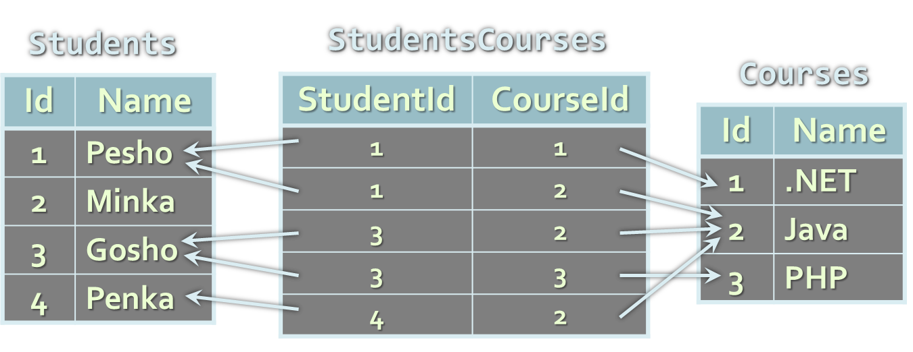

<!-- attr: { hasScriptWrapper:true, showInPresentation:true } -->
<!-- # Relationships' Multiplicity -->
*	Relationship `one-to-one`
	*	A single record in a table corresponds to a single record in the other table
	*	Used to model `inheritance` between tables

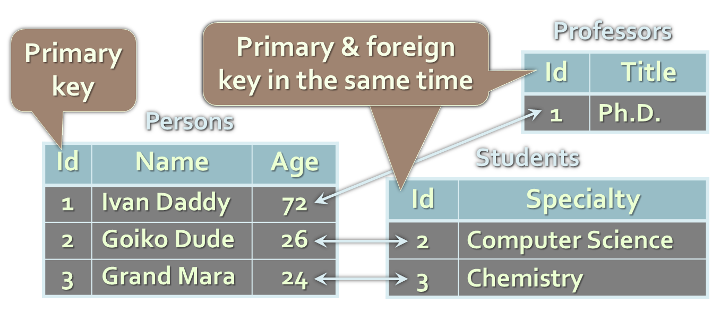

<!-- attr: {hasScriptWrapper: true} -->
# Representing Hierarchical Data
*	How do we represent trees and graphs? 

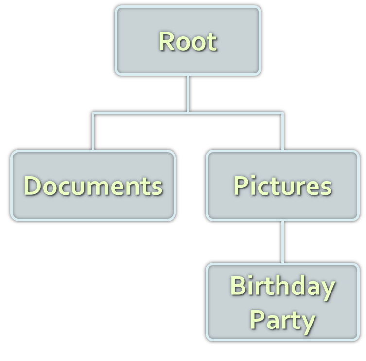

<!-- attr: {hasScriptWrapper: true} -->
# Self-Relationships
*	The primary / foreign key relationships can point to one and the same table
	*	Example: employees in a company have a manager, who is also an employee

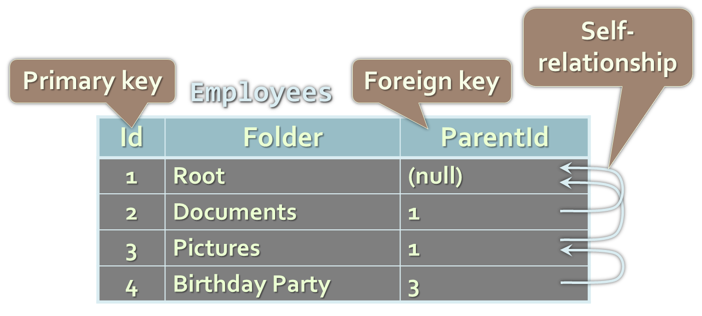

<!-- section start -->
<!-- attr: {id: 'er-diagrams', class: 'slide-section', hasScriptWrapper: true} -->
# E/R Diagrams
## Entity / Relationship Diagrams and DB Modeling Tools

<!-- attr: {style: 'font-size: 44px'} -->
# Relational Schema
*	`Relational schema` of a DB is the collection of:
	*	The schemas of all tables
	*	Relationships between the tables
	*	Any other database objects (e.g. constraints)
*	The relational schema describes the structure of the database
	*	Doesn't contain data, but metadata
*	Relational schemas are graphically displayed in Entity / Relationship diagrams (E/R Diagrams)

<!-- attr: {hasScriptWrapper: true} -->
# E/R Diagrams – Examples


<!-- attr: {hasScriptWrapper: true} -->
# E/R Diagrams – Examples
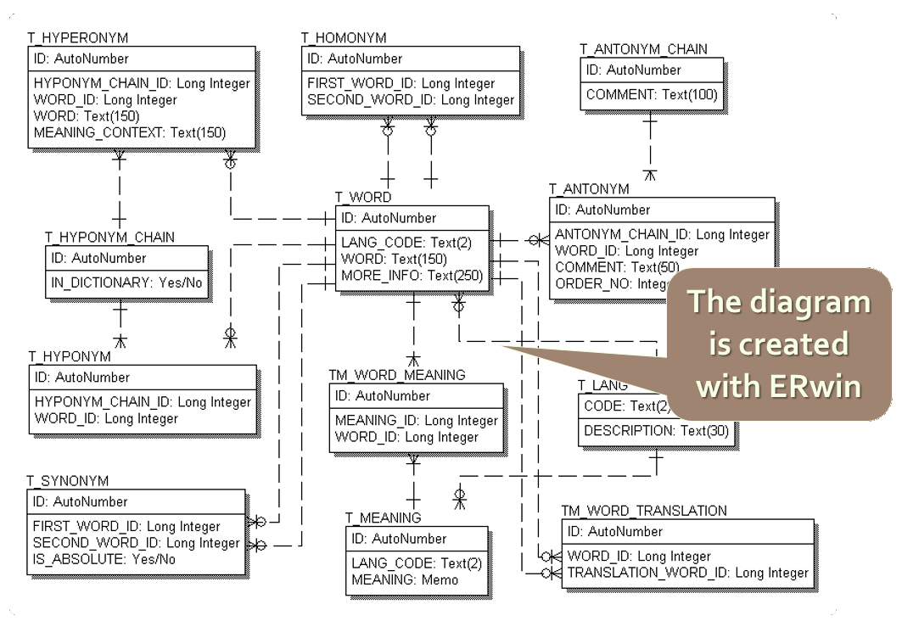

<!-- attr: {hasScriptWrapper: true} -->
# E/R Diagrams – Examples


<!-- attr: {hasScriptWrapper: true} -->
# E/R Diagrams – Examples
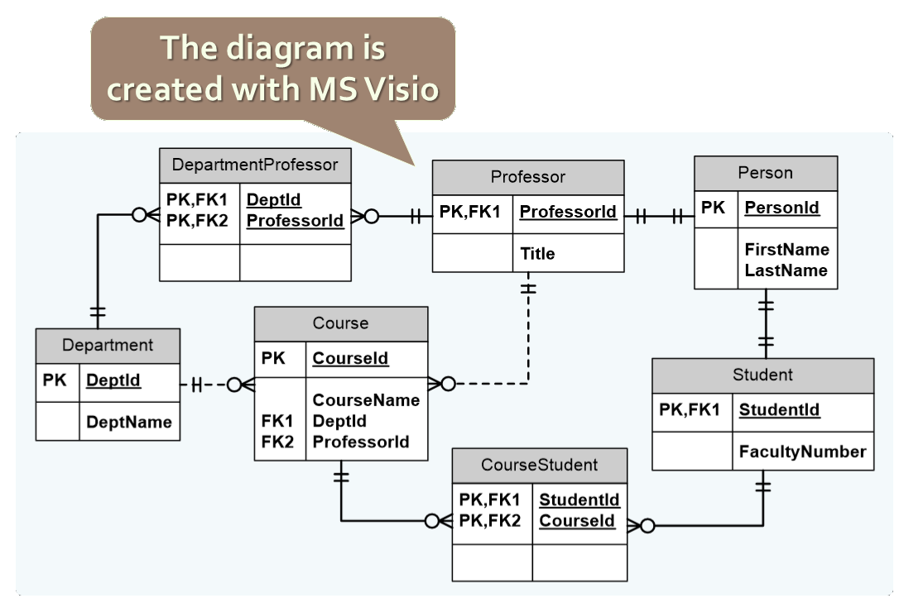

<!-- attr: {hasScriptWrapper: true} -->
# Tools for E/R Design
*	Data modeling tools allow building E/R diagrams, generate / import DB schemas:
	*	SQL Server Management Studio
	*	MySQL Workbench
	*	Oracle JDeveloper
	*	Microsoft Visio
	*	CASE Studio
	*	Computer Associates ERwin
	*	IBM Rational Rose

<!-- section start -->
<!-- attr: {id: 'db-normalization', class: 'slide-section', hasScriptWrapper: true} -->
# DB Normalization
## Avoiding Duplicated Data through Database Schema Normalization

<!-- attr: {hasScriptWrapper: true} -->
# Normalization
*	`Normalization` of the relational schema removes repeating data
*	Non-normalized schemas can contain many data repetitions, e.g.
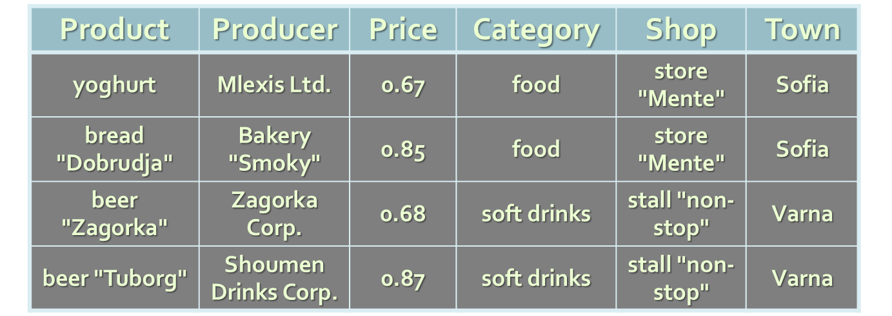

<!-- attr: {hasScriptWrapper: true} -->
# Normalization
*	Example of fully normalized schema (in 4th Normal Form):
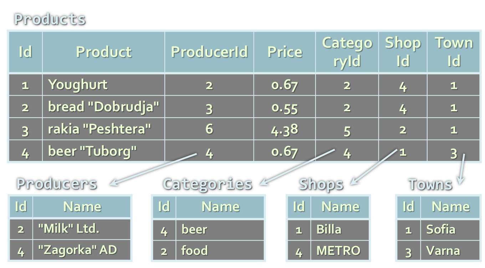

<!-- section start -->
<!-- attr: {id: 'other-database-objects', class: 'slide-section', hasScriptWrapper: true} -->
# Other Database Objects
## Constraints, Indices, SQL, Stored Procedures, Views, Triggers

# Integrity Constraints
*	`Integrity constraints` ensure data integrity in the database tables
	*	Enforce data rules which cannot be violated
*	`Primary key constraint`
	*	Ensures that the primary key of a table has unique value for each table row
*	`Unique key constraint`
	*	Ensures that all values in a certain column (or a group of columns) are unique

# Integrity Constraints
*	`Foreign key constraint`
	*	Ensures that the value in given column is a key from another table
*	`Check constraint`
	*	Ensures that values in a certain column meet some predefined condition
	*	Examples:
	
```sql
(hour >= 0) AND (hour < 24)
```
```sql
name = UPPER(name)
```

# Indices
*	`Indices` speed up searching of values in a certain column or group of columns 
*	Usually implemented as B-trees
*	Indices can be built-in the table (`clustered`) or stored externally (`non-clustered`)
*	Adding and deleting records in indexed tables is slower!
*	Indices should be used for big tables only (e.g. 50 000 rows)

<!-- section start -->
<!-- attr: {id: 'the-sql-language', class: 'slide-section', hasScriptWrapper: true} -->
# The SQL Language

# The SQL Language
*	`SQL` (Structured Query Language)
	*	Standardized declarative language for manipulation of relational databases
	*	`SQL-99` is currently in use in most databases
	*	[wiki/SQL](http://en.wikipedia.org/wiki/SQL)
*	SQL language supports:
	*	Creating, altering, deleting tables and other objects in the database
	*	Searching, retrieving, inserting, modifying and deleting table data (rows)

# The SQL Language
*	SQL consists of:
	*	`DDL` – Data Definition Language
		*	`CREATE`, `ALTER`, `DROP` commands
	*	`DML` – Data Manipulation Language
		*	`SELECT`, `INSERT`, `UPDATE`, `DELETE` commands
	*	Example of SQL `SELECT` query:

```sql
SELECT Towns.Name, Countries.Name
FROM Towns, Countries
WHERE Towns.CountryId = Countries.Id
```

# Stored Procedures
*	`Stored procedures` (database-level procedures)
	*	Consist of SQL-like code stored in the database
	*	Code executed inside the database server 
	*	Much faster than an external code
	*	Data is locally accessible
	*	Can accept parameters
	*	Can return results
		*	Single value
		*	Record sets

# Stored Procedures
*	Stored procedures are written in a language extension of SQL 
	*	T-SQL – in Microsoft SQL Server
	*	PL/SQL – in Oracle
*	Example of stored procedure in Oracle PL/SQL:

```sql
CREATE OR REPLACE PROCEDURE spInsertCountry(countryName varchar2) IS
BEGIN
  INSERT INTO Countries(Name)
  VALUES(countryName);
END;
```

# Views
*	`Views` are named SQL `SELECT` queries which are used as tables
	*	Simplify data access
	*	Facilitate writing of complex SQL queries
*	Used also to apply security restrictions:
	*	E.g. a certain user isn't given permissions on any of the tables in the database
	*	The user is given permissions on few views (subset of DB) and few stored procedures only

<!-- attr: {hasScriptWrapper: true} -->
# Views – Example
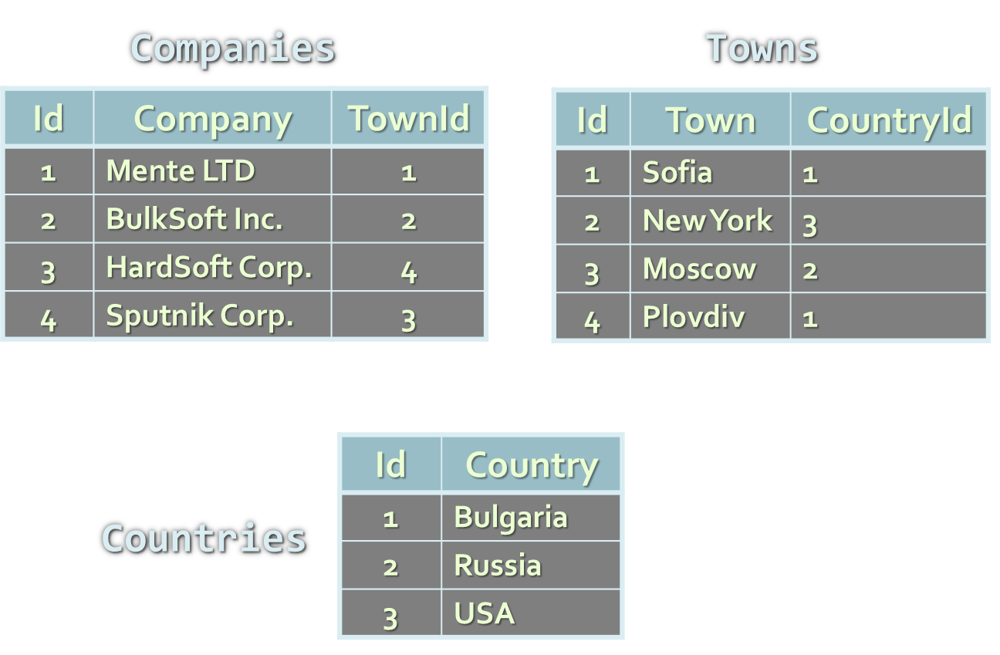

<!-- attr: { hasScriptWrapper:true, showInPresentation:true } -->
<!-- # Views – Example -->
```sql
CREATE VIEW V_BGCompanies AS
  SELECT
    Companies.Id AS Id,
    Companies.Company AS Company
  FROM Companies INNER JOIN
    (Towns INNER JOIN Countries ON
     Towns.CountryId = Countries.Id)
    ON Companies.TownId = Towns.Id
  WHERE
    Countries.Country = "Bulgaria";
```

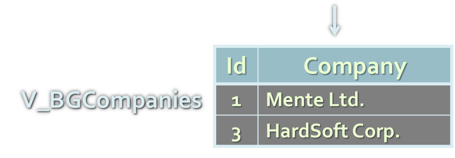

# Triggers
*	`Triggers` are special stored procedures that are activate when some event occurs, for instance:
	*	When inserting a record
	*	When changing a record
	*	When deleting a record
*	Triggers can perform additional data processing of the affected rows, e.g.
	*	To change the newly added data
	*	To maintain logs and history

# Triggers – Example
We have a table holding company names:

```sql
CREATE TABLE Companies(
  Id number NOT NULL,
  Name varchar(50) NOT NULL)
```

A trigger that appends "Ltd." at the end of the name of a new company:

```sql
CREATE OR REPLACE TRIGGER trg_Companies_INSERT
  BEFORE INSERT ON Company
  FOR EACH ROW
BEGIN
  :NEW.Name := :NEW.Name || ' Ltd.';
END;
```

<!-- section start -->
<!-- attr: {id: 'transactions', class: 'slide-section', hasScriptWrapper: true} -->
# Transactions
## ACID Transactions and Isolation

# Transactions
*	`Transactions` are a sequence of database operations which are executed as a single unit:
	*	Either all of them execute successfully
	*	Or none of them is executed at all
*	Example:
	*	A bank transfer from one account into another (withdrawal + deposit)
	*	If either the withdrawal or the deposit fails the entire operation should be cancelled

<!-- attr: {hasScriptWrapper: true} -->
# DB Transactions Lifecycle
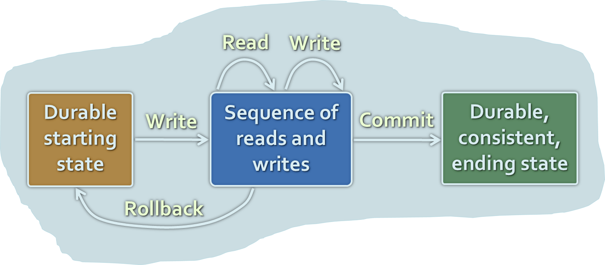

# Transactions Behavior
*	Transactions guarantee the consistency and the integrity of the database
	*	All changes in a transaction are temporary
	*	Changes become final when `COMMIT` is successfully executed
	*	At any time all changes done in the transaction can be cancelled by executing `ROLLBACK`
*	All operations are executed as a single unit
	*	Either all of them pass or none of them

<!-- section start -->
<!-- attr: {id: 'nosql-databses', class: 'slide-section', hasScriptWrapper: true} -->
# NoSQL Databases
## Non-Relational Database Systems

# Non-Relational Data Models
*	Document model (e.g. MongoDB, CouchDB)
	*	Set of documents, e.g. JSON strings
*	Key-value model (e.g. Redis)
	*	Set of key-value pairs
*	Hierarchical key-value
	*	Hierarchy of key-value pairs
*	Wide-column model (e.g. Cassandra)
	*	Key-value model with schema
*	Object model (e.g. Cache)
	*	Set of OOP-style objects
	
# What is NoSQL Database?
*	`NoSQL (non-relational) databases`
	*	Use `document-based` model (non-relational)
	*	Schema-free document storage
		*	Still support CRUD operations
			*	Create, Read, Update, Delete
		*	Still support indexing and querying
		*	Still supports concurrency  and transactions
	*	Highly optimized for append / retrieve
	*	Great performance and scalability
	*	NoSQL == “No SQL” or “Not Only SQL”?

# Relational vs. NoSQL Databases
*	Relational databases
	*	Data stored as table rows
	*	Relationships between related rows
	*	Single entity spans multiple tables
	*	RDBMS systems are very mature, rock solid
*	NoSQL databases
	*	Data stored as documents
	*	Single entity (document) is a single record
	*	Documents do not have a fixed structure

<!-- attr: { hasScriptWrapper: true } -->
# Relational vs. NoSQL Models
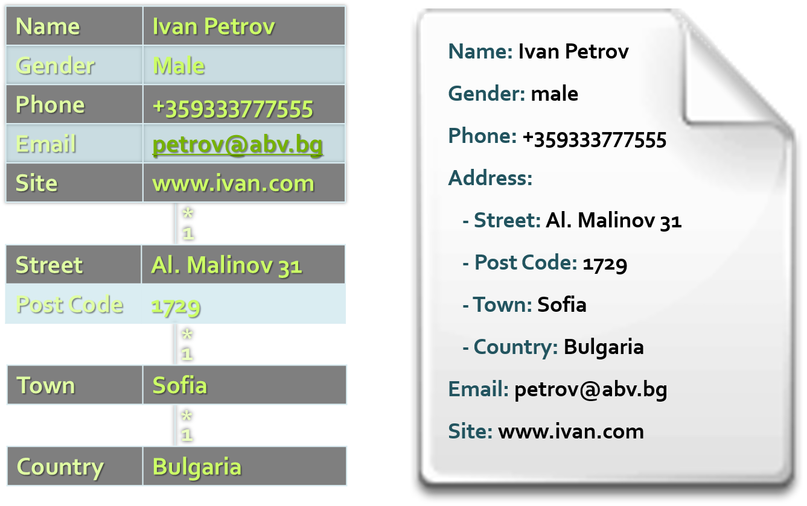

# NoSQL Database Systems
*	[Redis](http://redis.io/)
	*	Ultra-fast in-memory data structures server
*	[MongoDB](https://www.mongodb.org/)
	*	Mature and powerful JSON-document database
*	[CouchDB](http://couchdb.apache.org/)
	*	JSON-based document database with REST API
*	[Cassandra](http://cassandra.apache.org/)
	*	Distributed wide-column database
*	DB Ranking: http://db-engines.com/en/ranking


<!-- section start -->
<!-- attr: {id: 'questions', class: 'slide-section', hasScriptWrapper: true} -->
# Questions
## Database Systems
