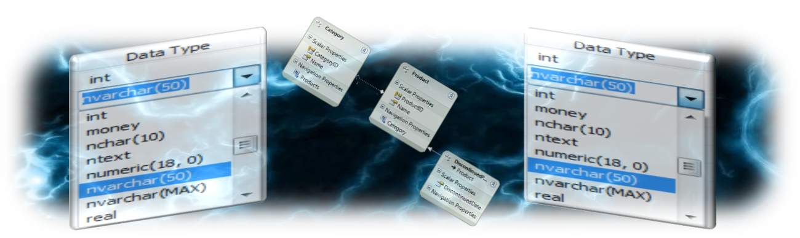
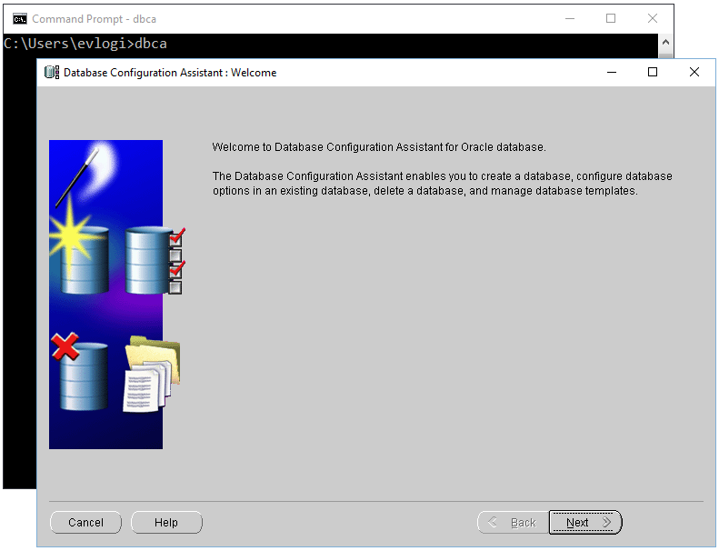
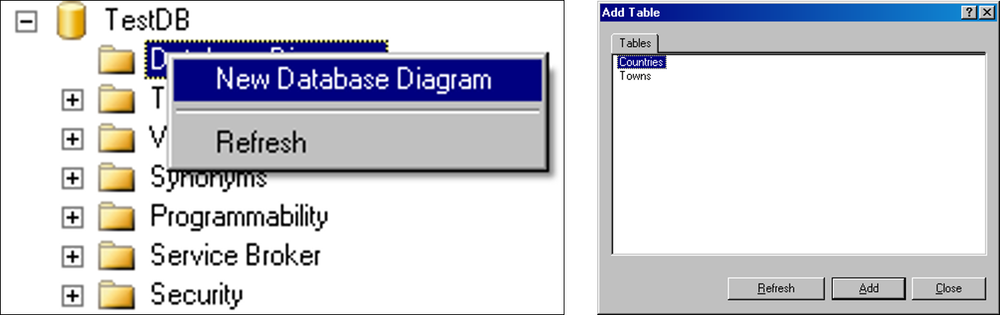
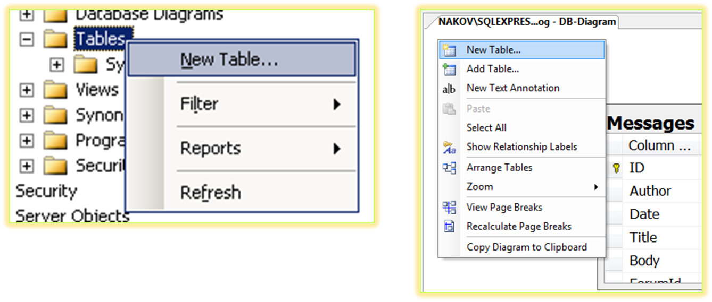
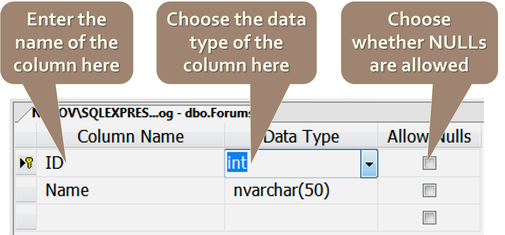
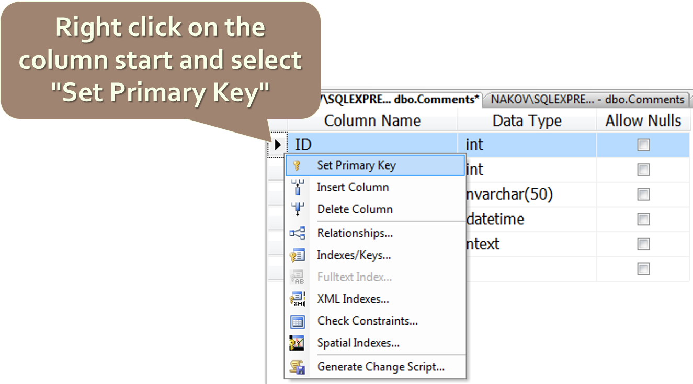
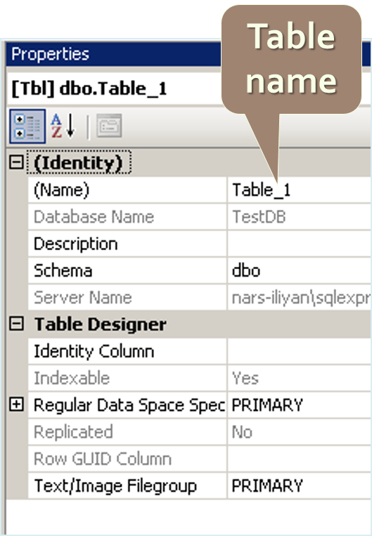
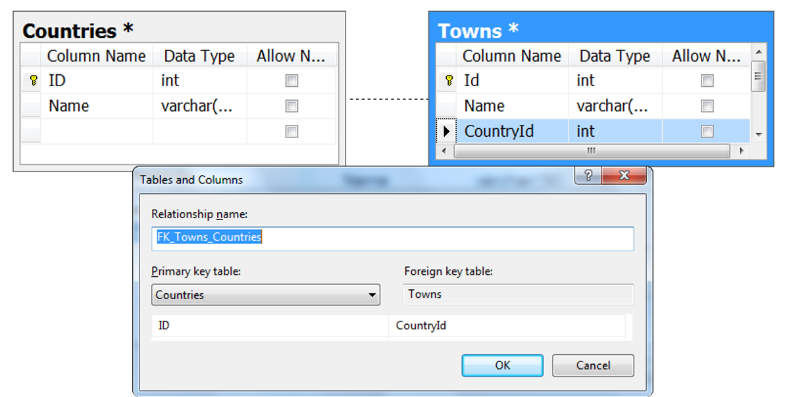

<!-- section start -->

<!-- attr: {id: 'title', class: 'slide-title', hasScriptWrapper: true} -->

# Database Modelling
## Creating E/R Diagrams with SQL Developer

<div class="signature">
    <p class="signature-course">Databses with Java</p>
    <p class="signature-initiative">Telerik School Academy</p>
    <a href="http://academy.telerik.com" class="signature-link">http://academy.telerik.com</a>
</div>

<!-- section start -->
<!-- attr: {id: 'table-of-contents'} -->
# Table of Contents
- Data Modelling – Principles
-	Data Types in Oracle
-	Creating Databases in Oracle
-	Creating Tables
-	Defining a Primary Key and Identity Columns
-	Creating Relationships between the Tables
	-	One-to-many, Many-to-many, One-to-one
-	Naming Conventions

<!-- section start -->
<!-- attr: {id: 'data-modelling', class: 'slide-section'} -->
# Relational Data Modelling
## Fundamental Concepts

# Steps in Database Design
*	Steps in the database design process:
	1.	Identification of the entities
	1.	Identification of the columns in the tables
	1.	Defining a primary key for each entity table
	1.	Identification and modelling of relationships
		-	Multiplicity of relationships
	1.	Defining other constraints
	1.	Filling test data in the tables

# Identification of Entities
-	Entity tables represent objects from the real world
-	Most often they are nouns in the specification
-	For example:

```xml
We need to develop a system that stores information about
students, which are trained in various courses. The courses
are held in different towns. When registering a new student
the following information is entered: name, faculty number,
photo and date.
```
*	Entities: Student, Course, Town

# Identification of Columns
-	Columns in the tables are characteristics of the entities
	-	They have name and type
-	For example students have:
	-	Name (text)
	-	Faculty number (number)
	-	Photo (binary block)
	-	Date of enlistment (date)

# Identification of the Columns
-	Columns are clarifications for the entities in the text of the specification, for example:

```xml
We need to develop a system that stores information about
students, which are trained in various courses. The courses
are held in different towns. When registering a new student
the following information is entered: name, faculty number,
photo and date.
```

-	Students have the following characteristics:
	-	Name, faculty number, photo, date of enlistment and a list of courses they visit

# How to Choose a Primary Key?
-	Always define an additional column for the primary key
	-	Don't use an existing column (for example SSN)
	-	Must be an integer number
	-	Must be declared as a primary key
	-	Use `identity` to implement auto-increment
	-	Put the primary key as a first column
-	Exceptions
	-	Entities that have well known ID, e.g. countries (BG, DE, US) and currencies (USD, EUR, BGN)

# Identification of Relationships
-	Relationships are dependencies between the entities:

```xml
We need to develop a system that stores information about
students, which are trained in various courses. The courses
are held in different towns. When registering a new student
the following information is entered: name, faculty number,
photo and date.
```

-	"`Students are trained in courses`" – many-to-many relationship
-	"`Courses are held in towns`" – many-to-one (or many-to-many) relationship

<!-- section start -->
<!-- attr: {id: 'data-types', class: 'slide-section'} -->
# Data Types in Oracle

<!-- attr: { showInPresentation:true } -->
<!-- # Data Types in Oracle -->
-	Character Datatypes
	-	`CHAR(size)` – fixed size string
	-	`VARCHAR2(size)` and `VARCHAR(size)` – variable size string
	-	`NVARCHAR2(size)` and `NCHAR(size)` – Unicode variable size string
	-	`LONG` - variable-length character data (up to 2 gigabytes)
	-	`CLOB` and `NCLOB` – text data block (8 terabytes of character data)

<!-- attr: { showInPresentation:true, hasScriptWrapper:true, style:'font-size:0.9em' } -->
<!-- # Data Types in Oracle -->
-	`NUMBER`
	-	Positive numbers from 1 x 10<sup>-130</sup> to 9.99...9 x 10<sup>125</sup>
	-	Negative numbers from -1 x 10<sup>-130</sup> to 9.99...99 x 10<sup>125</sup>
	 -	Up to **38 significant digits**
	-	Syntax: `column_name NUMBER (precision, scale)`
	-	[How Scale Factors Affect Numeric Data Storage](https://docs.oracle.com/cd/B28359_01/server.111/b28318/datatype.htm#g23242)
-	`Floating-Point Numbers`
	 -	`BINARY_FLOAT`
	   - 32-bit single-precision floating-point number
	 -	`BINARY_DOUBLE`
  	 -	64-bit double-precision floating-point number

<!-- attr: { showInPresentation:true } -->
<!-- # Data Types in Oracle -->
-	`DATE`
	-	stores point-in-time values (**dates** and **times**)
	-	stores the **year** (including the century), the **month**, the **day**, the **hours**, the **minutes**, and the **seconds** (after midnight)
-	`LOB` Datatypes
  -	`BLOB`, `CLOB`, `NCLOB`, and `BFILE`
	-	The maximum size of a `LOB` is **128 terabytes**

<!-- attr: { showInPresentation:true, hasScriptWrapper: true } -->
<!-- # Data Types in Oracle -->
-	Other types
	-	`TIMESTAMP` – automatically generated number whenever a change is made to the data row
	-	`XML` – data in XML format
	-	`URI`
 

<!-- attr: { showInPresentation:true } -->
<!-- # Data Types in Oracle -->
-	`NULL` and `NOT NULL` types
	-	All columns are `Nullable` if `NOT NULL` or `PRIMARY KEY`
-	`PRIMARY KEY` columns
	-	Uniquely defines a record
	-	Cannot be Null
-	`IDENTITY` columns **available on Oracle 12c**
	-	Automatically increased values when a new row is inserted (auto-increment values)
	-	Used in combination with `PRIMARY KEY`


<!-- section start -->

<!-- attr: {id: 'creating-database', class: 'slide-section'} -->
# Database Modeling with SQL Developer
## Creating Database

<!-- attr: { hasScriptWrapper: true } -->
# Connecting to the Database
- Create Database using `cmd` > `dbca`
  - Run as administrator
-	Create new Connection in SQL Developer
 
 

<!-- attr: { showInPresentation:true, class:'slide-section demo' } -->
<!-- # Creating a Database -->
## [Demo]()

<!-- section start -->

<!-- attr: {id: 'creating-diagrams', class: 'slide-section'} -->
# Database Modelling with SQL Developer
## Creating E/R Diagrams

<!-- attr: { hasScriptWrapper: true } -->
# Creating an E/R diagram
-	In the "Database Diagrams" menu choose the "New Database Diagram"


-	We can choose from the existing tables, which we want to add to the diagram

<!-- attr: { class: 'slide-section' } -->
# Database Modeling with SQL Developer
## Creating Tables

<!-- attr: { hasScriptWrapper: true } -->
# Creating Tables
-	If the database doesn't show immediately in Object Explorer perform "Refresh" [F5]
-	Creating new table:
 

<!-- attr: { hasScriptWrapper: true } -->
# Creating Tables
-	Enter table name  and define the table columns (name and type):
 

<!-- attr: { hasScriptWrapper: true } -->
# Creating Tables
*	Defining a primary key 
 

<!-- attr: { hasScriptWrapper: true } -->
# Creating Tables
-	It is a good practice to set the name of the table at the time it is created
 

<!-- attr: { class: 'slide-section' } -->
# Database Modeling with SQL Developer
## Creating Relationships between Tables

<!-- attr: { hasScriptWrapper: true } -->
# Creating Relationships
-	To create one-to-many relationship drag the foreign key column onto the other table
	-	Drag from the child table to the parent table
 

<!-- section start -->
<!-- attr: {id: 'naming', class: 'slide-section'} -->
# Database Modeling with SQL Developer
## Naming Conventions

# Naming Conventions
-	Tables
	-	Each word is capitalized (Pascal Case)
	-	In English, plural
	-	Examples: `Users`, `PhotoAlbums`, `Countries`
-	Columns
	-	In English, singular
	-	Each word is capitalized (Pascal Case)
	-	Avoid reserved words (e.g. `key`, `int`, `date`)
	-	Examples: `FirstName`, `OrderDate`, `Price`

# Naming Conventions
-	Primary key
	-	Use "`Id`" or `name_of_the_table` + "Id"
	-	Example: in the `Users` table the PK column should be be called `Id` or `UserId`
-	Foreign key
	-	Use the name of the referenced table + "`Id`"
	-	Example: in the `Users` table the foreign key column that references the `Groups` table should be named `GroupId`

# Naming Conventions
-	Relationship names (constraints)
	-	In English, Pascal Case
	-	"`FK_`" + `table1` + "`_`" + `table2`
	-	For example: `FK_Users_Groups`
-	Index names
	-	"`IX_`" + `table` + `column`
	-	For example: `IX_Users_UserName`

# Naming Conventions
-	Unique key constraints names
	-	"`UK_`" + `table` + `column`
	-	For instance: `UK_Users_UserName`
-	Views names
	-	`V_` + `name`
	-	Example: `V_BGCompanies`
-	Stored procedures names
	-	`usp_` + `name`
	-	Example: `usp_InsertCustomer(@name)`

<!-- attr: { class: 'slide-section demo' } -->
# Database Modelling with SQL Developer
## [Demo]()

<!-- section start -->
<!-- attr: {id: 'questions', class: 'slide-section'} -->
# Questions
## Database Modeling
