<!-- section start -->

<!-- attr: {id: 'title', class: 'slide-title', hasScriptWrapper: true} -->

# Structured Query Language (SQL)
##  SQL Intro
<div class="signature">
    <p class="signature-course">Databses with Java</p>
    <p class="signature-initiative">Telerik School Academy</p>
    <a href="http://academy.telerik.com" class="signature-link">http://academy.telerik.com</a>
</div>

<!-- section start -->
<!-- attr: {id: 'table-of-contents'} -->
# Table of Contents
*	Relational Databases and SQL
  * SQL Language
*	Introducing the `SELECT` SQL Statement
	*	Allowed Operators
	*	The `WHERE` Clause
	*	Sorting with `ORDER BY`
	*	Selecting Data From Multiple Tables

# Table of Contents
*	Selecting Data From Multiple Tables
	*	Natural Joins
	*	Join with `USING` Clause
	*	Inner Joins with `ON` Clause
	*	Left, Right and Full Outer Joins
	*	Cross Joins
*	Inserting Data
*	Updating Data
*	Deleting Data

<!-- section start -->
<!-- attr: {id: 'sql', class: 'slide-section'} -->
# Relational Databases and SQL
## The SQL Execution Model

# Relational Databases and SQL
*	A relational database can be accessed and modified by executing SQL statements
	*	SQL allows
		*	Defining / modifying the database schema
		*	Searching / modifying table data
	*	A set of SQL commands are available for extracting subset of the table data
	*	Most SQL commands return a `single value` or `record set`

<!-- attr: { hasScriptWrapper: true } -->
# Communicating with the DB
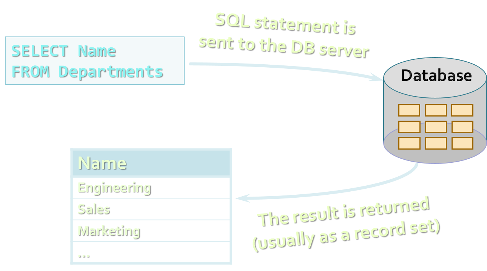

# SQL Execution
*	SQL commands are executed through a `database connection`
	*	DB connection is a channel between the client and the SQL server
	*	DB connections take resources and should be closed when no longer used
	*	Multiple clients can be connected to the SQL server at the same time
	*	SQL commands can be executed in parallel
		*	Transactions and isolation deal with concurrency

<!-- section start -->
<!-- attr: {id: 'sql-introduction', class: 'slide-section'} -->
# SQL
## Introduction

# What is SQL?
*	`Structured Query Language` (SQL)
	*	Declarative language for query and manipulation of relational data
	*	[wiki/SQL](en.wikipedia.org/wiki/SQL)
*	SQL consists of:
	*	Data Manipulation Language (`DML`)
		*	`SELECT`, `INSERT`, `UPDATE`, `DELETE`
	*	Data Definition Language (`DDL`)
		*	`CREATE`, `DROP`, `ALTER`
		*	`GRANT`, `REVOKE`

# SQL – Few Examples

```sql
SELECT FirstName, LastName, JobTitle FROM Employees
```
```sql
SELECT * FROM Projects WHERE StartDate = '1-JAN-06'
```
```sql
INSERT INTO Projects(Name, StartDate)
VALUES('Introduction to SQL Course', '1-JAN-06')
```
```sql
UPDATE Projects
SET EndDate = '31-AUG-06'
WHERE StartDate = '1-JAN-06'
```
```sql
DELETE FROM Projects
WHERE StartDate = '1-JAN-06'
```

<!-- section start -->
<!-- attr: {id: 'select', class: 'slide-section'} -->
# SQL Language
## Introducing SELECT Statement

<!-- attr: { hasScriptWrapper: true } -->
# Capabilities of SQL SELECT 
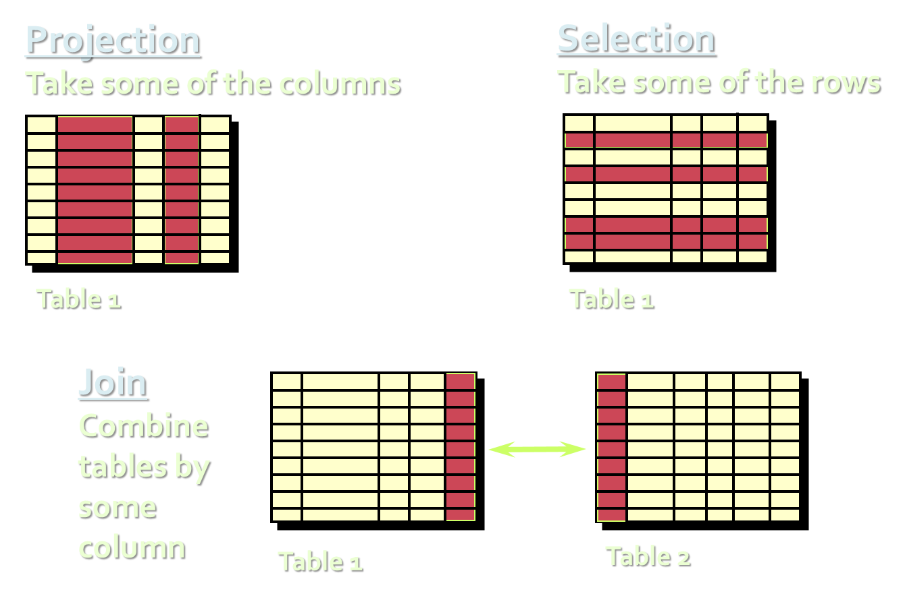

<!-- attr: { hasScriptWrapper: true } -->
# Database Schema in SQL Server


<!-- attr: { hasScriptWrapper: true } -->
# Basic SELECT Statement
```sql
SELECT *|{[DISTINCT] column|expression [alias],...}
FROM	table
```
*	`SELECT` identifies what columns
*	`FROM` identifies which table


<!-- attr: { hasScriptWrapper: true } -->
# SELECT Example
```sql
SELECT * FROM Departments
```
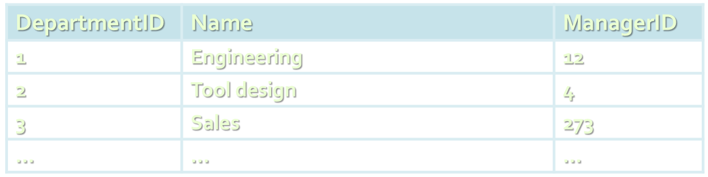

```sql
SELECT DepartmentID, Name FROM Departments
```


<!-- attr: { hasScriptWrapper: true } -->
# Arithmetic Operations
*	Arithmetic operators are available:
	*	`+`, `-`, `*`, `/`
*	Examples:

```sql
SELECT (2 + 3) * 4 FROM CATEGORIES   --> returns 20
```
```sql
SELECT LastName, Salary, Salary + 300 FROM Employees
```
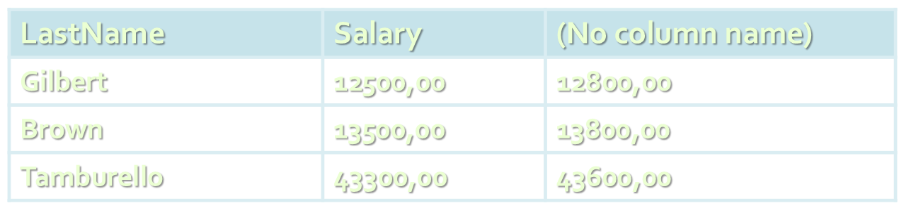

<!-- attr: { hasScriptWrapper: true } -->
# The NULL Value
*	A `NULL` is a value that is unavailable, unassigned, unknown, or inapplicable
	*	Not the same as zero or a blank space
*	Arithmetic expressions containing a `NULL` value are evaluated to `NULL`

```sql
SELECT LastName, ManagerID FROM Employees
```
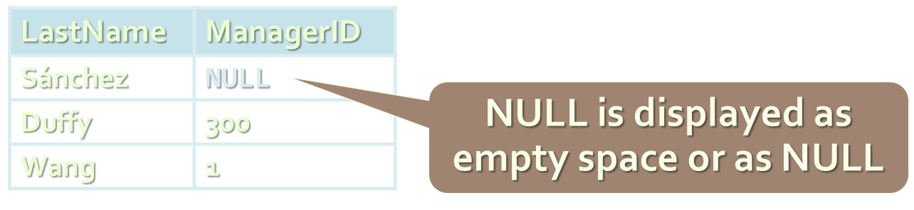

<!-- attr: { hasScriptWrapper: true } -->
# Column Aliases
*	Aliases rename a column heading
*	Useful with calculations
*	Immediately follows the column name
	*	There is an optional `AS` keyword
*	Double quotation marks if contains spaces

```sql
SELECT FirstName, LastName, Salary,
Salary * 0.2 AS Bonus FROM Employees
```


<!-- attr: { hasScriptWrapper: true } -->
# Concatenation Operator
*	Concatenates columns or character strings to other columns 
* `concat([string], [string])`
*	Creates a resultant column that is a character expression

```sql
SELECT concat(FirstName, concat(' ', LastName)) AS [Full Name],
EmployeeID as [No.] FROM Employees
```


<!-- attr: { hasScriptWrapper: true, style: 'font-size:0.9em' } -->
# Literal Character Strings
*	A literal is a character, a number, or a date included in the `SELECT` list
	*	Date and character literal values must be enclosed within single quotation marks
	*	Each character string is output once for each row returned

```sql
SELECT concat(FirstName, concat('''s last name is ' +
LastName)) AS [Our Employees] FROM Employees
```


<!-- attr: { hasScriptWrapper: true } -->
# Removing Duplicate Rows
*	The default display of queries is all rows, including duplicate rows
<div style="width: 50%">
```sql
SELECT DepartmentID
FROM Employees
```
</div>
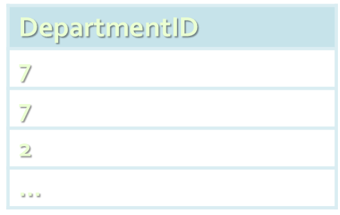

*	Eliminate duplicate rows by using the `DISTINCT` keyword in the SELECT clause
<div style="width: 50%">
```sql
SELECT
  DISTINCT DepartmentID
FROM Employees
```
</div>


<!-- attr: { hasScriptWrapper: true, style: 'font-size:0.9em' } -->
# Set Operations: UNION, INTERSECT and EXCEPT
*	`UNION` combines the results from several SELECT statements
	*	The columns count and types should match

<div style="width: 65%">
```sql
SELECT FirstName AS Name
FROM Employees
UNION
SELECT LastName AS Name
FROM Employees
```
</div>
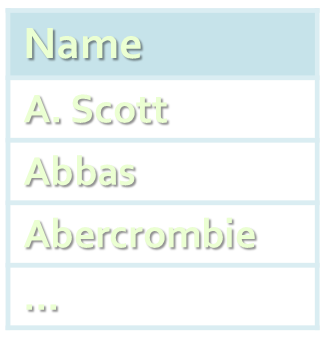

*	`INTERSECT`/`EXCEPT` perform logical intersection/difference between given two sets of records

<!-- attr: { hasScriptWrapper: true } -->
# Limiting the Rows Selected
*	Restrict the rows returned by using the WHERE clause:

<div style="width: 63%">
```sql
SELECT LastName, DepartmentID
FROM Employees WHERE DepartmentID = 1
```
</div>
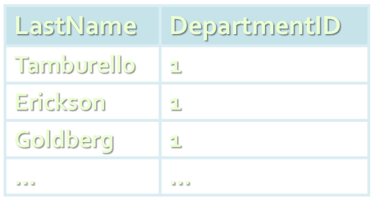

*	More examples:

```sql
SELECT FirstName, LastName, DepartmentID FROM
Employees WHERE LastName = 'Sullivan'
```
```sql
SELECT LastName, Salary FROM Employees
WHERE Salary <= 20000
```

# Other Comparison Conditions
*	Using `BETWEEN` operator to specify a range:

```sql
SELECT LastName, Salary FROM Employees
WHERE Salary BETWEEN 20000 AND 22000
```
*	Using `IN`/`NOT IN` to specify a set of values:

```sql
SELECT FirstName, LastName, ManagerID FROM
Employees WHERE ManagerID IN (109, 3, 16)
```
*	Using `LIKE` operator to specify a pattern:

```sql
SELECT FirstName FROM Employees WHERE FirstName LIKE 'S%'
```
*	`%` means 0 or more chars; `_` means one char

<!-- attr: { hasScriptWrapper:true } -->
# Comparing with NULL
*	Checking for `NULL` value:

```sql
SELECT LastName, ManagerId FROM Employees
WHERE ManagerId IS NULL
```
```sql
SELECT LastName, ManagerId FROM Employees
WHERE ManagerId IS NOT NULL
```
*	Attention: `COLUMN = NULL` is always false!

```sql
SELECT LAST_NAME, MANAGER_ID FROM EMPLOYEES
WHERE MANAGER_ID = NULL
```
```sql
SELECT LAST_NAME, MANAGER_ID FROM EMPLOYEES
WHERE NULL = NULL
```
<div class="fragment" >
	<div class="balloon" style="top:72%;right:10%">This is always false!</div>
	<div class="balloon" style="top:87%;right:10%">This is always false!</div>
</div>

# Logical Operators and Brackets
*	Using `NOT`, `OR` and `AND` operators and brackets:

```sql
SELECT FirstName, LastName FROM Employees
WHERE Salary >= 20000 AND LastName LIKE 'C%'
```
```sql
SELECT LastName FROM Employees
WHERE ManagerID IS NOT NULL OR LastName LIKE '%so_'
```
```sql
SELECT LastName FROM Employees
WHERE NOT (ManagerID = 3 OR ManagerID = 4)
```
```sql
SELECT FirstName, LastName FROM Employees
WHERE
    (ManagerID = 3 OR ManagerID = 4) AND
    (Salary >= 20000 OR ManagerID IS NULL)
```

<!-- attr: { hasScriptWrapper: true } -->
# Sorting with ORDER BY
*	Sort rows with the `ORDER BY` clause
	*	`ASC`: ascending order, default
	*	`DESC`: descending order

<div style="width:60%">
```sql
SELECT LastName, HireDate FROM
Employees ORDER BY HireDate
```
```sql
SELECT LastName, HireDate FROM
Employees ORDER BY HireDate DESC
```
</div>
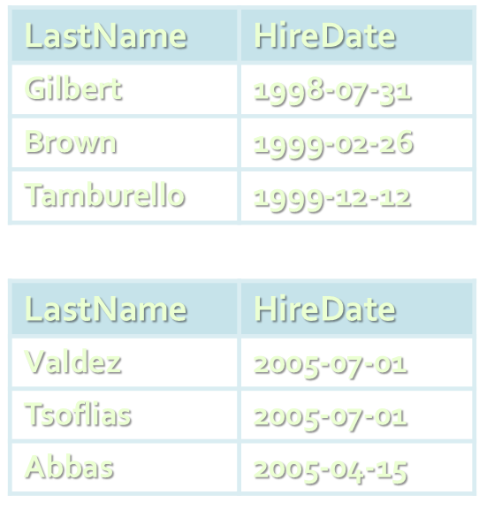

<!-- section start -->
<!-- attr: {id: 'data-from-multiple-tables', class: 'slide-section'} -->
# SQL Language
## Joins: Selecting Data From Multiple Tables

<!-- attr: { hasScriptWrapper: true } -->
# Data from Multiple Tables
*	Sometimes you need data from more than one table:
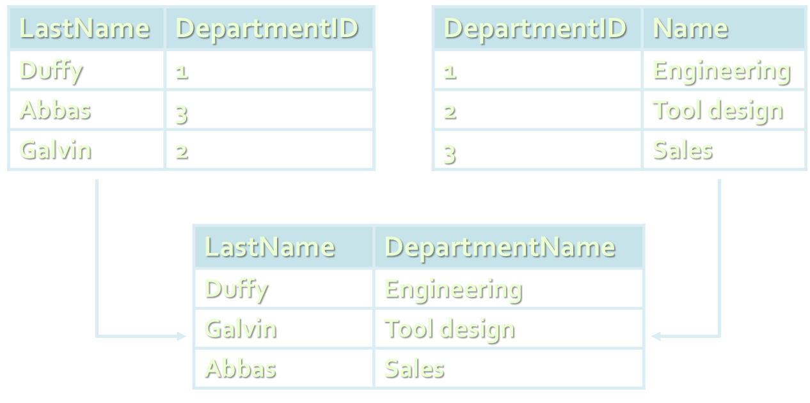

<!-- attr: { hasScriptWrapper: true } -->
# Cartesian Product
*	This will produce Cartesian product:
```sql
SELECT LastName, Name AS DepartmentName
FROM Employees, Departments
```
*	The result:
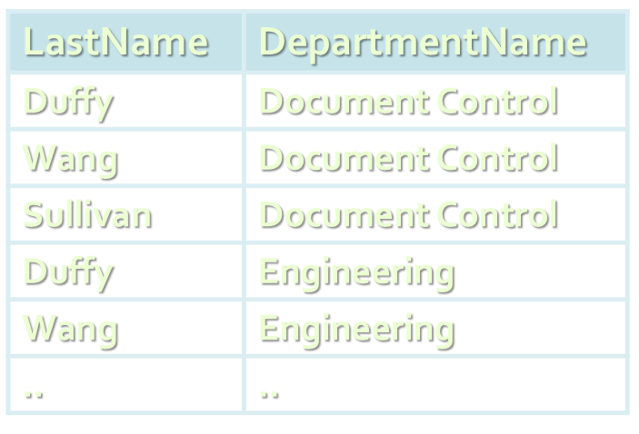

# Cartesian Product
*	A Cartesian product is formed when:
	*	A join condition is omitted
	*	A join condition is invalid
	*	All rows in the first table are joined to all rows in the second table
*	To avoid a Cartesian product, always include a valid join condition

<!-- attr: { hasScriptWrapper: true } -->
# Types of Joins
*	Inner joins
*	Left, right and full outer joins
*	Cross joins


<!-- attr: { hasScriptWrapper: true } -->
# Inner Join with ON Clause
*	To specify arbitrary conditions or specify columns to join, the `ON` clause is used
	*	Such `JOIN` is called also `INNER JOIN`

```sql
SELECT e.EmployeeID, e.LastName, e.DepartmentID, 
       d.DepartmentID, d.Name AS DepartmentName
FROM Employees e 
  INNER JOIN Departments d 
    ON e.DepartmentID = d.DepartmentID
```


<!-- attr: { hasScriptWrapper: true } -->
# Equijoins
*	Inner joins with join conditions pushed down to the `WHERE` clause

```sql
SELECT e.EmployeeID, e.LastName, e.DepartmentID, 
       d.DepartmentID, d.Name AS DepartmentName
FROM Employees e, Departments d 
WHERE e.DepartmentID = d.DepartmentID
```


# INNER vs. OUTER Joins
*	`Inner join`
	*	A join of two tables returning only rows matching the join condition
*	`Left` (or `right`) `outer join`
	*	Returns the results of the inner join as well as unmatched rows from the left (or right) table
*	`Full outer join`
	*	Returns the results of an inner join as well as the results of a left and right join

<!-- attr: { hasScriptWrapper: true } -->
# INNER JOIN
```sql
SELECT e.LastName EmpLastName,
       m.EmployeeID MgrID, m.LastName MgrLastName
FROM Employees e INNER JOIN Employees m
  ON e.ManagerID = m.EmployeeID
```
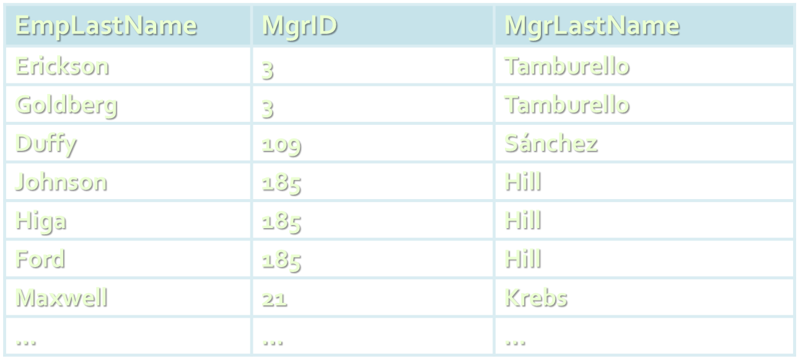

<!-- attr: { hasScriptWrapper: true } -->
# LEFT OUTER JOIN
```sql
SELECT e.LastName EmpLastName,
       m.EmployeeID MgrID, m.LastName MgrLastName
FROM Employees e LEFT OUTER JOIN Employees m
  ON e.ManagerID = m.EmployeeID
```
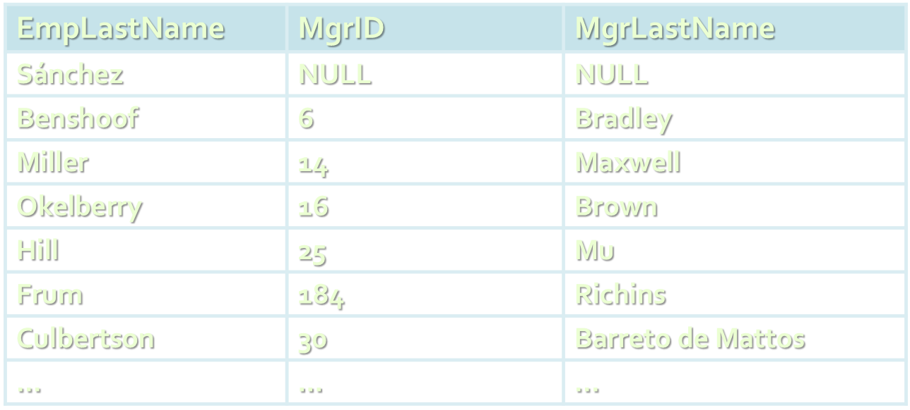

<!-- attr: { hasScriptWrapper: true } -->
# RIGHT OUTER JOIN
```sql
SELECT e.LastName EmpLastName,
       m.EmployeeID MgrID, m.LastName MgrLastName
FROM Employees e RIGHT OUTER JOIN Employees m
  ON e.ManagerID = m.EmployeeID
```
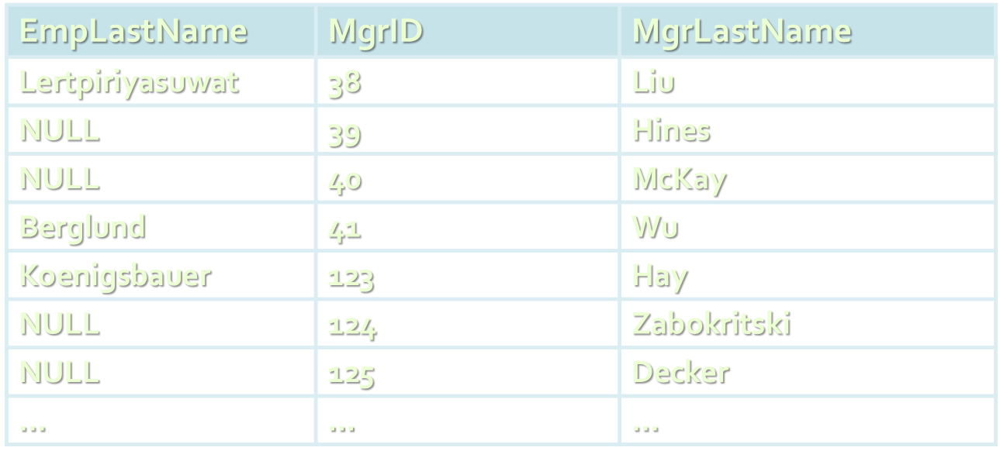

<!-- attr: { hasScriptWrapper: true } -->
# FULL OUTER JOIN
```sql
SELECT e.LastName EmpLastName,
       m.EmployeeID MgrID, m.LastName MgrLastName
FROM employee e FULL OUTER JOIN employee m
  ON e.ManagerID = m.EmployeeID
```
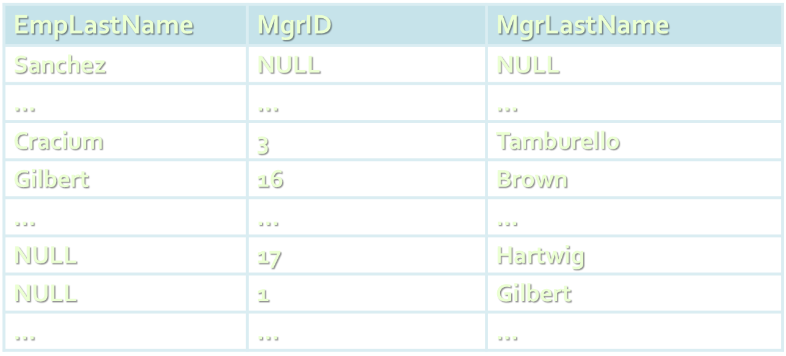

<!-- attr: { hasScriptWrapper: true } -->
# Three-Way Joins
*	A three-way join is a join of three tables
```sql
SELECT e.FirstName, e.LastName,
  t.Name as Towns, a.AddressText
FROM Employees e
  JOIN Addresses a
    ON e.AddressID = a.AddressID
  JOIN Towns t
    ON a.TownID = t.TownID
```
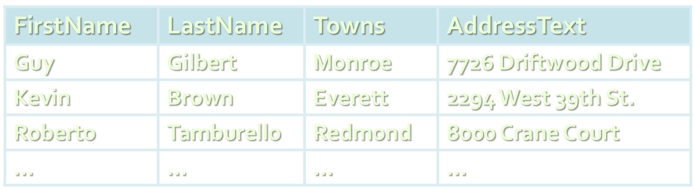

<!-- attr: { hasScriptWrapper: true } -->
# Self-Join
*	Self-join means to join a table to itself
	*	Always used with table aliases
```sql
SELECT e.FirstName + ' ' + e.LastName +
 ' is managed by ' + m.LastName as Message
FROM Employees e JOIN Employees m
ON (e.ManagerId = m.EmployeeId)
```


<!-- attr: { hasScriptWrapper: true } -->
# Cross Join
*	The `CROSS JOIN` clause produces the cross-product of two tables
	*	Same as a Cartesian product
	*	Not often used

```sql
SELECT LastName [Last Name], Name [Dept Name]
FROM Employees CROSS JOIN Departments
```


<!-- attr: { hasScriptWrapper: true } -->
# Additional Conditions
*	You can apply additional conditions in the `WHERE` clause:

```sql
SELECT e.EmployeeID, e.LastName, e.DepartmentID, 
       d.DepartmentID, d.Name AS DepartmentName
FROM Employees e 
  INNER JOIN Departments d 
    ON e.DepartmentID = d.DepartmentID
WHERE d.Name = 'Sales'
```
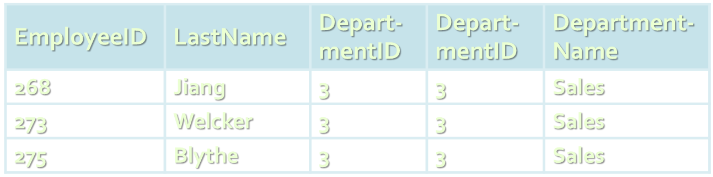

<!-- attr: { hasScriptWrapper: true } -->
# Complex Join Conditions
*	Joins can use any Boolean expression in the `ON` clause:
```sql
SELECT e.FirstName, e.LastName, d.Name as DeptName
FROM Employees e
  INNER JOIN Departments d
  ON (e.DepartmentId = d.DepartmentId
  AND e.HireDate > '1/1/1999'
  AND d.Name IN ('Sales', 'Finance'))
```


<!-- section start -->
<!-- attr: {id: 'inserting-data', class: 'slide-section'} -->
# SQL Language
## Inserting Data in Tables

# Inserting Data
*	`INSERT` command
	*	`INSERT INTO &lt;table> VALUES (&lt;values>)`
	*	`INSERT INTO &lt;table>(&lt;columns>) VALUES (&lt;values>)`
	*	`INSERT INTO &lt;table> SELECT &lt;values>`

```sql
INSERT INTO EmployeesProjects VALUES (229, 25)
```
```sql
INSERT INTO Projects(Name, StartDate)
VALUES ('New project', GETDATE())
```
```sql
INSERT INTO Projects(Name, StartDate)
  SELECT Name + ' Restructuring', GETDATE()
  FROM Departments
```

# Bulk Insert
*	Bulk `INSERT` can insert multiple values through a single SQL command
```sql
INSERT INTO EmployeesProjects VALUES
 (229, 1),
 (229, 2),
 (229, 3),
 (229, 4),
 (229, 5),
 (229, 6),
 (229, 8),
 (229, 9),
 (229, 10),
 (229, 11),
 (229, 12),
 (229, 26)
```

<!-- section start -->
<!-- attr: {id:'updating-data', class:'slide-section'} -->
# SQL Language
## Updating Data in Tables

# Updating Joined Tables
*	We can update tables based on condition from joined tables
```sql
UPDATE Employees
SET JobTitle = 'Senior ' + JobTitle
FROM Employees e 
  JOIN Departments d
    ON e.DepartmentID = d.DepartmentID
WHERE d.Name = 'Sales'
```

# Updating Data
*	`UPDATE` command
	*	`UPDATE &lt;table> SET &lt;column=expression> WHERE &lt;condition>`
	*	_Note_: Don't forget the `WHERE` clause!

```sql
UPDATE Employees
SET LastName = 'Brown'
WHERE EmployeeID = 1

UPDATE Employees
SET Salary = Salary * 1.10,
  JobTitle = 'Senior ' + JobTitle
WHERE DepartmentID = 3
```

<!-- section start -->
<!-- attr: {id:'deleting-data', class:'slide-section'} -->
# SQL Language
## Deleting Data From Tables

# Deleting Data
*	Deleting rows from a table
	*	`DELETE FROM &lt;table> WHERE &lt;condition>`
	*	_Note_: Don’t forget the `WHERE` clause!

```sql
DELETE FROM Employees WHERE EmployeeID = 1
DELETE FROM Employees WHERE LastName LIKE 'S%'
```
	
*	Delete all rows from a table at once
	*	`TRUNCATE TABLE &lt;table>`

```sql
TRUNCATE TABLE Users
```

# Deleting from Joined Tables
*	We can delete records from tables based on condition from joined tables

```sql
DELETE FROM Employees
FROM Employees e 
  JOIN Departments d
    ON e.DepartmentID = d.DepartmentID
WHERE d.Name = 'Sales'
```


<!-- section start -->

<!-- attr: {id:'questions', class:'slide-section'} -->
# Questions
## Databases
