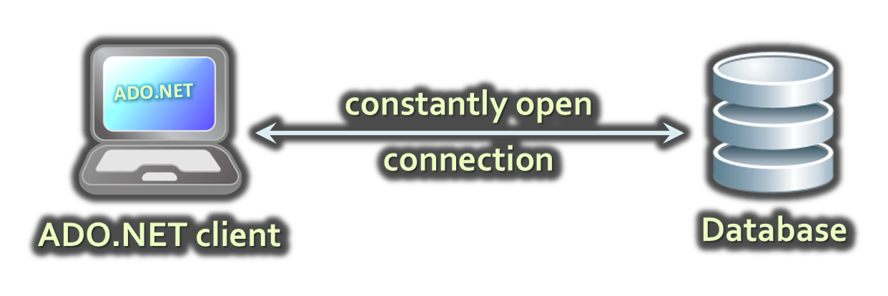
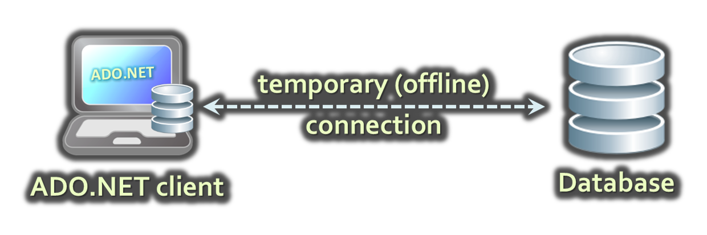
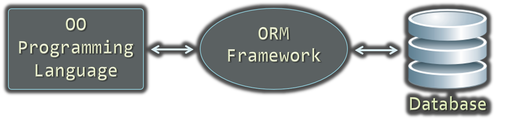

<!-- section start -->

<!-- attr: {id: 'title', class: 'slide-title', hasScriptWrapper: true} -->
# JDBC
##  Java Database Connectivity

<div class="signature">
    <p class="signature-course">Databses with Java</p>
    <p class="signature-initiative">Telerik School Academy</p>
    <a href="http://academy.telerik.com" class="signature-link">http://academy.telerik.com</a>
</div>

<!-- section start -->

<!-- attr: { id:'table-of-contents' } -->
# Table of Contents
- Data Access Models
  - Connected
  - Disconnected
  - Object-relational Model (ORM)
- JDBC Architecture
- Accessing Oracle from JDBS (Connected Model)
  - Connecting with `Connection`
  - Using `Statement` and `ResultSet`
  - Parametrized Queries
- SQL Injection
  - What is SQL Injection and How to Avoid It?
<!-- section start -->
<!-- attr: {id: 'data-access-models', class: 'slide-section'} -->
# Data Access Models

<!-- attr: { id:'connected-model', hasScriptWrapper:true } -->
# Connected Model
-   Connected data access model
    -   Applicable to an environment where the database is constantly available


# Connected Model: Benefits and Drawbacks
-   `Connected data access model`
    -   Benefits:
        -   Concurrency control is easier to maintain
        -   Better chance to work with the most recent version of the data
    -   Drawbacks:  
        -   Needs a constant reliable network
        -   Problems when scalability is an issue

<!-- attr: { id:'disconnected-model', hasScriptWrapper:true } -->
# Disconnected Model
-   Disconnected data access model
    -   A subset of the central database is copied locally at the client and he works with the copy
    -   Database synchronization is done offline

    -   Legacy technology (deprecated)

# Disconnected Model: Benefits and Drawbacks
-   Benefits:
    -   The client connects to DB from time to time
        -   Works with the local copy the rest of the time
    -   Other clients can connect during that time
    -   Has superior scalability
-   Drawbacks:
    -   The data you work with is not always the latest data in the database
    -   Additional efforts to resolve the conflicts caused by different versions of the data

<!-- attr: { id:'orm-model', hasScriptWrapper:true } -->
# ORM Model
-   `Object-Relational Mapping data access model` (JDBC)
    -   Maps database tables to classes and objects
    -   Objects can be automatically persisted in the database
    -   Can operate in both connected and disconnected models


# ORM Model – Benefits and Problems
-   ORM model benefits
    -   Increased productivity – writing less code
    -   Use objects with associations instead of tables and SQL commands
    -   Integrated object query mechanism
-   ORM model drawbacks:
    -   Less flexibility
        -   SQL is automatically generated
    -   Performance issues (sometimes)

<!-- section start -->
<!-- attr: { id:'jdbc-architecture', class:'slide-section', hasScriptWrapper:true } -->
# JDBC Architecture

# What Is JDBC?
-   `JDBC` is a standard JAVA class library for accessing databases, processing data and XML
    -   A program model for working with data in Java
    -   Supports connected, disconnected and ORM data access models
    -   Allows executing SQL in RDBMS systems
        -   DB connections, data readers, DB commands
    -   Allows accessing data in the ORM approach

# Register the JDBC drivers
- To access a database from a Java application, you must first provide the code to register your installed driver with your program
- You register the driver only once in your Java application

```java
// Register JDBC driver
Class.forName("oracle.jdbc.driver.OracleDriver");
```
- Or use `DriverManager` with the oracle driver

```java
DriverManager.registerDriver(new oracle.jdbc.OracleDriver())
```

<!-- attr: { hasScriptWrapper:true } -->
# JDBC `Connection` Class
-   `Connection`
    -   Establish database connection to SQL Server
    -   URL is of the form:
      - `jdbc:oracle:<drivertype>:@<database>`


```java
String DB_URL = "jdbc:oracle:thin:@localhost:1521:orcl";
String USER = "hr"; // fillin username
String PASS = "hr"; // fillin password

Connection conn = DriverManager
    .getConnection(DB_URL, USER, PASS);

// make queries to the database

conn.close();
```

# JDBC `Statement` Class
-   `Statement`
    -   Executes SQL commands on the SQL Server through an established connection
    -   Could accept parameters (`SQLParameter`)

```java
Statement stmt;
stmt = conn.createStatement();
String sql = "SELECT * FROM JOBS";
ResultSet rs = stmt.executeQuery(sql);

// process data

stmt.close();
```

# JDBC `ResultSet` Class
-   `ResultSet`
    -   Retrieves data (record set) from SQL Server as a result of SQL query execution

```java
ResultSet rs = stmt.executeQuery(sql);
while (rs.next()) {
  //Retrieve by column name
  String str = rs.getString("[column name]");

  //Display values
  System.out.println(str);
}

rs.close();
```

<!-- section start  -->

<!-- attr: { class:'slide-section', showInPresentation: true } -->
<!-- # Questions
##  Java Database Connectivity -->
